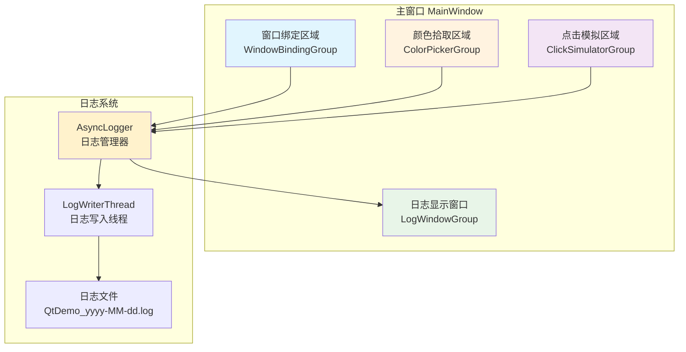
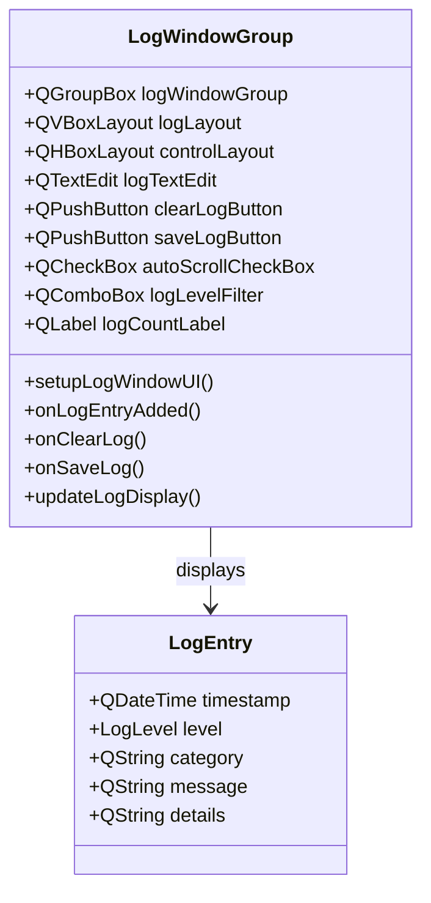
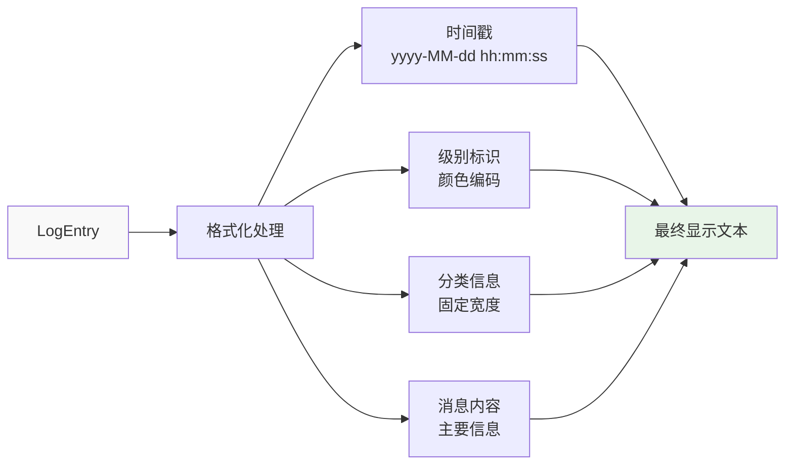
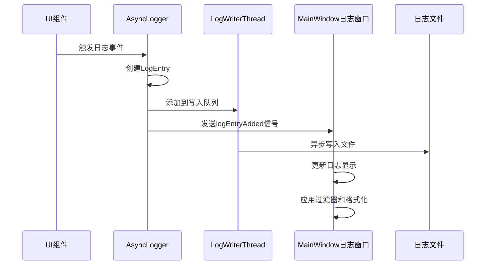
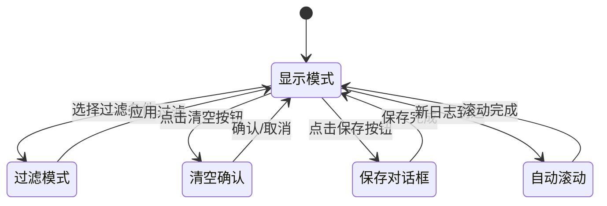
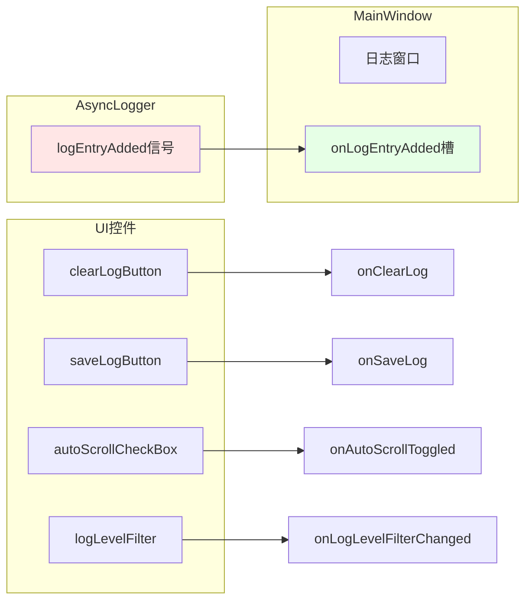

# 移除无用按钮并创建日志窗口功能设计

## 概述

本设计旨在优化Qt高级窗口操作工具的用户界面，通过移除无实际功能的测试按钮并增加日志显示窗口，提升用户体验和系统可观测性。该优化将使界面更加简洁专业，同时为用户提供实时的操作反馈和系统状态监控能力。

## 技术栈与依赖

| 组件 | 技术选型 | 版本要求 |
|------|----------|----------|
| UI框架 | Qt Widgets | Qt 6.5+ |
| 日志系统 | AsyncLogger | 现有组件 |
| 布局管理 | QVBoxLayout, QHBoxLayout | Qt标准组件 |
| 窗口管理 | QWidget, QGroupBox | Qt标准组件 |

## 功能架构设计

### 现状分析

当前主窗口包含以下UI组件：
- 原始测试按钮（"点击我!"）- 无实际业务功能
- 窗口绑定区域 - 核心功能
- 颜色拾取区域 - 核心功能  
- 点击模拟区域 - 核心功能

### 目标架构

优化后的主窗口将包含：
- 窗口绑定区域 - 保持不变
- 颜色拾取区域 - 保持不变
- 点击模拟区域 - 保持不变
- **新增：日志显示窗口** - 实时显示系统日志

## 详细设计规范

### 组件移除设计

#### 移除的UI组件
| 组件名称 | 类型 | 移除原因 |
|----------|------|----------|
| button | QPushButton | 仅用于功能测试，无实际业务价值 |
| onButtonClicked() | 槽函数 | 与移除按钮相关的事件处理 |

#### 布局调整策略
- 移除按钮后，主布局(mainLayout)顶部将直接显示窗口绑定区域
- 保持现有组件间距和对齐方式
- 确保窗口最小尺寸和响应式布局不受影响

### 日志窗口设计规范

#### 日志窗口组件结构

#### 日志显示组件规格

| 组件 | 类型 | 功能描述 | 样式规范 |
|------|------|----------|----------|
| logTextEdit | QTextEdit | 主要日志显示区域 | 只读、等宽字体、最小高度200px |
| clearLogButton | QPushButton | 清空当前显示的日志 | 标准按钮样式 |
| saveLogButton | QPushButton | 保存日志到文件 | 标准按钮样式 |
| autoScrollCheckBox | QCheckBox | 自动滚动到最新日志 | 默认选中 |
| logLevelFilter | QComboBox | 按日志级别过滤显示 | 包含All、Debug、Info、Warning、Error、Action |
| logCountLabel | QLabel | 显示当前日志条数 | 右对齐、灰色文字 |

#### 日志格式化规范

#### 日志级别颜色方案

| 日志级别 | 颜色编码 | HTML颜色值 | 应用场景 |
|----------|----------|------------|----------|
| DEBUG | 灰色 | #808080 | 调试信息 |
| INFO | 蓝色 | #0066cc | 一般信息 |
| WARNING | 橙色 | #ff8800 | 警告信息 |
| ERROR | 红色 | #cc0000 | 错误信息 |
| ACTION | 绿色 | #008800 | 用户操作记录 |

### 数据流设计

#### 日志数据流转过程

#### 日志过滤机制

| 过滤类型 | 实现方式 | 性能考虑 |
|----------|----------|----------|
| 级别过滤 | 枚举值比较 | O(1)时间复杂度 |
| 分类过滤 | 字符串匹配 | 使用哈希表优化 |
| 时间范围 | 时间戳比较 | 维护有序索引 |
| 关键词搜索 | 正则表达式 | 限制搜索范围 |

### 性能与资源管理

#### 内存管理策略

| 方面 | 策略 | 限制参数 |
|------|------|----------|
| 日志条目缓存 | 滚动窗口机制 | 最大1000条显示记录 |
| 文本编辑器 | 定期清理过期内容 | 超出限制时清理最旧50% |
| 异步处理 | 队列大小限制 | 最大队列长度500 |
| 自动保存 | 批量写入机制 | 每100条或10秒一次 |

#### 响应性保障措施

- 日志写入采用异步线程，避免阻塞UI
- 日志显示使用虚拟滚动技术处理大量数据
- 过滤和搜索操作使用防抖技术
- 文件I/O操作在后台线程执行

### 用户交互设计

#### 日志窗口交互行为

#### 用户操作反馈

| 操作 | 即时反馈 | 持久化效果 |
|------|----------|------------|
| 清空日志 | 界面立即清空 | 不影响日志文件 |
| 保存日志 | 显示保存进度 | 创建导出文件 |
| 级别过滤 | 实时更新显示 | 记住用户偏好 |
| 自动滚动切换 | 复选框状态更新 | 保存到配置 |

### 集成点设计

#### 与现有日志系统集成

| 集成点 | 接口方法 | 数据格式 |
|--------|----------|----------|
| 按钮点击日志 | LOG_BUTTON_CLICK宏 | 按钮名称+附加信息 |
| 颜色拾取日志 | LOG_COLOR_PICKED宏 | 颜色值+坐标+窗口信息 |
| 点击模拟日志 | LOG_CLICK_SIMULATED宏 | 坐标+类型+按钮+结果 |
| 窗口绑定日志 | LOG_WINDOW_BOUND宏 | 窗口标题+详细信息 |
| 系统信息日志 | LOG_INFO宏 | 分类+消息+详情JSON |

#### 信号槽连接设计

### 配置管理

#### 日志窗口配置参数

| 参数名称 | 数据类型 | 默认值 | 描述 |
|----------|----------|--------|------|
| maxDisplayLines | int | 1000 | 最大显示行数 |
| autoScroll | bool | true | 是否自动滚动 |
| defaultLogLevel | LogLevel | Info | 默认过滤级别 |
| fontFamily | QString | "Consolas" | 日志字体 |
| fontSize | int | 9 | 字体大小 |
| showTimestamp | bool | true | 是否显示时间戳 |
| showCategory | bool | true | 是否显示分类 |

#### 持久化存储

- 用户偏好设置保存到QSettings
- 窗口大小和位置自动记忆
- 过滤条件在应用重启后恢复

### 测试策略

#### 功能测试用例

| 测试场景 | 预期行为 | 验证点 |
|----------|----------|--------|
| 按钮移除验证 | 测试按钮不再显示 | UI布局正确 |
| 日志实时显示 | 操作立即产生日志记录 | 日志内容准确 |
| 级别过滤功能 | 只显示选定级别日志 | 过滤逻辑正确 |
| 自动滚动功能 | 新日志自动滚动到底部 | 滚动行为正确 |
| 清空日志功能 | 显示区域清空但文件保留 | 数据一致性 |
| 保存日志功能 | 成功导出当前显示日志 | 文件格式正确 |

#### 性能测试指标

| 性能指标 | 基准值 | 测试方法 |
|----------|--------|----------|
| 日志显示延迟 | < 100ms | 高频日志生成测试 |
| 内存占用 | < 50MB | 长时间运行监控 |
| 过滤响应时间 | < 50ms | 大量日志过滤测试 |
| 文件写入性能 | > 1000条/秒 | 批量日志写入测试 |