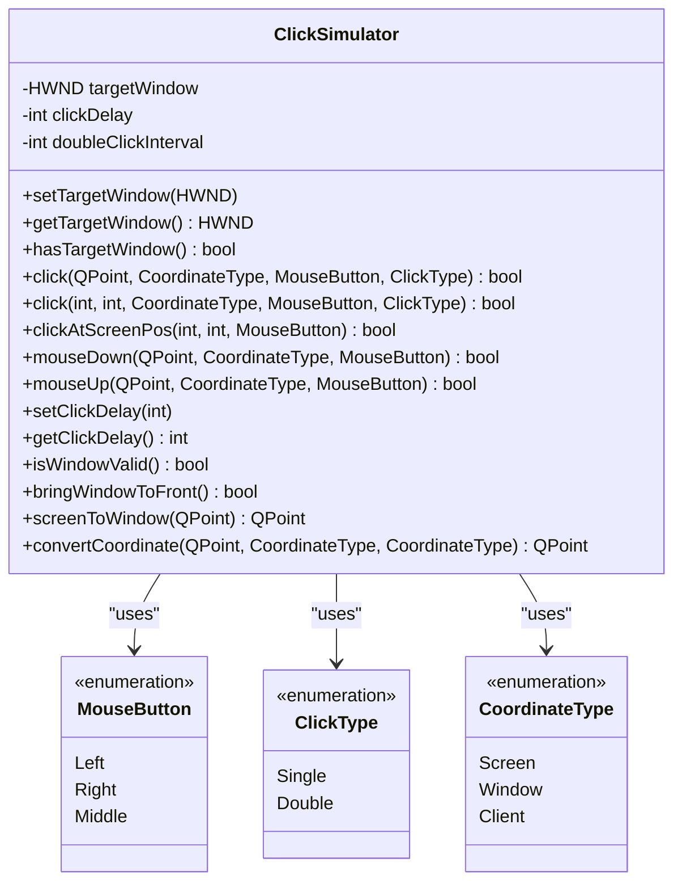
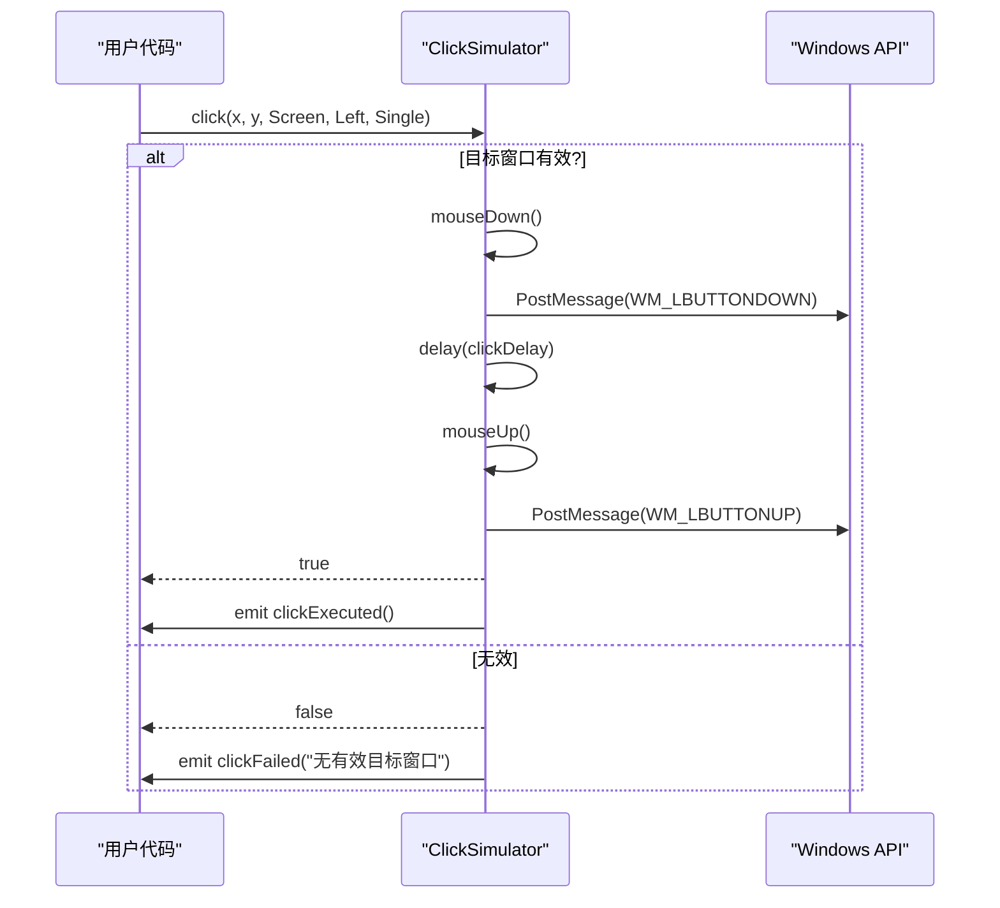
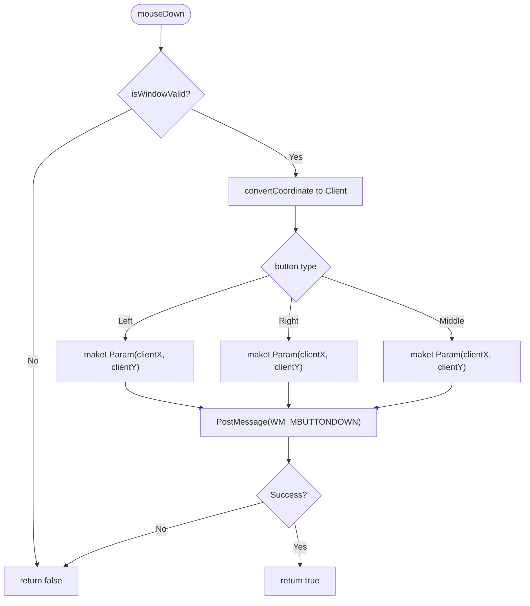

# ClickSimulator API参考

<cite>
**Referenced Files in This Document **  
- [ClickSimulator.h](file://include/core/ClickSimulator.h)
- [ClickSimulator.cpp](file://src/core/ClickSimulator.cpp)
</cite>

## 目录
1. [简介](#简介)
2. [核心功能概览](#核心功能概览)
3. [点击方法族详解](#点击方法族详解)
4. [高级便捷方法](#高级便捷方法)
5. [低级鼠标消息控制](#低级鼠标消息控制)
6. [操作节奏与延迟控制](#操作节奏与延迟控制)
7. [坐标转换系统](#坐标转换系统)
8. [窗口状态管理](#窗口状态管理)
9. [信号与事件](#信号与事件)
10. [使用约束与注意事项](#使用约束与注意事项)

## 简介

`ClickSimulator` 类是一个专为Windows平台设计的鼠标事件模拟器，旨在通过发送Windows消息来精确控制目标窗口的鼠标交互。该类提供了从基础点击到复杂双击、从屏幕绝对坐标到客户区相对坐标的全方位支持，是自动化测试和UI交互脚本的核心组件。

**Section sources**
- [ClickSimulator.h](file://include/core/ClickSimulator.h#L1-L98)

## 核心功能概览

`ClickSimulator` 的核心功能围绕着对目标窗口的鼠标事件注入。它通过 `setTargetWindow()` 设置目标窗口句柄，并在所有操作前进行有效性检查。整个API设计围绕三个关键枚举展开：

- **MouseButton**: 指定左键、右键或中键。
- **ClickType**: 控制单击或双击行为。
- **CoordinateType**: 定义坐标系（屏幕、窗口、客户区）。



**Diagram sources **
- [ClickSimulator.h](file://include/core/ClickSimulator.h#L15-L45)

**Section sources**
- [ClickSimulator.h](file://include/core/ClickSimulator.h#L15-L45)

## 点击方法族详解

`ClickSimulator` 提供了两个重载的 `click()` 方法，构成了其功能的核心。

### 重载方法签名

- `bool click(const QPoint& position, CoordinateType coordType = CoordinateType::Screen, MouseButton button = MouseButton::Left, ClickType clickType = ClickType::Single)`
- `bool click(int x, int y, CoordinateType coordType = CoordinateType::Screen, MouseButton button = MouseButton::Left, ClickType clickType = ClickType::Single)`

这两个方法允许用户以点对象或独立的x/y坐标进行调用，极大地提高了API的灵活性。

### 执行流程

点击操作被分解为一系列原子化的鼠标消息发送：
1. 对于单击：发送 `WM_LBUTTONDOWN` -> 延迟 -> 发送 `WM_LBUTTONUP`
2. 对于双击：执行两次单击序列，中间间隔 `doubleClickInterval`

此过程确保了与真实用户操作的高度一致性。



**Diagram sources **
- [ClickSimulator.cpp](file://src/core/ClickSimulator.cpp#L50-L100)

**Section sources**
- [ClickSimulator.h](file://include/core/ClickSimulator.h#L50-L60)
- [ClickSimulator.cpp](file://src/core/ClickSimulator.cpp#L50-L100)

## 高级便捷方法

为了简化常见场景下的调用，`ClickSimulator` 提供了一系列封装方法。

### 封装方法列表

| 方法名 | 功能描述 |
|-------|--------|
| `clickAtScreenPos()` | 在指定屏幕坐标处进行左键单击 |
| `clickAtWindowPos()` | 在指定窗口坐标处进行左键单击 |
| `clickAtClientPos()` | 在指定客户区坐标处进行左键单击 |
| `doubleClick()` | 在指定位置执行左键双击 |

这些方法本质上是对核心 `click()` 方法的参数预设调用，降低了用户的认知负担。

**Section sources**
- [ClickSimulator.h](file://include/core/ClickSimulator.h#L62-L68)

## 低级鼠标消息控制

对于需要精细控制的场景，`ClickSimulator` 暴露了 `mouseDown()` 和 `mouseUp()` 方法。

### 内部实现机制

这两个方法直接调用Windows API的 `PostMessage()` 函数，向目标窗口发送底层的鼠标消息：
- `mouseDown()`: 发送 `WM_LBUTTONDOWN`, `WM_RBUTTONDOWN`, 或 `WM_MBUTTONDOWN`
- `mouseUp()`: 发送 `WM_LBUTTONUP`, `WM_RBUTTONUP`, 或 `WM_MBUTTONUP`

坐标在发送前会通过 `convertCoordinate()` 转换为目标所需的客户区坐标。



**Diagram sources **
- [ClickSimulator.cpp](file://src/core/ClickSimulator.cpp#L150-L180)

**Section sources**
- [ClickSimulator.h](file://include/core/ClickSimulator.h#L70-L72)
- [ClickSimulator.cpp](file://src/core/ClickSimulator.cpp#L150-L180)

## 操作节奏与延迟控制

`ClickSimulator` 允许用户精确控制鼠标操作的时间特性。

### 关键参数

- **clickDelay**: 模拟鼠标按下和释放之间的延迟，默认为50毫秒。
- **doubleClickInterval**: 两次单击构成双击的最大时间间隔，默认为200毫秒。

### 控制方法

| 方法 | 描述 |
|------|------|
| `setClickDelay(int)` | 设置点击延迟时间（毫秒） |
| `getClickDelay()` | 获取当前点击延迟时间 |
| `setDoubleClickInterval(int)` | 设置双击间隔时间 |
| `getDoubleClickInterval()` | 获取当前双击间隔时间 |

内部通过 `QThread::msleep()` 实现阻塞式延迟。

**Section sources**
- [ClickSimulator.h](file://include/core/ClickSimulator.h#L74-L78)
- [ClickSimulator.cpp](file://src/core/ClickSimulator.cpp#L200-L215)

## 坐标转换系统

`ClickSimulator` 内置了一个强大的坐标转换引擎，支持三种坐标系间的任意转换。

### 坐标系定义

- **Screen**: 屏幕绝对坐标，原点在左上角。
- **Window**: 窗口相对坐标，原点在窗口左上角（包含标题栏和边框）。
- **Client**: 客户区相对坐标，原点在客户区左上角（不包含非客户区元素）。

### 转换原理

转换依赖于Windows API：
- `GetWindowRect()`: 获取窗口在屏幕上的矩形区域。
- `GetClientRect()`: 获取客户区在窗口内的矩形区域。
- `ClientToScreen()`: 将客户区坐标转换为屏幕坐标。
- `ScreenToClient()`: 将屏幕坐标转换为客户区坐标。

```mermaid
erDiagram
COORDINATE_TYPE ||--o{ CONVERSION : "defines"
CONVERSION }|--|| SCREEN_COORD : "from/to"
CONVERSION }|--|| WINDOW_COORD : "from/to"
CONVERSION }|--|| CLIENT_COORD : "from/to"
class SCREEN_COORD {
int x
int y
}
class WINDOW_COORD {
int x
int y
}
class CLIENT_COORD {
int x
int y
}
class CONVERSION {
convertCoordinate()
screenToWindow()
windowToScreen()
screenToClient()
clientToScreen()
}
```

**Diagram sources **
- [ClickSimulator.cpp](file://src/core/ClickSimulator.cpp#L230-L280)

**Section sources**
- [ClickSimulator.h](file://include/core/ClickSimulator.h#L80-L84)
- [ClickSimulator.cpp](file://src/core/ClickSimulator.cpp#L230-L280)

## 窗口状态管理

确保目标窗口处于可交互状态是成功模拟的前提。

### 状态检查

`isWindowValid()` 方法执行三重检查：
1. 句柄非空
2. `IsWindow()` 确认句柄对应一个有效的窗口
3. `IsWindowVisible()` 确保窗口可见

### 窗口激活

`bringWindowToFront()` 方法尝试将目标窗口置于前台，这通常能提高消息处理的成功率。

**Section sources**
- [ClickSimulator.h](file://include/core/ClickSimulator.h#L86-L87)
- [ClickSimulator.cpp](file://src/core/ClickSimulator.cpp#L260-L270)

## 信号与事件

`ClickSimulator` 通过Qt信号机制通知外部操作结果。

### 信号列表

- **clickExecuted**: 当点击成功执行时发出。携带参数：
  - `position`: 触发点击的位置（原始输入坐标）
  - `coordType`: 坐标类型
  - `button`: 按下的鼠标按钮
- **clickFailed**: 当点击失败时发出。携带参数：
  - `reason`: 失败原因字符串（如"没有设置有效的目标窗口"）

这些信号可用于日志记录、调试或构建更复杂的响应逻辑。

**Section sources**
- [ClickSimulator.h](file://include/core/ClickSimulator.h#L89-L94)

## 使用约束与注意事项

### 必要条件

- **主线程调用**: 所有 `ClickSimulator` 的方法必须在主线程中调用。
- **目标窗口状态**: 目标窗口必须存在、可见且能够接收消息。
- **Windows平台**: 该类严重依赖Windows API，不具备跨平台性。

### 最佳实践

1. 在调用任何点击方法前，先调用 `hasTargetWindow()` 或 `isWindowValid()` 进行检查。
2. 使用 `bringWindowToFront()` 提高操作成功率。
3. 根据应用响应速度调整 `clickDelay` 和 `doubleClickInterval`。

**Section sources**
- [ClickSimulator.h](file://include/core/ClickSimulator.h#L1-L98)
- [ClickSimulator.cpp](file://src/core/ClickSimulator.cpp#L1-L288)