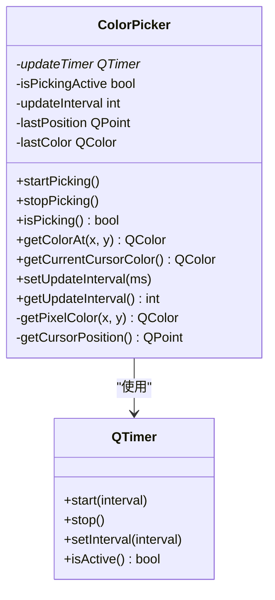

# ColorPicker API参考

<cite>
**本文档中引用的文件**
- [ColorPicker.h](file://include/core/ColorPicker.h)
- [ColorPicker.cpp](file://src/core/ColorPicker.cpp)
</cite>

## 目录
1. [简介](#简介)
2. [核心功能与设计](#核心功能与设计)
3. [取色控制方法](#取色控制方法)
4. [颜色读取方法](#颜色读取方法)
5. [设置与状态查询](#设置与状态查询)
6. [信号机制](#信号机制)
7. [私有槽函数](#私有槽函数)
8. [性能与线程约束](#性能与线程约束)

## 简介
`ColorPicker` 类是一个基于Qt框架的实时屏幕取色器，专为Windows平台设计。它利用Windows API实现对屏幕上任意像素点的颜色采集，并通过定时器驱动的事件循环提供连续的颜色跟踪功能。该类封装了底层的 `GetDC` 和 `GetPixel` API调用，为上层应用提供了简洁、安全且高效的取色接口。

**Section sources**
- [ColorPicker.h](file://include/core/ColorPicker.h#L12-L56)
- [ColorPicker.cpp](file://src/core/ColorPicker.cpp#L1-L10)

## 核心功能与设计
`ColorPicker` 的核心功能是实时监控鼠标光标下的屏幕颜色，并在颜色发生变化时发出通知。其设计采用观察者模式，通过Qt的信号与槽机制进行通信。关键组件包括一个 `QTimer` 定时器用于周期性检查光标位置和颜色，以及多个私有成员变量来跟踪当前状态（如是否正在取色、上次检测到的位置和颜色等）。

**Diagram sources**
- [ColorPicker.h](file://include/core/ColorPicker.h#L12-L56)
- [ColorPicker.cpp](file://src/core/ColorPicker.cpp#L1-L126)

**Section sources**
- [ColorPicker.h](file://include/core/ColorPicker.h#L12-L56)
- [ColorPicker.cpp](file://src/core/ColorPicker.cpp#L1-L126)

## 取色控制方法

### startPicking()
启动实时取色模式。此方法会将内部状态 `isPickingActive` 设置为 `true`，并启动 `updateTimer` 定时器。一旦定时器开始触发，`updateColor()` 槽函数将被周期性调用，从而实现对光标下颜色的持续监控。成功启动后，会发射 `pickingStarted` 信号。

[SPEC SYMBOL](file://include/core/ColorPicker.h#L20)
[SPEC SYMBOL](file://src/core/ColorPicker.cpp#L15-L21)

### stopPicking()
停止实时取色模式。此方法会将 `isPickingActive` 设置为 `false`，并立即停止 `updateTimer`。这有效地终止了 `updateColor()` 函数的周期性执行。成功停止后，会发射 `pickingStopped` 信号。

[SPEC SYMBOL](file://include/core/ColorPicker.h#L21)
[SPEC SYMBOL](file://src/core/ColorPicker.cpp#L23-L30)

**Section sources**
- [ColorPicker.h](file://include/core/ColorPicker.h#L20-L22)
- [ColorPicker.cpp](file://src/core/ColorPicker.cpp#L15-L30)

## 颜色读取方法

### getColorAt(int x, int y)
获取指定屏幕坐标 `(x, y)` 处的像素颜色。该方法直接调用私有的 `getPixelColor()` 函数来完成实际的API交互。

[SPEC SYMBOL](file://include/core/ColorPicker.h#L25)
[SPEC SYMBOL](file://src/core/ColorPicker.cpp#L49-L51)

### getCurrentCursorColor()
获取当前鼠标光标所在位置的屏幕颜色。该方法首先调用 `getCursorPosition()` 获取光标坐标，然后使用该坐标调用 `getColorAt()` 来获取颜色。

[SPEC SYMBOL](file://include/core/ColorPicker.h#L27)
[SPEC SYMBOL](file://src/core/ColorPicker.cpp#L53-L56)

### getPixelColor(int x, int y)
这是一个私有方法，负责封装Windows API调用以读取像素颜色。它使用 `GetDC(NULL)` 获取整个屏幕的设备上下文（DC），然后调用 `GetPixel(screenDC, x, y)` 读取指定坐标的 `COLORREF` 值。最后，通过 `GetRValue`, `GetGValue`, `GetBValue` 宏提取RGB分量，并将其转换为Qt的 `QColor` 对象。操作完成后，必须调用 `ReleaseDC` 释放设备上下文。

[SPEC SYMBOL](file://src/core/ColorPicker.cpp#L108-L125)

**Section sources**
- [ColorPicker.h](file://include/core/ColorPicker.h#L24-L28)
- [ColorPicker.cpp](file://src/core/ColorPicker.cpp#L49-L56)
- [ColorPicker.cpp](file://src/core/ColorPicker.cpp#L108-L125)

## 设置与状态查询

### setUpdateInterval(int milliseconds)
设置实时取色的更新间隔（以毫秒为单位）。此值决定了 `updateTimer` 触发 `updateColor()` 槽函数的频率。较高的间隔值（如200ms）可降低CPU占用，但响应速度较慢；较低的间隔值（如16ms）可提供更流畅的体验，但会增加CPU负载。如果定时器正在运行，此方法会动态调整其间隔。

[SPEC SYMBOL](file://include/core/ColorPicker.h#L30)
[SPEC SYMBOL](file://src/core/ColorPicker.cpp#L58-L63)

### getUpdateInterval()
返回当前设置的更新间隔。

[SPEC SYMBOL](file://include/core/ColorPicker.h#L31)
[SPEC SYMBOL](file://src/core/ColorPicker.cpp#L65-L67)

### isPicking()
查询取色器是否处于活动状态。返回 `isPickingActive` 成员变量的值，该值在调用 `startPicking()` 后为 `true`，在调用 `stopPicking()` 后为 `false`。

[SPEC SYMBOL](file://include/core/ColorPicker.h#L22)
[SPEC SYMBOL](file://src/core/ColorPicker.cpp#L45-L47)

**Section sources**
- [ColorPicker.h](file://include/core/ColorPicker.h#L30-L31)
- [ColorPicker.cpp](file://src/core/ColorPicker.cpp#L58-L67)

## 信号机制
`ColorPicker` 类定义了四个信号，用于向外部对象通报状态变化和颜色信息。

### colorChanged(const QColor& color, const QPoint& position)
当鼠标光标移动到新位置且该位置的颜色与之前不同时，此信号被发射。它携带了新的颜色值和对应的屏幕坐标。该信号由 `updateColor()` 槽函数在检测到变化时发出。

[SPEC SYMBOL](file://include/core/ColorPicker.h#L34)
[SPEC SYMBOL](file://src/core/ColorPicker.cpp#L98)

### colorPicked(const QColor& color, const QPoint& position)
当用户显式调用 `pickColorAtCursor()` 方法确认拾取当前光标下的颜色时，此信号被发射。它同样携带颜色和位置信息，通常用于最终确定一个颜色选择。

[SPEC SYMBOL](file://include/core/ColorPicker.h#L35)
[SPEC SYMBOL](file://src/core/ColorPicker.cpp#L100)

### pickingStarted()
在成功调用 `startPicking()` 方法后发射，表示实时取色模式已启动。

[SPEC SYMBOL](file://include/core/ColorPicker.h#L36)
[SPEC SYMBOL](file://src/core/ColorPicker.cpp#L19)

### pickingStopped()
在成功调用 `stopPicking()` 方法后发射，表示实时取色模式已停止。

[SPEC SYMBOL](file://include/core/ColorPicker.h#L37)
[SPEC SYMBOL](file://src/core/ColorPicker.cpp#L28)

**Section sources**
- [ColorPicker.h](file://include/core/ColorPicker.h#L34-L37)
- [ColorPicker.cpp](file://src/core/ColorPicker.cpp#L19)
- [ColorPicker.cpp](file://src/core/ColorPicker.cpp#L28)
- [ColorPicker.cpp](file://src/core/ColorPicker.cpp#L98)
- [ColorPicker.cpp](file://src/core/ColorPicker.cpp#L100)

## 私有槽函数

### updateColor()
这是 `updateTimer` 定时器超时时调用的核心槽函数。它首先检查 `isPickingActive` 状态，确保仅在活动状态下执行。然后获取当前光标位置，并与 `lastPosition` 比较。只有当位置发生改变时，才会调用 `getColorAt()` 读取新颜色。如果新颜色或新位置与记录的 `lastColor` 或 `lastPosition` 不同，则更新这些记录并发射 `colorChanged` 信号。这种双重检查机制有效减少了不必要的信号发射和CPU消耗。

[SPEC SYMBOL](file://include/core/ColorPicker.h#L48)
[SPEC SYMBOL](file://src/core/ColorPicker.cpp#L70-L99)

**Section sources**
- [ColorPicker.h](file://include/core/ColorPicker.h#L48)
- [ColorPicker.cpp](file://src/core/ColorPicker.cpp#L70-L99)

## 性能与线程约束
`ColorPicker` 类依赖于 `QTimer` 的事件循环机制，因此**必须在主线程（GUI线程）中创建和使用**。所有公共方法的调用都应遵循这一约束。`isPicking()` 方法准确反映了当前的活跃状态。`setUpdateInterval()` 提供了调节性能的关键手段：更高的更新频率带来更灵敏的响应，但会增加CPU使用率；更低的频率则相反。建议根据具体应用场景在流畅性和性能之间找到平衡点。

**Section sources**
- [ColorPicker.h](file://include/core/ColorPicker.h#L22)
- [ColorPicker.cpp](file://src/core/ColorPicker.cpp#L58-L63)