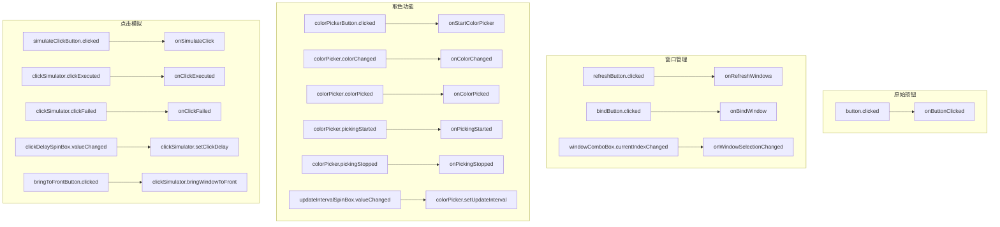

# MainWindow API参考

<cite>
**Referenced Files in This Document **   
- [MainWindow.h](file://include/ui/MainWindow.h)
- [MainWindow.cpp](file://src/ui/MainWindow.cpp)
- [WindowManager.h](file://include/core/WindowManager.h)
- [ColorPicker.h](file://include/core/ColorPicker.h)
- [ClickSimulator.h](file://include/core/ClickSimulator.h)
</cite>

## 目录
1. [构造函数与析构函数](#构造函数与析构函数)
2. [私有槽函数](#私有槽函数)
3. [UI构建方法](#ui构建方法)
4. [信号与槽连接](#信号与槽连接)
5. [成员变量](#成员变量)
6. [线程安全与访问级别](#线程安全与访问级别)

## 构造函数与析构函数

`MainWindow`类的构造函数 `MainWindow(QWidget *parent)` 负责初始化主窗口及其核心模块。它继承自 `QMainWindow`，并接受一个可选的父级 `QWidget` 指针。

在构造函数中，通过初始化列表创建了三个核心模块：`windowManager`、`colorPicker` 和 `clickSimulator`。这些模块均以 `this`（即 `MainWindow` 实例）作为其父对象，这使得它们被纳入Qt的对象树管理机制中。这意味着当 `MainWindow` 被销毁时，这三个子对象会自动被Qt的内存管理系统清理，无需手动释放，从而有效防止内存泄漏。

构造函数随后调用 `setupUI()` 方法来构建用户界面，并调用 `connectSignals()` 方法来建立信号与槽的连接。最后，它初始化窗口列表并设置窗口标题和尺寸。

析构函数 `~MainWindow()` 为空。由于所有核心模块都正确地设置了父对象，Qt会在 `MainWindow` 销毁时自动递归删除其所有子对象，因此不需要在析构函数中执行任何显式的清理工作。

**Section sources**
- [MainWindow.h](file://include/ui/MainWindow.h#L27-L28)
- [MainWindow.cpp](file://src/ui/MainWindow.cpp#L10-L39)

## 私有槽函数

`MainWindow` 类定义了一系列私有槽函数，用于响应用户交互和内部事件。

### onButtonClicked
此槽函数处理原始按钮的点击事件。当用户点击界面上的“点击我!”按钮时，该函数被触发。其内部调用日志宏记录点击行为，并弹出一个信息对话框通知用户按钮已被点击。

**Section sources**
- [MainWindow.h](file://include/ui/MainWindow.h#L31)
- [MainWindow.cpp](file://src/ui/MainWindow.cpp#L106-L110)

### onRefreshWindows
此槽函数负责刷新窗口列表。当用户点击“刷新列表”按钮时，该函数被调用。它首先通过 `windowManager->refreshWindowList()` 更新底层的窗口数据，然后清空并重新填充 `windowComboBox` 下拉框，将所有可枚举的窗口标题和类名显示给用户。同时，它会更新状态标签以反映当前找到的窗口数量。

**Section sources**
- [MainWindow.h](file://include/ui/MainWindow.h#L34)
- [MainWindow.cpp](file://src/ui/MainWindow.cpp#L112-L138)

### onBindWindow
此槽函数执行窗口绑定逻辑。当用户从下拉框中选择一个窗口并点击“绑定窗口”按钮时，该函数被触发。它获取当前选中的索引，并调用 `windowManager->bindWindow(index)` 尝试绑定。如果成功，它会同步更新 `clickSimulator` 的目标窗口句柄，以便后续的点击模拟操作能作用于正确的窗口。函数还会更新UI上的信息显示和状态提示。

**Section sources**
- [MainWindow.h](file://include/ui/MainWindow.h#L35)
- [MainWindow.cpp](file://src/ui/MainWindow.cpp#L140-L174)

### onStartColorPicker
此槽函数启动取色流程。当用户点击“开始取色”按钮时，该函数被调用。它首先检查是否已绑定一个有效窗口，若未绑定则弹出警告。如果已绑定且当前未处于取色模式，则调用 `colorPicker->startPicking()` 启动取色器；如果已在取色模式，则调用 `stopPicking()` 停止取色。该函数实现了按钮文本的动态切换。

**Section sources**
- [MainWindow.h](file://include/ui/MainWindow.h#L38)
- [MainWindow.cpp](file://src/ui/MainWindow.cpp#L176-L194)

### onSimulateClick
此槽函数发起鼠标点击模拟。当用户点击“执行点击”按钮时，该函数被触发。它首先验证 `clickSimulator` 是否已设置目标窗口。接着，它解析用户在输入框中提供的坐标 (x,y)，并根据下拉框的选择获取坐标类型、鼠标按键和单/双击模式。在进行必要的格式和数值校验后，它调用 `clickSimulator->click()` 方法执行实际的点击模拟，并更新UI状态以反映操作结果。

**Section sources**
- [MainWindow.h](file://include/ui/MainWindow.h#L44)
- [MainWindow.cpp](file://src/ui/MainWindow.cpp#L234-L288)

## UI构建方法

`MainWindow` 通过一系列 `setupUI` 系列方法来构建其复杂的用户界面布局。

### setupUI
这是总入口方法，在构造函数中被调用。它创建中心部件和主垂直布局 (`mainLayout`)，并将各个功能区域的控件按顺序添加到布局中。

**Section sources**
- [MainWindow.h](file://include/ui/MainWindow.h#L54)
- [MainWindow.cpp](file://src/ui/MainWindow.cpp#L42-L57)

### setupWindowBindingUI
此方法构建“窗口绑定”功能区。它创建一个 `QGroupBox`，并在其中使用水平和垂直布局组织 `QComboBox`（用于选择窗口）、两个 `QPushButton`（“刷新列表”和“绑定窗口”）以及一个 `QLabel`（用于显示所选窗口的详细信息）。

**Section sources**
- [MainWindow.h](file://include/ui/MainWindow.h#L55)
- [MainWindow.cpp](file://src/ui/MainWindow.cpp#L59-L90)

### setupColorPickerUI
此方法构建“颜色拾取”功能区。它包含一个用于启动/停止取色的按钮、一个用于设置更新间隔的 `QSpinBox`、一个用于实时显示颜色的 `QLabel` 以及另一个用于显示位置和RGB信息的 `QLabel`。

**Section sources**
- [MainWindow.h](file://include/ui/MainWindow.h#L56)
- [MainWindow.cpp](file://src/ui/MainWindow.cpp#L92-L123)

### setupClickSimulatorUI
此方法构建“点击模拟”功能区。它提供了输入点击坐标的 `QLineEdit`、选择坐标类型的 `QComboBox`、选择鼠标按键的 `QComboBox`、一个“双击”复选框、一个用于设置延迟的 `QSpinBox`，以及“执行点击”和“置顶窗口”两个按钮。最后是一个 `QLabel` 用于显示操作状态。

**Section sources**
- [MainWindow.h](file://include/ui/MainWindow.h#L57)
- [MainWindow.cpp](file://src/ui/MainWindow.cpp#L125-L168)

## 信号与槽连接

`connectSignals()` 方法是整个UI交互的核心，它建立了所有信号与槽的连接关系。

**Diagram sources **
- [MainWindow.h](file://include/ui/MainWindow.h#L78)
- [MainWindow.cpp](file://src/ui/MainWindow.cpp#L99-L155)

**Section sources**
- [MainWindow.h](file://include/ui/MainWindow.h#L78)
- [MainWindow.cpp](file://src/ui/MainWindow.cpp#L99-L155)

## 成员变量

`MainWindow` 类维护了多个成员变量，用于管理其UI组件和核心功能模块。

### 核心模块指针
- `windowManager`: 指向 `WindowManager` 对象的指针，负责枚举系统窗口、绑定目标窗口并提供窗口信息。
- `colorPicker`: 指向 `ColorPicker` 对象的指针，负责实现屏幕取色功能，包括实时预览和单次拾取。
- `clickSimulator`: 指向 `ClickSimulator` 对象的指针，负责模拟鼠标点击事件，支持多种坐标系和点击类型。

这三个指针的生命周期由Qt的对象树严格管理。它们在构造函数中被创建，并以 `MainWindow` 为父对象，确保在 `MainWindow` 析构时被自动销毁。

### UI控件指针
这些指针指向在 `setupUI` 系列方法中创建的具体控件，如 `centralWidget`, `mainLayout`, `button`, `windowComboBox`, `colorPickerButton`, `simulateClickButton` 等。它们同样作为 `MainWindow` 的子对象，由Qt统一管理生命周期。

**Section sources**
- [MainWindow.h](file://include/ui/MainWindow.h#L60-L104)

## 线程安全与访问级别

`MainWindow` 类设计运行于主线程（GUI线程）。所有的UI操作和槽函数调用都必须在主线程中执行，以保证线程安全。`ColorPicker` 内部使用 `QTimer` 在主线程中定期更新颜色，而 `ClickSimulator` 使用Windows API发送消息，这些操作都遵循了Qt的线程规则。

访问级别方面，构造函数为 `public`，允许外部代码实例化 `MainWindow`。所有槽函数均为 `private slots`，表明它们仅用于内部响应信号，不应被外部直接调用。所有辅助方法和成员变量也都是 `private`，封装了内部实现细节。

该类在正常情况下是异常安全的。资源管理依赖于RAII和Qt的对象树，避免了裸指针和手动内存管理。关键操作（如解析坐标）都包含了错误检查和用户反馈，确保程序不会因无效输入而崩溃。

**Section sources**
- [MainWindow.h](file://include/ui/MainWindow.h#L27-L108)