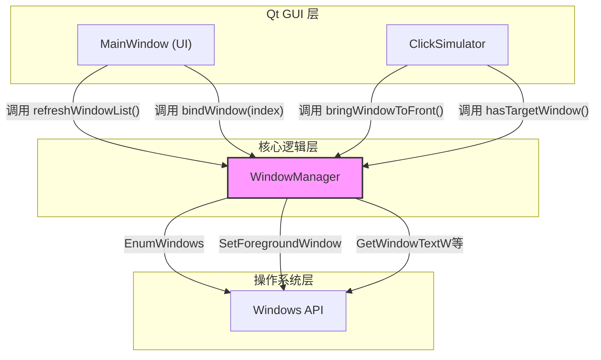
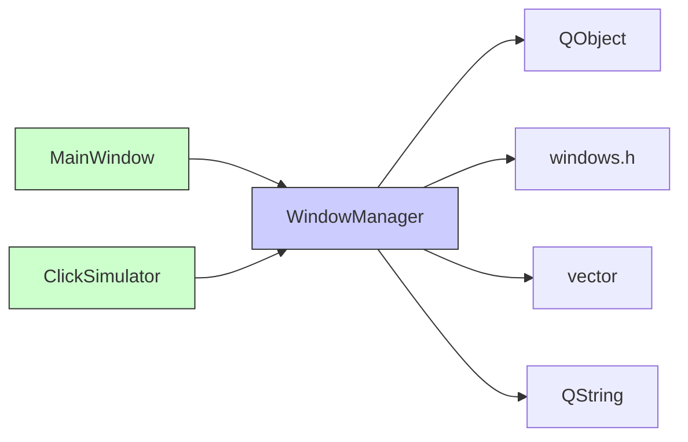

<cite>
**本文档中引用的文件**
- [WindowManager.h](file://include/core/WindowManager.h)
- [WindowManager.cpp](file://src/core/WindowManager.cpp)
- [MainWindow.cpp](file://src/ui/MainWindow.cpp)
</cite>

## 目录
1. [WindowManager API参考](#windowmanager-api参考)
2. [核心组件](#核心组件)
3. [架构概述](#架构概述)
4. [详细组件分析](#详细组件分析)
5. [依赖关系分析](#依赖关系分析)
6. [性能考量](#性能考量)
7. [故障排除指南](#故障排除指南)
8. [结论](#结论)

## WindowManager API参考

`WindowManager` 类是Qt应用程序中的核心系统级窗口管理组件，继承自 `QObject`，提供对Windows操作系统顶层窗口的枚举、选择、绑定和操作功能。该类通过调用Windows API实现底层交互，允许用户界面选择并控制外部应用程序窗口。

### 核心功能
- **窗口枚举**: 通过 `refreshWindowList()` 方法利用 `EnumWindowsProc` 回调函数遍历所有可见的顶层窗口。
- **窗口绑定**: 使用 `bindWindow()` 方法将管理器与特定窗口关联，后续操作均作用于该目标窗口。
- **状态查询**: 提供 `isBound()` 和 `getBoundWindowInfo()` 等方法检查当前绑定状态和获取窗口信息。
- **窗口操作**: 实现 `bringWindowToFront()` 方法以激活并置顶已绑定的窗口。

### 设计要点
- **性能优化**: `getWindowList()` 返回 `const std::vector<WindowInfo>&` 避免了不必要的数据复制。
- **信号发射**: 作为 `QObject` 的子类，虽然未定义显式信号，但其状态变化（如窗口绑定）会间接影响连接到它的其他对象。
- **线程安全**: 该类**非线程安全**，所有方法必须在GUI主线程中调用，以确保与Qt事件循环和Windows API的兼容性。

**Section sources**
- [WindowManager.h](file://include/core/WindowManager.h#L1-L63)
- [WindowManager.cpp](file://src/core/WindowManager.cpp#L1-L170)

## 核心组件

本节深入分析 `WindowManager` 类的核心方法及其内部机制。

### 窗口列表刷新 (refreshWindowList)
此方法负责清空现有的 `windowList` 并重新枚举系统中所有符合条件的顶层窗口。它通过调用Windows API的 `EnumWindows` 函数，并传入静态的 `EnumWindowsProc` 回调函数来实现遍历。

```mermaid
flowchart TD
A[refreshWindowList()] --> B[调用 EnumWindows]
B --> C{EnumWindowsProc 被每个窗口调用}
C --> D[验证窗口有效性 isValidWindow]
D --> E{窗口有效?}
E --> |是| F[调用 addWindow 添加到列表]
E --> |否| G[跳过该窗口]
F --> H[继续下一个窗口]
G --> H
H --> I[遍历完成]
I --> J[windowList 填充完毕]
```

**Diagram sources**
- [WindowManager.cpp](file://src/core/WindowManager.cpp#L10-L18)
- [WindowManager.cpp](file://src/core/WindowManager.cpp#L139-L150)

### 获取窗口列表 (getWindowList)
该方法返回一个指向内部 `windowList` 的常量引用 (`const std::vector<WindowInfo>&`)。这种设计避免了返回大型数据结构时的深拷贝开销，显著提升了性能，尤其是在列表包含大量窗口时。

**Section sources**
- [WindowManager.h](file://include/core/WindowManager.h#L24-L25)
- [WindowManager.cpp](file://src/core/WindowManager.cpp#L20-L24)

### 窗口绑定 (bindWindow)
`bindWindow` 方法有两种重载形式：
1.  **按索引绑定**: 接收一个整数 `index`，检查其是否在 `windowList` 的有效范围内，若有效则将 `boundWindow` 句柄设置为对应窗口的句柄。
2.  **按句柄绑定**: 接收一个 `HWND` 句柄，直接检查该句柄的有效性（存在、是窗口且可见），若有效则进行绑定。

两种方式最终都通过 `isWindowValid` 辅助方法进行验证。

```mermaid
flowchart LR
subgraph 按索引绑定
A[bindWindow(int index)] --> B{index 在范围内?}
B --> |否| C[返回 false]
B --> |是| D[获取 windowList[index].hwnd]
D --> E[调用 isWindowValid]
E --> F{有效?}
F --> |否| C
F --> |是| G[设置 boundWindow]
G --> H[返回 true]
end
subgraph 按句柄绑定
I[bindWindow(HWND hwnd)] --> J[调用 isWindowValid(hwnd)]
J --> K{有效?}
K --> |否| L[返回 false]
K --> |是| M[设置 boundWindow = hwnd]
M --> N[返回 true]
end
```

**Diagram sources**
- [WindowManager.cpp](file://src/core/WindowManager.cpp#L26-L42)

### 绑定状态检查 (isBound)
此方法用于检查当前是否已成功绑定一个有效的窗口。它不仅检查 `boundWindow` 是否为空指针，还通过 `isWindowValid` 方法确认该窗口句柄在系统中仍然有效且可见。

**Section sources**
- [WindowManager.h](file://include/core/WindowManager.h#L32-L33)
- [WindowManager.cpp](file://src/core/WindowManager.cpp#L59-L63)

### 获取绑定窗口信息 (getBoundWindowInfo)
当窗口已绑定时，此方法构建并返回一个完整的 `WindowInfo` 结构体，其中包含绑定窗口的句柄、标题、类名和矩形区域。这些信息是通过调用相应的静态辅助方法实时获取的。

**Section sources**
- [WindowManager.h](file://include/core/WindowManager.h#L34-L35)
- [WindowManager.cpp](file://src/core/WindowManager.cpp#L65-L77)

### 置顶窗口 (bringWindowToFront)
此方法使用Windows API的 `SetForegroundWindow` 函数尝试将已绑定的窗口激活并带到所有其他窗口的前面。如果当前没有绑定有效窗口或API调用失败，则返回 `false`。

**Section sources**
- [WindowManager.h](file://include/core/WindowManager.h#L37-L38)
- [WindowManager.cpp](file://src/core/WindowManager.cpp#L85-L91)

### 静态辅助方法
这些静态方法封装了对Windows API的直接调用，用于获取窗口的特定属性。

- **getWindowTitle(HWND)**: 使用 `GetWindowTextW` 获取指定窗口的标题文本。
- **getWindowClassName(HWND)**: 使用 `GetClassNameW` 获取指定窗口的类名。
- **getWindowRect(HWND)**: 使用 `GetWindowRect` 获取指定窗口相对于屏幕的坐标和大小。

```mermaid
classDiagram
class WindowManager {
+static QString getWindowTitle(HWND hwnd)
+static QString getWindowClassName(HWND hwnd)
+static RECT getWindowRect(HWND hwnd)
}
note right of WindowManager
这些静态方法直接调用Windows API
GetWindowTextW, GetClassNameW, GetWindowRect
end note
```

**Diagram sources**
- [WindowManager.h](file://include/core/WindowManager.h#L39-L41)
- [WindowManager.cpp](file://src/core/WindowManager.cpp#L93-L127)

## 架构概述

`WindowManager` 类在整体应用架构中扮演着“桥梁”的角色，连接了Qt图形用户界面与Windows操作系统底层的窗口管理系统。



**Diagram sources**
- [WindowManager.h](file://include/core/WindowManager.h#L1-L63)
- [MainWindow.cpp](file://src/ui/MainWindow.cpp#L1-L490)

## 详细组件分析

### WindowInfo 结构体
这是一个简单的数据载体，用于存储单个窗口的关键信息。

**Table: WindowInfo 结构体成员**

| 成员 | 类型 | 描述 |
| :--- | :--- | :--- |
| `hwnd` | HWND | 窗口的唯一句柄标识符 |
| `title` | QString | 窗口的标题栏文本 |
| `className` | QString | 窗口的Windows类名 |
| `rect` | RECT | 窗口在屏幕上的位置和大小 |

**Section sources**
- [WindowManager.h](file://include/core/WindowManager.h#L7-L16)

### 内部辅助方法
这些私有方法支持核心功能的实现。

- **isValidWindow(HWND)**: 定义了判断一个窗口是否应被纳入管理的标准。它检查窗口是否可见、标题是否非空，并过滤掉工具窗口（`WS_EX_TOOLWINDOW`）。
- **addWindow(HWND)**: 将一个有效的窗口句柄转换为 `WindowInfo` 对象并添加到 `windowList` 中。

**Section sources**
- [WindowManager.h](file://include/core/WindowManager.h#L54-L55)
- [WindowManager.cpp](file://src/core/WindowManager.cpp#L152-L169)

## 依赖关系分析

`WindowManager` 类具有明确的依赖关系。



**Diagram sources**
- [WindowManager.h](file://include/core/WindowManager.h#L3-L5)
- [MainWindow.cpp](file://src/ui/MainWindow.cpp#L1-L490)

## 性能考量

- **`getWindowList()` 的引用返回**: 这是最关键的性能优化，避免了在每次调用时复制整个窗口列表。
- **回调枚举效率**: `EnumWindows` 是Windows提供的高效枚举机制，配合 `EnumWindowsProc` 回调，能够快速遍历所有顶层窗口。
- **信息延迟加载**: 窗口的详细信息（如标题、类名、矩形）仅在需要时通过 `getWindowInfo` 或 `getBoundWindowInfo` 调用静态方法获取，而不是在枚举时全部加载，减少了初始枚举的开销。

## 故障排除指南

### 常见问题及解决方案

- **问题**: `refreshWindowList()` 后列表为空。
  - **原因**: 可能所有顶层窗口都不可见、无标题或是工具窗口。
  - **解决**: 检查是否有常规的应用程序窗口处于打开状态。

- **问题**: `bindWindow(int index)` 失败。
  - **原因**: 传入的 `index` 超出 `windowList` 的范围，或该索引对应的窗口在调用时已失效。
  - **解决**: 确保先调用 `refreshWindowList()` 更新列表，并检查索引值的有效性。

- **问题**: `bringWindowToFront()` 调用无效。
  - **原因**: 当前未绑定任何窗口，或目标窗口因权限等原因无法被前置。
  - **解决**: 确认 `isBound()` 返回 `true`，并检查目标应用程序的状态。

**Section sources**
- [WindowManager.cpp](file://src/core/WindowManager.cpp#L26-L42)
- [WindowManager.cpp](file://src/core/WindowManager.cpp#L85-L91)

## 结论

`WindowManager` 类是一个功能完备、设计合理的系统级窗口管理工具。它有效地封装了复杂的Windows API调用，为上层应用提供了简洁、高效的接口。其核心优势在于通过引用返回优化性能、清晰的绑定状态管理以及对窗口有效性的严格校验。开发者在使用时需牢记其非线程安全的特性，确保所有调用都在GUI线程中进行。