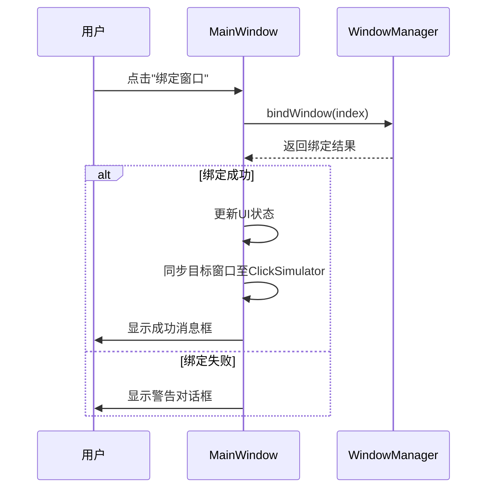
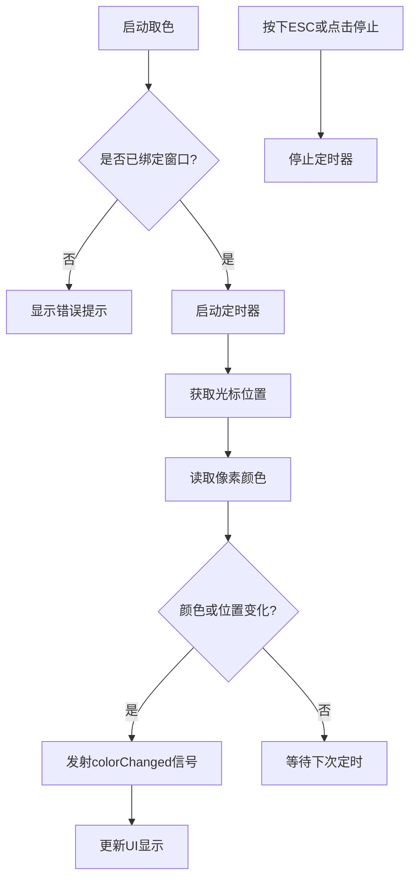
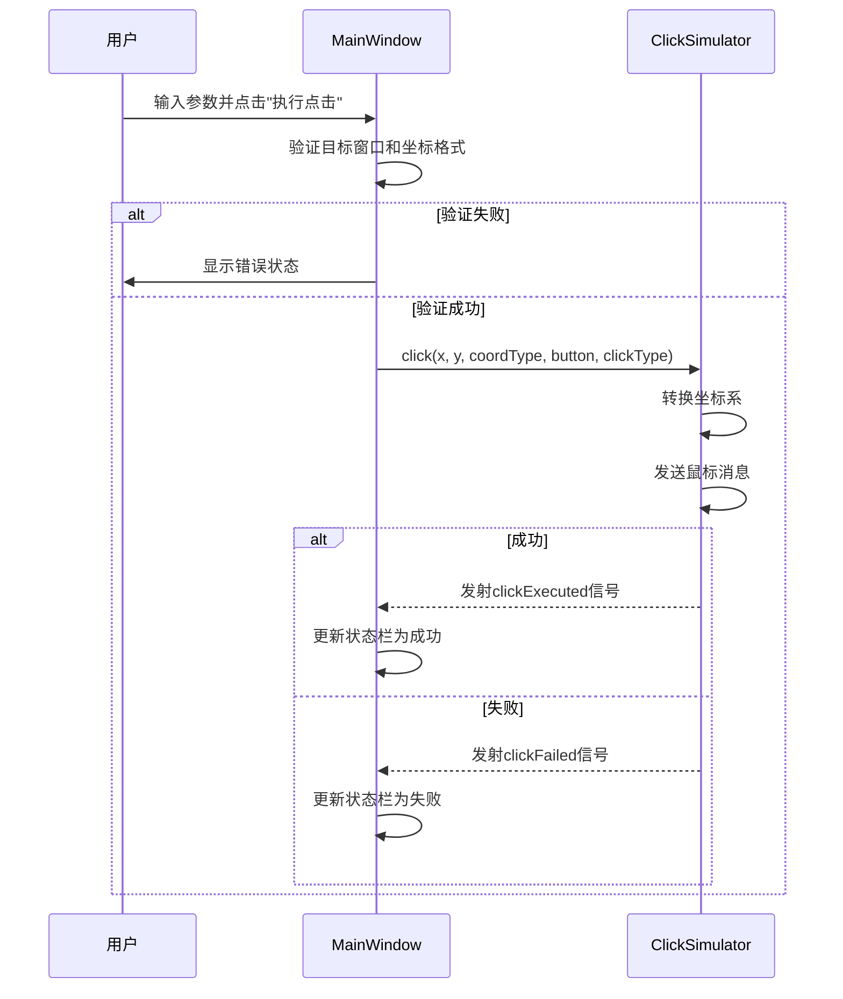

# 功能使用手册

<cite>
**本文档引用的文件**
- [MainWindow.cpp](file://src/ui/MainWindow.cpp)
- [MainWindow.h](file://include/ui/MainWindow.h)
- [ColorPicker.cpp](file://src/core/ColorPicker.cpp)
- [ClickSimulator.cpp](file://src/core/ClickSimulator.cpp)
- [WindowManager.cpp](file://src/core/WindowManager.cpp)
- [WindowManager.h](file://include/core/WindowManager.h)
</cite>

## 目录
1. [原始按钮测试区域](#原始按钮测试区域)
2. [窗口绑定区域](#窗口绑定区域)
3. [颜色拾取区域](#颜色拾取区域)
4. [点击模拟区域](#点击模拟区域)

## 原始按钮测试区域

主界面左上角的“点击我！”按钮是基础功能验证入口。当用户点击该按钮时，会触发 `onButtonClicked` 槽函数，弹出一个包含提示信息的消息框，用于确认UI交互正常。

**Section sources**
- [MainWindow.cpp](file://src/ui/MainWindow.cpp#L200-L205)

## 窗口绑定区域

此区域允许用户选择并绑定目标窗口，为后续操作提供作用对象。

### 刷新窗口列表
点击“刷新列表”按钮将调用 `onRefreshWindows` 槽函数。该函数通过 `windowManager->refreshWindowList()` 重新枚举系统中所有可见窗口，并将窗口标题和类名填充到 `windowComboBox` 下拉框中。

**Section sources**
- [MainWindow.cpp](file://src/ui/MainWindow.cpp#L207-L226)

### 选择窗口
在 `windowComboBox` 中选择不同项时，会触发 `onWindowSelectionChanged` 槽函数。该函数调用 `updateWindowInfo` 方法，实时更新下方 `windowInfoLabel` 显示所选窗口的详细信息，包括标题、类名、句柄及位置尺寸。

**Section sources**
- [MainWindow.cpp](file://src/ui/MainWindow.cpp#L248-L259)

### 绑定窗口
点击“绑定窗口”按钮执行 `onBindWindow` 槽函数。该函数首先检查是否已选择有效窗口，然后调用 `windowManager->bindWindow(index)` 将选中窗口的句柄绑定至 `WindowManager` 实例。成功后，相关信息会同步给 `ClickSimulator`，并在状态栏反馈结果。

**Diagram sources**
- [MainWindow.cpp](file://src/ui/MainWindow.cpp#L228-L246)
- [WindowManager.cpp](file://src/core/WindowManager.cpp#L85-L104)

## 颜色拾取区域

该功能支持实时获取屏幕任意位置的颜色值。

### 启动取色
点击“开始取色 (按ESC停止)”按钮触发 `onStartColorPicker` 槽函数。程序首先检查是否已绑定窗口，若未绑定则提示错误；否则启动 `ColorPicker` 的定时器，进入持续采样模式。

**Section sources**
- [MainWindow.cpp](file://src/ui/MainWindow.cpp#L251-L267)

### 颜色更新机制
`ColorPicker` 内部通过 `QTimer` 定时调用 `updateColor` 方法，获取当前光标位置的颜色。当颜色或位置发生变化时，发出 `colorChanged` 信号，由 `MainWindow` 的 `onColorChanged` 槽函数接收并更新 `colorDisplayLabel` 和 `colorInfoLabel` 的显示内容，包括RGB值和十六进制编码。

**Diagram sources**
- [ColorPicker.cpp](file://src/core/ColorPicker.cpp#L45-L85)
- [MainWindow.cpp](file://src/ui/MainWindow.cpp#L269-L280)

### 调节采样频率
用户可通过 `updateIntervalSpinBox` 控件调节 `ColorPicker` 的 `updateInterval` 属性，从而控制颜色采样的时间间隔（单位：毫秒），平衡精度与性能。

**Section sources**
- [MainWindow.cpp](file://src/ui/MainWindow.cpp#L185-L188)

## 点击模拟区域

此模块可模拟鼠标在指定坐标执行点击操作。

### 输入参数配置
用户需输入格式为 "x,y" 的坐标值，并从下拉框中选择坐标类型（屏幕/窗口/客户区）、鼠标按键（左/右/中键），以及是否双击和延迟时间等参数。

### 执行点击
点击“执行点击”按钮调用 `onSimulateClick` 槽函数。该函数首先验证目标窗口是否存在及坐标格式是否正确，随后解析参数并调用 `clickSimulator->click()` 方法执行模拟点击。过程中会根据设置插入相应延迟。

**Diagram sources**
- [MainWindow.cpp](file://src/ui/MainWindow.cpp#L282-L346)
- [ClickSimulator.cpp](file://src/core/ClickSimulator.cpp#L35-L110)

### 结果反馈
点击执行结果通过信号槽机制反馈：成功时 `onClickExecuted` 槽函数更新状态栏显示成功信息；失败时 `onClickFailed` 槽函数显示具体错误原因。

**Section sources**
- [MainWindow.cpp](file://src/ui/MainWindow.cpp#L348-L389)