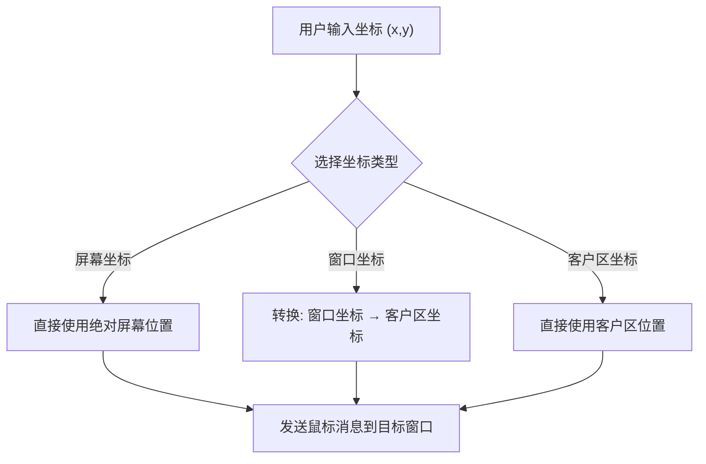
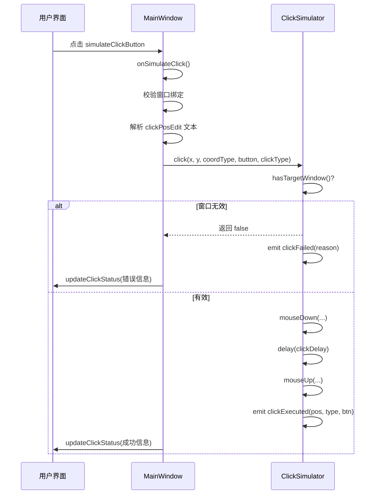

# 点击模拟功能

<cite>
**Referenced Files in This Document **   
- [MainWindow.cpp](file://src/ui/MainWindow.cpp)
- [ClickSimulator.h](file://include/core/ClickSimulator.h)
- [ClickSimulator.cpp](file://src/core/ClickSimulator.cpp)
- [AsyncLogger.h](file://include/utils/AsyncLogger.h)
</cite>

## 目录
1. [坐标输入与解析](#坐标输入与解析)
2. [坐标系选择机制](#坐标系选择机制)
3. [鼠标行为参数配置](#鼠标行为参数配置)
4. [点击执行流程](#点击执行流程)
5. [窗口置顶功能](#窗口置顶功能)
6. [自动化测试脚本参考](#自动化测试脚本参考)
7. [常见问题排查](#常见问题排查)

## 坐标输入与解析

`onSimulateClick` 方法负责处理用户在 `clickPosEdit` 文本框中输入的坐标。系统要求输入格式为 "x,y"，即两个以英文逗号分隔的整数。

该方法首先对输入文本进行修剪和分割。若分割后得到的字符串数量不等于2，则判定为格式错误，并通过 `updateClickStatus` 更新状态标签显示错误信息。

随后，程序尝试将两个子字符串转换为整数。此过程使用 `toInt(&ok)` 函数并检查其布尔返回值 `okX` 和 `okY`。如果任一转换失败（例如输入了非数字字符），则会触发相应的错误处理逻辑，提示用户输入有效的数字坐标。

**Section sources**
- [MainWindow.cpp](file://src/ui/MainWindow.cpp#L208-L229)

## 坐标系选择机制

界面提供了 `coordTypeCombo` 下拉框供用户选择三种不同的坐标系：屏幕坐标、窗口坐标和客户区坐标。这些选项分别对应枚举类型 `CoordinateType` 中的 `Screen`、`Window` 和 `Client` 成员。

当用户点击“执行点击”按钮时，`onSimulateClick` 会读取 `coordTypeCombo` 的当前数据（`currentData()`），将其转换为 `CoordinateType` 枚举值，并作为参数传递给 `ClickSimulator::click` 方法。

`ClickSimulator` 内部通过 `convertCoordinate` 方法实现不同坐标系之间的转换。例如，当使用窗口或客户区坐标时，系统会先将其转换为目标窗口的客户区坐标，再通过 Windows API 发送消息，确保点击事件能准确作用于目标位置。

**Diagram sources **
- [ClickSimulator.h](file://include/core/ClickSimulator.h#L15-L21)
- [ClickSimulator.cpp](file://src/core/ClickSimulator.cpp#L228-L287)

**Section sources**
- [MainWindow.cpp](file://src/ui/MainWindow.cpp#L174-L180)
- [ClickSimulator.cpp](file://src/core/ClickSimulator.cpp#L228-L287)

## 鼠标行为参数配置

用户可通过以下控件自定义点击行为：

- **`mouseButtonCombo`**: 允许选择左键、右键或中键点击。其选中项的数据（`currentData()`）被转换为 `MouseButton` 枚举类型，用于确定发送的 Windows 消息（如 `WM_LBUTTONDOWN`）。
- **`doubleClickCheckBox`**: 勾选时，`clickType` 被设为 `ClickType::Double`，触发双击逻辑；否则为单击。
- **`clickDelaySpinBox`**: 设置鼠标按下与释放之间的延迟时间（毫秒）。该值通过信号连接实时同步到 `ClickSimulator` 实例的 `clickDelay` 成员变量，影响每次点击动作的持续时间。

这些参数共同构成了 `ClickSimulator::click` 方法的调用参数，精确控制模拟点击的细节。

**Section sources**
- [MainWindow.cpp](file://src/ui/MainWindow.cpp#L181-L194)
- [ClickSimulator.h](file://include/core/ClickSimulator.h#L10-L13)

## 点击执行流程

点击“执行点击”按钮后，整个执行链路如下：

1.  **参数校验**: `onSimulateClick` 首先检查是否已绑定目标窗口（`hasTargetWindow()`），若未绑定则终止流程并报错。
2.  **坐标解析**: 对 `clickPosEdit` 的文本进行分割和整数转换，任何格式或数值错误都会导致流程中断。
3.  **目标窗口检查**: 在 `ClickSimulator::click` 方法内部，再次确认目标窗口句柄有效且可见（`isWindowValid()`）。
4.  **执行点击**: 根据 `clickType` 执行单击或双击逻辑。单击包含 `mouseDown` 和 `mouseUp` 两个步骤，并由 `delay(clickDelay)` 分隔。双击则在两次单击间插入 `delay(doubleClickInterval)`。
5.  **结果反馈**: 若点击成功，`ClickSimulator` 发出 `clickExecuted` 信号，被 `MainWindow` 的 `onClickExecuted` 槽函数捕获，更新 `clickStatusLabel` 显示成功信息；若失败，则发出 `clickFailed` 信号，由 `onClickFailed` 处理并显示错误原因。

**Diagram sources **
- [MainWindow.cpp](file://src/ui/MainWindow.cpp#L208-L255)
- [ClickSimulator.cpp](file://src/core/ClickSimulator.cpp#L36-L76)

**Section sources**
- [MainWindow.cpp](file://src/ui/MainWindow.cpp#L208-L255)
- [ClickSimulator.cpp](file://src/core/ClickSimulator.cpp#L36-L76)

## 窗口置顶功能

`bringToFrontButton` 按钮用于将目标窗口置顶到最前端。其点击事件通过 Lambda 表达式连接，调用 `ClickSimulator::bringWindowToFront` 方法。

该方法内部首先检查窗口的有效性（`isWindowValid()`），然后调用 Windows API 的 `SetForegroundWindow` 函数。如果调用成功，返回 `true`，UI 会更新状态为“窗口已置顶”；否则返回 `false`，并提示“窗口置顶失败”。

此功能对于确保后续的点击操作能正确作用于目标窗口至关重要，尤其是在多窗口环境下。

**Section sources**
- [MainWindow.cpp](file://src/ui/MainWindow.cpp#L196-L206)
- [ClickSimulator.cpp](file://src/core/ClickSimulator.cpp#L215-L226)

## 自动化测试脚本参考

虽然系统本身是图形化应用，但其核心逻辑可为编写自动化测试脚本提供参考。一个典型的测试脚本应遵循以下模式：

1.  初始化 `ClickSimulator` 并绑定目标应用窗口。
2.  使用 `setClickDelay` 调整点击速度。
3.  调用 `click` 方法，传入特定坐标、坐标系和鼠标按键，模拟用户交互。
4.  监听 `clickExecuted` 或 `clickFailed` 信号来验证操作结果。
5.  利用 `AsyncLogger` 记录每一步操作，便于事后分析。

例如，一个简单的测试序列可以是：
- 将窗口置顶 (`bringWindowToFront`)
- 在客户区坐标 (100, 100) 进行左键单击
- 在屏幕坐标 (500, 300) 进行右键双击

**Section sources**
- [ClickSimulator.h](file://include/core/ClickSimulator.h)
- [AsyncLogger.h](file://include/utils/AsyncLogger.h)

## 常见问题排查

点击操作可能因多种原因失败，主要排查方向如下：

1.  **窗口不可见或无效**: `ClickSimulator::isWindowValid()` 会检查窗口句柄是否存在、是否为有效窗口以及是否可见。如果目标窗口被最小化或隐藏，点击将失败。解决方法是先调用 `bringWindowToFront` 确保窗口处于活动状态。
2.  **权限限制**: 某些高权限进程（如UAC对话框、部分系统服务）可能无法通过 `PostMessage` API 接收模拟输入。这是操作系统安全机制所致，通常无法绕过。
3.  **坐标计算错误**: 确保选择了正确的坐标系。例如，在客户区内点击时，应使用“客户区坐标”而非“窗口坐标”，因为后者包含了标题栏和边框。
4.  **日志分析**: 系统通过 `AsyncLogger` 记录所有关键操作。检查日志文件中的 `ClickSimulator` 类别条目，特别是带有 `error` 级别的记录，可以快速定位失败原因。

**Section sources**
- [ClickSimulator.cpp](file://src/core/ClickSimulator.cpp#L215-L226)
- [AsyncLogger.h](file://include/utils/AsyncLogger.h#L125-L126)