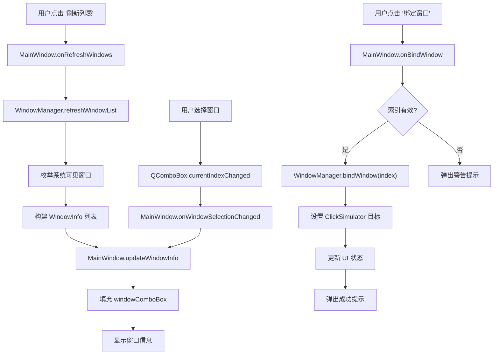
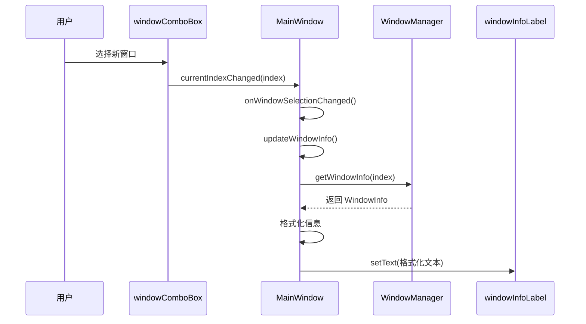
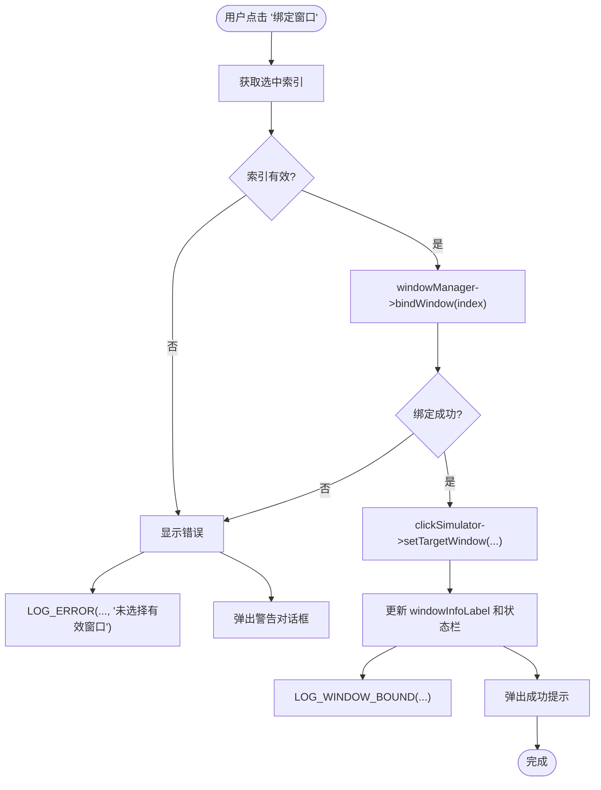

# 窗口绑定功能

<cite>
**Referenced Files in This Document **  
- [MainWindow.cpp](file://src/ui/MainWindow.cpp)
- [MainWindow.h](file://include/ui/MainWindow.h)
- [WindowManager.cpp](file://src/core/WindowManager.cpp)
- [WindowManager.h](file://include/core/WindowManager.h)
- [ClickSimulator.cpp](file://src/core/ClickSimulator.cpp)
- [ClickSimulator.h](file://include/core/ClickSimulator.h)
- [AsyncLogger.h](file://include/utils/AsyncLogger.h)
</cite>

## 目录
1. [简介](#简介)
2. [核心组件与流程](#核心组件与流程)
3. [刷新窗口列表](#刷新窗口列表)
4. [选择窗口并更新信息](#选择窗口并更新信息)
5. [绑定目标窗口](#绑定目标窗口)
6. [日志记录机制](#日志记录机制)
7. [典型使用场景](#典型使用场景)
8. [常见问题与解决方案](#常见问题与解决方案)

## 简介

本说明文档详细阐述了应用程序中“窗口绑定”功能的完整工作流程。该功能允许用户通过图形界面操作，发现、选择并绑定系统中的其他可见窗口（如游戏或应用程序主窗口），以便后续进行自动化操作（如点击模拟）。文档重点解析了从点击“刷新列表”按钮开始，到最终成功绑定目标窗口的全过程，涵盖信号槽机制、核心类协作、错误处理及日志记录等关键环节。

## 核心组件与流程

窗口绑定功能涉及多个核心类的协同工作，其主要流程如下：
1.  **用户触发**：用户在 `MainWindow` 界面点击“刷新列表”或“绑定窗口”按钮。
2.  **信号分发**：`MainWindow` 的 UI 控件发出信号，连接至相应的槽函数。
3.  **窗口枚举**：`WindowManager` 负责调用 Windows API 枚举所有符合条件的可见窗口，并维护一个窗口信息列表。
4.  **UI 更新**：`MainWindow` 将 `WindowManager` 提供的窗口信息填充到下拉框 (`windowComboBox`) 并显示详情。
5.  **执行绑定**：当用户确认绑定时，`MainWindow` 协调 `WindowManager` 和 `ClickSimulator` 完成绑定操作。
6.  **状态反馈**：通过 UI 元素和日志系统向用户提供操作结果反馈。

**Diagram sources**
- [MainWindow.cpp](file://src/ui/MainWindow.cpp#L100-L150)
- [WindowManager.cpp](file://src/core/WindowManager.cpp#L20-L50)

**Section sources**
- [MainWindow.cpp](file://src/ui/MainWindow.cpp#L100-L150)
- [WindowManager.cpp](file://src/core/WindowManager.cpp#L20-L50)

## 刷新窗口列表

此功能由“刷新列表”按钮触发，其目的是获取当前系统中所有符合条件的可见窗口，并将其展示给用户。

### 执行流程

1.  **信号触发**：当用户点击“刷新列表”按钮时，Qt 框架会发射 `QPushButton::clicked` 信号。
2.  **槽函数响应**：该信号已通过 `connectSignals()` 方法连接到 `MainWindow` 类的 `onRefreshWindows()` 槽函数。
3.  **日志记录**：首先，`LOG_BUTTON_CLICK` 宏被调用，记录用户点击了“刷新列表”按钮这一操作事件。
4.  **刷新数据**：`MainWindow` 调用其成员变量 `windowManager` 的 `refreshWindowList()` 方法。
5.  **枚举窗口**：`WindowManager` 使用 Windows API 的 `EnumWindows` 函数遍历所有顶层窗口。对于每个窗口，它会检查其是否可见、标题非空且非工具窗口（通过 `isValidWindow` 方法判断），并将符合要求的窗口信息（句柄、标题、类名、矩形区域）封装为 `WindowInfo` 对象，添加到内部的 `windowList` 向量中。
6.  **更新UI**：回到 `onRefreshWindows()` 函数，它清空 `windowComboBox` 下拉框，然后遍历 `WindowManager` 中的 `windowList`，将每个窗口的标题和类名组合成字符串并添加到下拉框中。
7.  **信息同步**：调用 `updateWindowInfo()` 方法，根据当前选中的索引（通常为0）更新 `windowInfoLabel` 的显示内容。
8.  **状态反馈**：最后，通过 `updateClickStatus()` 更新状态栏，告知用户已找到多少个窗口，并通过 `LOG_INFO` 记录此次刷新操作。

**Section sources**
- [MainWindow.cpp](file://src/ui/MainWindow.cpp#L100-L115)
- [WindowManager.cpp](file://src/core/WindowManager.cpp#L20-L49)

## 选择窗口并更新信息

当用户在 `windowComboBox` 下拉框中选择不同的窗口项时，需要实时更新界面上的窗口信息显示。

### 执行流程

1.  **信号触发**：`QComboBox` 在用户改变选择时，会发射 `currentIndexChanged(int index)` 信号。
2.  **槽函数响应**：该信号已连接到 `MainWindow` 类的 `onWindowSelectionChanged()` 槽函数。
3.  **信息查询**：`onWindowSelectionChanged()` 函数本身非常简洁，它直接调用私有辅助方法 `updateWindowInfo()`。
4.  **信息提取与格式化**：`updateWindowInfo()` 方法首先获取当前选中的索引。如果索引有效，则调用 `windowManager->getWindowInfo(index)` 获取对应的 `WindowInfo` 结构体。该结构体包含窗口的句柄 (`hwnd`)、标题 (`title`)、类名 (`className`) 和矩形区域 (`rect`)。
5.  **UI 显示**：将获取到的信息格式化为多行文本，内容包括：
    -   **标题**: 窗口的名称。
    -   **类名**: 窗口的底层类标识符。
    -   **句柄**: 窗口的唯一系统标识 (以十六进制显示)。
    -   **位置**: 窗口左上角的屏幕坐标。
    -   **大小**: 窗口的宽度和高度。
6.  **动态更新**：格式化后的文本被设置到 `windowInfoLabel` 上，实现信息的实时更新。如果未选择任何窗口（索引无效），则显示“未选择窗口”。

**Diagram sources**
- [MainWindow.cpp](file://src/ui/MainWindow.cpp#L140-L145)
- [WindowManager.cpp](file://src/core/WindowManager.cpp#L35-L40)

**Section sources**
- [MainWindow.cpp](file://src/ui/MainWindow.cpp#L140-L145)
- [WindowManager.cpp](file://src/core/WindowManager.cpp#L35-L40)

## 绑定目标窗口

这是整个功能的核心步骤，用户通过点击“绑定窗口”按钮，将选定的窗口设置为后续操作（如点击模拟）的目标。

### 执行流程

1.  **信号触发**：用户点击“绑定窗口”按钮，触发 `QPushButton::clicked` 信号。
2.  **槽函数响应**：信号连接至 `MainWindow` 的 `onBindWindow()` 槽函数。
3.  **日志记录**：`LOG_BUTTON_CLICK` 宏记录“绑定窗口”按钮被点击。
4.  **有效性验证**：函数首先获取 `windowComboBox` 的当前索引。如果索引无效（例如，用户未选择任何窗口），则进入错误处理分支。
5.  **错误处理**：
    -   调用 `updateClickStatus("窗口绑定失败", true)` 将状态栏文字设为红色背景的“窗口绑定失败”。
    -   `LOG_ERROR` 宏记录一条错误日志，类别为 "WindowManager"，消息为“窗口绑定失败”，详情为“用户未选择有效窗口”。
    -   弹出 `QMessageBox::warning` 警告对话框，提示用户“请先选择一个有效窗口！”。
6.  **执行绑定**：如果索引有效，则调用 `windowManager->bindWindow(index)` 方法。
7.  **实际绑定**：`WindowManager` 的 `bindWindow(int index)` 方法会检查索引范围，若有效，则将内部的 `boundWindow` 成员变量设置为对应 `WindowInfo` 中的 `hwnd` 句柄，并通过 `isWindowValid(hwnd)` 再次确认该窗口句柄仍然有效。
8.  **同步目标**：绑定成功后，`MainWindow` 会立即调用 `clickSimulator->setTargetWindow(info.hwnd)`，将 `ClickSimulator` 的目标窗口也设置为同一个句柄，确保两个模块操作的是同一个窗口。
9.  **UI 与状态更新**：
    -   再次调用 `updateWindowInfo()`，此时 `windowInfoLabel` 会显示已绑定窗口的最新信息。
    -   调用 `updateClickStatus()` 更新状态栏，显示“已绑定窗口: [窗口标题]”。
    -   `LOG_WINDOW_BOUND` 宏记录成功的绑定事件，包含窗口标题和详细信息（类名、句柄）。
    -   弹出 `QMessageBox::information` 信息对话框，提示用户“已绑定窗口: [窗口标题]”。

**Diagram sources**
- [MainWindow.cpp](file://src/ui/MainWindow.cpp#L117-L139)
- [WindowManager.cpp](file://src/core/WindowManager.cpp#L52-L60)

**Section sources**
- [MainWindow.cpp](file://src/ui/MainWindow.cpp#L117-L139)
- [WindowManager.cpp](file://src/core/WindowManager.cpp#L52-L60)

## 日志记录机制

系统集成了强大的异步日志功能，用于追踪用户操作和程序运行状态，便于调试和审计。

### 关键宏定义

日志功能通过一系列宏来简化调用：

-   **`LOG_BUTTON_CLICK(buttonName, ...)`**: 记录用户点击了哪个按钮。例如，在 `onRefreshWindows` 和 `onBindWindow` 开头调用。
-   **`LOG_INFO(category, message, ...)`**: 记录一般性信息。例如，记录刷新后找到的窗口数量。
-   **`LOG_ERROR(category, message, ...)`**: 记录错误事件。例如，当绑定失败时，记录具体原因。
-   **`LOG_WINDOW_BOUND(title, info)`**: 专门用于记录窗口绑定成功的事件，包含窗口标题和详细信息。

这些宏最终都调用单例对象 `AsyncLogger::instance()` 的相应方法。

### 工作原理

`AsyncLogger` 类采用生产者-消费者模式：
-   **生产者**：应用程序各处通过宏调用日志方法，将 `LogEntry` 条目添加到队列中。
-   **消费者**：一个独立的 `LogWriterThread` 后台线程负责从队列中取出日志条目，并安全地写入到指定的日志文件中。
这种设计保证了日志记录不会阻塞主线程（GUI线程），从而保持了界面的流畅性。

**Section sources**
- [AsyncLogger.h](file://include/utils/AsyncLogger.h#L117-L127)
- [MainWindow.cpp](file://src/ui/MainWindow.cpp#L101-L135)

## 典型使用场景

### 场景一：绑定游戏窗口

1.  启动目标游戏，确保其主窗口处于可见状态。
2.  打开本应用程序。
3.  点击“刷新列表”按钮。`windowComboBox` 下拉框中将出现游戏窗口的标题和类名。
4.  从下拉框中选择该游戏窗口。
5.  点击“绑定窗口”按钮。若成功，会收到“已绑定窗口”的提示。
6.  此时，可以在“点击模拟”区域输入坐标并执行点击，实现对游戏窗口的自动化控制。

### 场景二：绑定应用程序主窗口

1.  打开任意桌面应用程序（如记事本、浏览器）。
2.  在本应用中点击“刷新列表”。
3.  在 `windowComboBox` 中找到并选择该应用程序的窗口。
4.  点击“绑定窗口”。成功后，可以利用“置顶窗口”按钮将其置于最前端，或使用颜色拾取功能分析其界面元素。

## 常见问题与解决方案

### 问题：点击“绑定窗口”后提示“请先选择一个有效窗口！”

*   **原因**：用户没有在 `windowComboBox` 下拉框中选择任何窗口，或者下拉框为空。
*   **解决方案**：首先点击“刷新列表”按钮，确保窗口列表已加载。然后从下拉框中选择一个具体的窗口项，再尝试绑定。

### 问题：绑定失败，但未给出明确提示

*   **原因**：虽然选择了窗口，但该窗口可能已被关闭、隐藏或权限不足导致无法绑定。
*   **解决方案**：检查目标窗口是否仍然存在且可见。尝试以管理员身份运行本应用程序，有时高权限的应用程序需要同样权限的进程才能与其交互。

### 问题：绑定成功，但后续的点击模拟无反应

*   **原因**：目标应用程序可能具有反自动化保护机制，或者坐标系理解有误。
*   **解决方案**：
    1.  确认在“点击模拟”区域选择的“坐标类型”正确（屏幕坐标、窗口坐标、客户区坐标）。
    2.  使用“颜色拾取”功能辅助定位精确坐标。
    3.  查看日志文件 (`logs/app.log`)，检查 `ClickSimulator` 是否报告了“点击执行失败”的错误，这有助于定位问题。