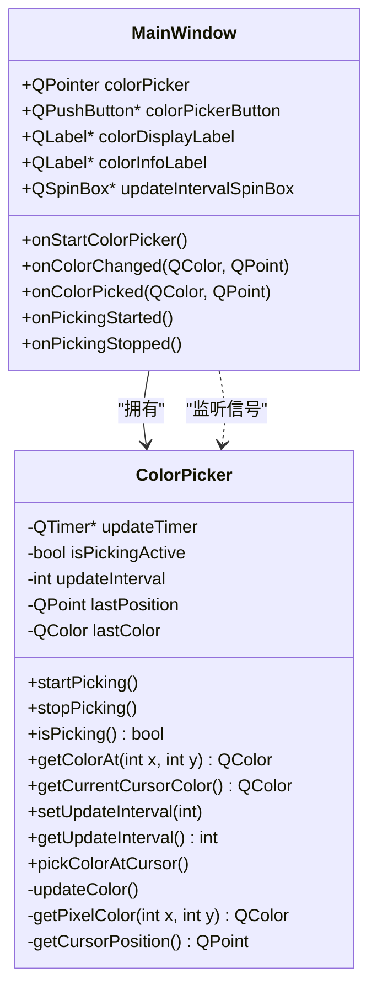
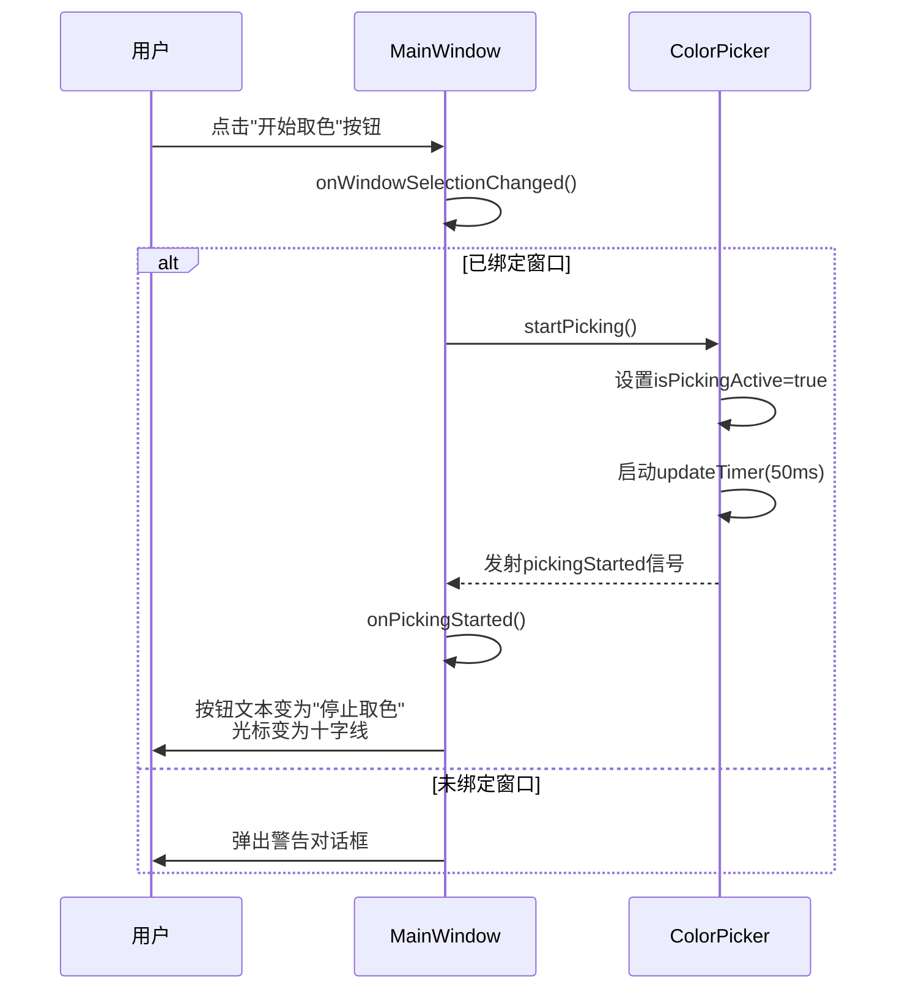
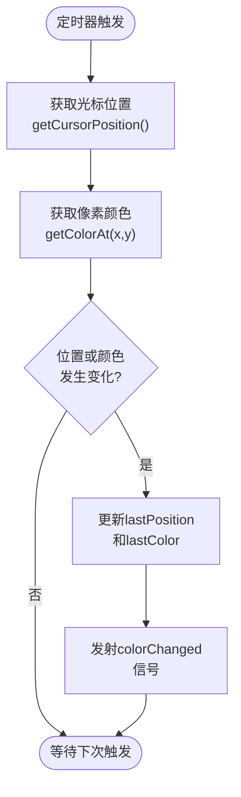
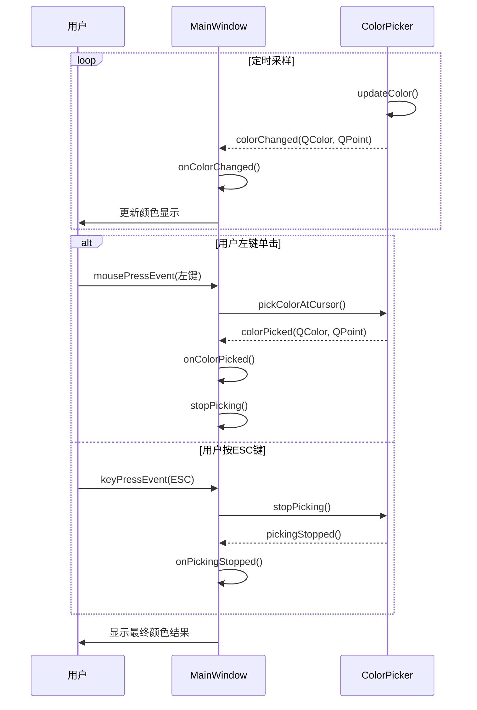

# 颜色拾取功能

<cite>
**Referenced Files in This Document **   
- [MainWindow.cpp](file://src/ui/MainWindow.cpp)
- [MainWindow.h](file://include/ui/MainWindow.h)
- [ColorPicker.cpp](file://src/core/ColorPicker.cpp)
- [ColorPicker.h](file://include/core/ColorPicker.h)
- [AsyncLogger.h](file://include/utils/AsyncLogger.h)
</cite>

## 目录
1. [颜色拾取流程概述](#颜色拾取流程概述)
2. [核心组件与信号连接](#核心组件与信号连接)
3. [启动与停止取色](#启动与停止取色)
4. [实时颜色监控机制](#实时颜色监控机制)
5. [用户交互与终止](#用户交互与终止)
6. [采样频率调节](#采样频率调节)
7. [应用实例与问题应对](#应用实例与问题应对)

## 颜色拾取流程概述

本系统中的颜色拾取功能是一个完整的闭环工作流，从用户点击“开始取色”按钮触发，到最终获取并记录屏幕上的颜色值。该流程涉及 `MainWindow` 和 `ColorPicker` 两个核心类的协同工作。

当用户在绑定窗口后点击“开始取色”按钮时，`MainWindow` 的 `onStartColorPicker` 槽函数被调用。此函数首先检查窗口绑定状态，若未绑定则提示错误；若已绑定，则调用 `ColorPicker` 实例的 `startPicking` 方法来激活取色模式。一旦进入取色模式，`ColorPicker` 会启动一个定时器，以设定的间隔（默认50ms）持续采样鼠标光标下的屏幕像素颜色，并通过 `colorChanged` 信号将结果反馈给主窗口。

主窗口接收到 `colorChanged` 信号后，执行 `onColorChanged` 槽函数，更新界面上的颜色显示标签和信息标签，实时展示当前光标位置的RGB值和十六进制颜色码。用户可以通过左键单击或按下ESC键来捕获并确认最终的颜色，此时会触发 `onColorPicked` 槽函数，完成整个取色过程。

**Section sources**
- [MainWindow.cpp](file://src/ui/MainWindow.cpp#L278-L313)
- [ColorPicker.cpp](file://src/core/ColorPicker.cpp#L39-L45)

## 核心组件与信号连接

颜色拾取功能的实现依赖于 `MainWindow` 和 `ColorPicker` 类之间的紧密协作，这种协作通过Qt的信号与槽机制建立。

`MainWindow` 类持有一个 `ColorPicker` 对象的指针，并在 `connectSignals` 函数中建立了关键的信号-槽连接：
- `colorPickerButton` 的 `clicked` 信号连接到 `onStartColorPicker` 槽。
- `ColorPicker` 的 `colorChanged` 信号连接到 `onColorChanged` 槽。
- `ColorPicker` 的 `colorPicked` 信号连接到 `onColorPicked` 槽。
- `updateIntervalSpinBox` 的 `valueChanged` 信号连接到 `ColorPicker` 的 `setUpdateInterval` 槽。

**Diagram sources **
- [MainWindow.h](file://include/ui/MainWindow.h#L50-L108)
- [ColorPicker.h](file://include/core/ColorPicker.h#L15-L58)

**Section sources**
- [MainWindow.cpp](file://src/ui/MainWindow.cpp#L150-L180)
- [ColorPicker.h](file://include/core/ColorPicker.h#L15-L58)

## 启动与停止取色

取色过程的启动由 `MainWindow::onStartColorPicker` 函数控制。该函数是“开始取色”按钮的槽函数，其主要职责是作为用户操作与底层取色逻辑之间的协调者。

当用户点击按钮时，函数首先通过 `windowManager->isBound()` 检查是否已成功绑定目标窗口。这是确保后续操作有效性的必要前提。如果未绑定，函数会弹出警告对话框并记录错误日志。如果已绑定，函数会检查 `ColorPicker` 当前是否处于取色状态。若未处于取色状态，则调用 `colorPicker->startPicking()` 开始取色；反之，则调用 `colorPicker->stopPicking()` 停止取色。

`ColorPicker::startPicking` 方法负责实际的取色激活。它将内部标志 `isPickingActive` 设为 `true`，然后启动 `updateTimer` 定时器。定时器的超时间隔由 `updateInterval` 决定。一旦定时器启动，它会周期性地触发 `updateColor` 私有槽函数，从而开启实时采样循环。

**Diagram sources **
- [MainWindow.cpp](file://src/ui/MainWindow.cpp#L278-L289)
- [ColorPicker.cpp](file://src/core/ColorPicker.cpp#L39-L45)

**Section sources**
- [MainWindow.cpp](file://src/ui/MainWindow.cpp#L278-L289)
- [ColorPicker.cpp](file://src/core/ColorPicker.cpp#L39-L45)

## 实时颜色监控机制

在取色模式激活期间，`ColorPicker` 通过一个高效的定时采样机制来实现实时颜色监控。其核心是 `updateTimer` 定时器，它每隔 `updateInterval` 毫秒就触发一次 `updateColor` 私有槽函数。

`updateColor` 函数的执行流程如下：首先，它获取当前鼠标光标的屏幕坐标。接着，它使用 `getColorAt` 方法查询该坐标处的像素颜色。为了优化性能，函数会比较新获取的位置和颜色与上一次的结果。只有当位置发生变化或颜色值不同时，才会更新内部缓存 (`lastPosition`, `lastColor`) 并发射 `colorChanged` 信号。这种变化检测机制避免了不必要的信号发射和界面刷新，显著降低了CPU占用率。

`getColorAt` 方法最终调用私有的 `getPixelColor` 函数，该函数在Windows平台上利用Win32 API的 `GetDC`、`GetPixel` 和 `ReleaseDC` 函数来精确读取屏幕指定坐标的颜色值。获取到的 `COLORREF` 值会被解析为Qt的 `QColor` 对象。

主窗口接收到 `colorChanged` 信号后，执行 `onColorChanged` 槽函数。该函数调用 `updateColorDisplay` 来更新UI。`colorDisplayLabel` 的背景色被设置为当前颜色，其文字内容显示RGB和十六进制值。`colorInfoLabel` 则显示更详细的位置和颜色信息。

**Diagram sources **
- [ColorPicker.cpp](file://src/core/ColorPicker.cpp#L90-L125)
- [MainWindow.cpp](file://src/ui/MainWindow.cpp#L294-L300)

**Section sources**
- [ColorPicker.cpp](file://src/core/ColorPicker.cpp#L90-L125)
- [MainWindow.cpp](file://src/ui/MainWindow.cpp#L294-L300)

## 用户交互与终止

用户可以通过两种方式终止取色过程并捕获最终的颜色：左键单击或按下ESC键。

左键单击的处理发生在 `MainWindow` 的 `mousePressEvent` 重写函数中。当 `ColorPicker` 处于取色状态 (`isPicking()`) 且事件为左键单击时，函数会立即调用 `colorPicker->pickColorAtCursor()`。此方法会获取当前光标下的颜色，并直接发射 `colorPicked` 信号，从而触发 `onColorPicked` 槽函数。

按下ESC键的处理发生在 `keyPressEvent` 重写函数中。当检测到 `Qt::Key_Escape` 键被按下且取色正在进行时，函数会调用 `colorPicker->stopPicking()` 来停止取色。这会关闭定时器并发射 `pickingStopped` 信号。

`onColorPicked` 槽函数是取色完成后的处理中心。它首先调用 `updateColorDisplay` 更新UI，然后停止取色过程（以防通过单击方式触发时未自动停止），最后更新状态栏信息并记录一条包含颜色、位置和窗口信息的日志。

**Diagram sources **
- [MainWindow.cpp](file://src/ui/MainWindow.cpp#L313-L325)
- [MainWindow.cpp](file://src/ui/MainWindow.cpp#L380-L390)

**Section sources**
- [MainWindow.cpp](file://src/ui/MainWindow.cpp#L313-L325)
- [MainWindow.cpp](file://src/ui/MainWindow.cpp#L380-L390)

## 采样频率调节

系统的采样频率由 `updateIntervalSpinBox` 控件进行调节。这是一个范围在10到1000毫秒之间的 `QSpinBox`，允许用户根据需要调整颜色采样的速度。

该控件与 `ColorPicker` 模块的连接是在 `MainWindow::connectSignals` 函数中建立的。`updateIntervalSpinBox` 的 `valueChanged` 信号直接连接到 `colorPicker` 对象的 `setUpdateInterval` 槽函数。

`ColorPicker::setUpdateInterval` 方法不仅更新内部的 `updateInterval` 成员变量，还会检查定时器是否正在运行。如果是，则立即调用 `updateTimer->setInterval(updateInterval)` 来动态改变定时器的超时间隔。这意味着用户可以在取色过程中实时调整采样频率，而无需重启取色过程。

较高的采样频率（如10ms）能提供更流畅的实时预览，但会增加CPU负载；较低的频率（如500ms以上）则更节能，适合对实时性要求不高的场景。

**Section sources**
- [MainWindow.cpp](file://src/ui/MainWindow.cpp#L175-L176)
- [ColorPicker.cpp](file://src/core/ColorPicker.cpp#L78-L85)

## 应用实例与问题应对

### 应用实例

颜色拾取功能可广泛应用于以下场景：
- **设计辅助**：设计师可以快速获取屏幕上任何元素的颜色值，用于配色方案的复制或分析。
- **自动化测试**：在UI自动化脚本中，通过检测特定区域的颜色变化来判断程序状态或验证渲染结果。
- **游戏开发**：用于调试游戏内物品或角色的着色效果。

### 问题应对

一个潜在的问题是高DPI缩放导致的坐标偏差。现代操作系统支持高DPI显示，这可能导致应用程序获取的屏幕坐标与物理像素坐标之间存在比例关系。

为应对此问题，应在获取屏幕坐标后进行适当的缩放转换。Qt提供了 `QScreen` 类来查询DPI信息。例如，在 `getCursorPosition` 中，可以先获取主屏幕的设备像素比（devicePixelRatio），然后将原始坐标除以该比率，以获得与物理像素匹配的坐标。

此外，`AsyncLogger` 组件为整个功能提供了完善的日志记录。所有关键操作，如启动/停止取色、捕获颜色等，都会生成结构化的日志条目，便于问题追踪和用户行为分析。

**Section sources**
- [MainWindow.cpp](file://src/ui/MainWindow.cpp#L313-L325)
- [AsyncLogger.h](file://include/utils/AsyncLogger.h#L1-L128)