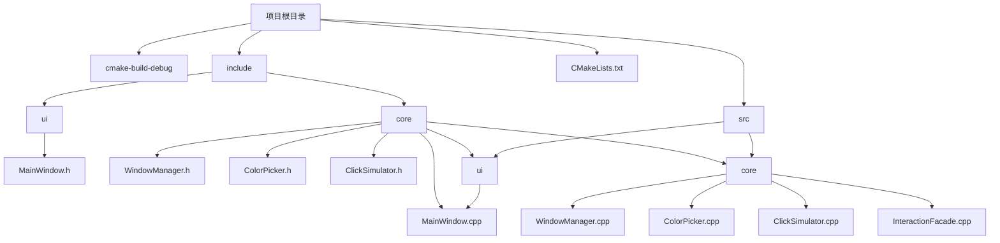
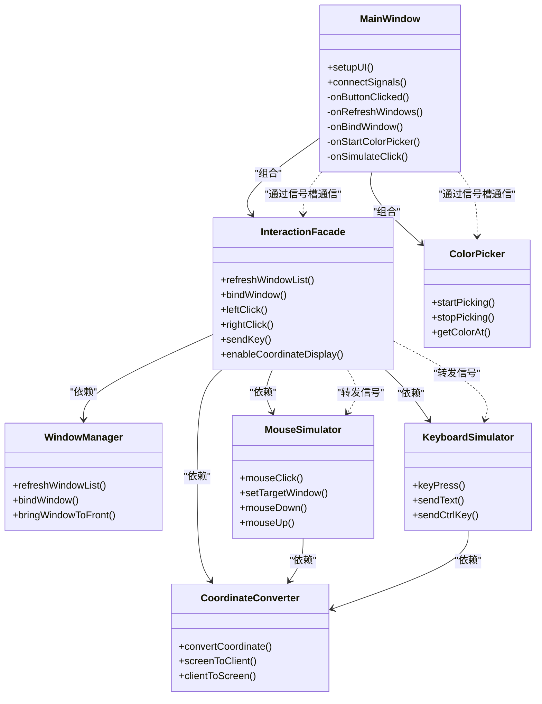
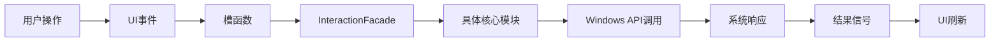
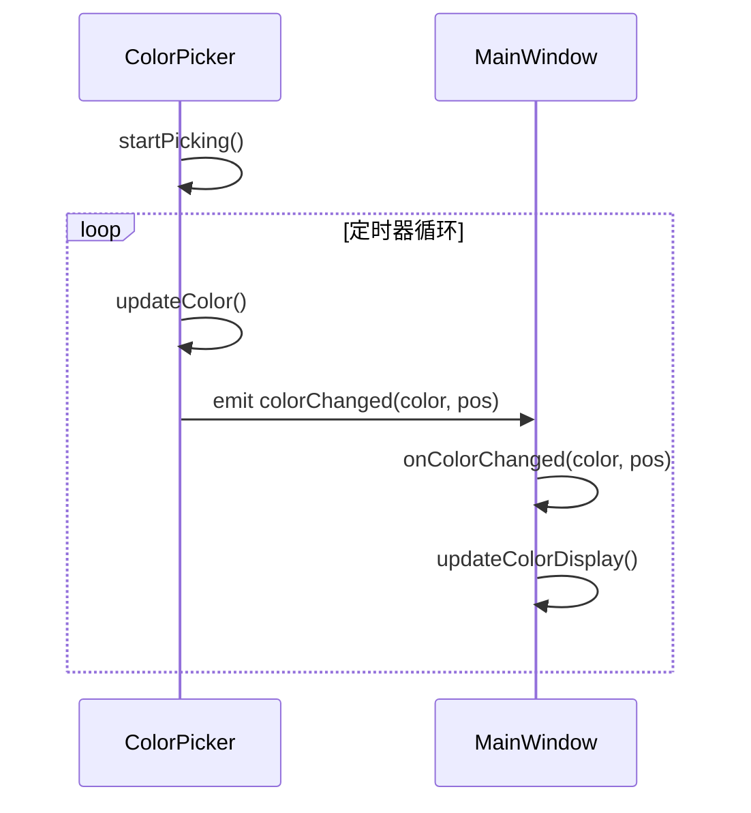

<docs>
# 技术架构详解

<cite>
**本文档引用的文件**
- [MainWindow.h](file://include/ui/MainWindow.h)
- [MainWindow.cpp](file://src/ui/MainWindow.cpp)
- [WindowManager.h](file://include/core/WindowManager.h)
- [WindowManager.cpp](file://src/core/WindowManager.cpp)
- [ColorPicker.h](file://include/core/ColorPicker.h)
- [ColorPicker.cpp](file://src/core/ColorPicker.cpp)
- [ClickSimulator.h](file://include/core/ClickSimulator.h)
- [ClickSimulator.cpp](file://src/core/ClickSimulator.cpp)
- [InteractionFacade.h](file://include/core/InteractionFacade.h)
- [InteractionFacade.cpp](file://src/core/InteractionFacade.cpp)
- [MouseSimulator.h](file://include/core/MouseSimulator.h)
- [KeyboardSimulator.h](file://include/core/KeyboardSimulator.h)
- [CoordinateConverter.h](file://include/core/CoordinateConverter.h)
- [API_OVERVIEW_CORE.md](file://src/core/API_OVERVIEW_CORE.md) - *新增核心层API概览文档*
- [API_OVERVIEW_UI.md](file://src/ui/API_OVERVIEW_UI.md) - *新增UI层API概览文档*
</cite>

## 更新摘要
**变更内容**
- 新增核心层与UI层的API概览文档引用，增强架构可理解性
- 更新MVC分层架构设计，反映新的模块化设计
- 扩展核心模块职责分析，包含新引入的`InteractionFacade`等模块
- 修订组件交互与数据流，体现新的外观模式通信机制
- 更新设计模式应用解析，增加外观模式说明
- 修订信号槽通信机制，反映新的信号连接方式

## 目录
1. [项目结构概览](#项目结构概览)
2. [MVC分层架构设计](#mvc分层架构设计)
3. [核心模块职责分析](#核心模块职责分析)
4. [组件交互与数据流](#组件交互与数据流)
5. [设计模式应用解析](#设计模式应用解析)
6. [信号槽通信机制](#信号槽通信机制)
7. [系统优势与可扩展性](#系统优势与可扩展性)

## 项目结构概览

本项目采用清晰的分层目录结构，将UI界面与核心业务逻辑分离。`include`目录下分为`ui`和`core`两个子模块，分别存放视图层和模型层头文件；`src`目录对应实现文件。这种组织方式体现了高内聚低耦合的设计原则。

**图示来源**
- [MainWindow.h](file://include/ui/MainWindow.h)
- [InteractionFacade.h](file://include/core/InteractionFacade.h)
- [WindowManager.h](file://include/core/WindowManager.h)
- [ColorPicker.h](file://include/core/ColorPicker.h)
- [MouseSimulator.h](file://include/core/MouseSimulator.h)
- [KeyboardSimulator.h](file://include/core/KeyboardSimulator.h)

**本节来源**
- [include/ui/MainWindow.h](file://include/ui/MainWindow.h)
- [include/core/InteractionFacade.h](file://include/core/InteractionFacade.h)
- [include/core/WindowManager.h](file://include/core/WindowManager.h)
- [include/core/ColorPicker.h](file://include/core/ColorPicker.h)
- [include/core/MouseSimulator.h](file://include/core/MouseSimulator.h)
- [include/core/KeyboardSimulator.h](file://include/core/KeyboardSimulator.h)

## MVC分层架构设计

系统采用类MVC（Model-View-Controller）架构模式，实现了关注点分离：

- **视图层（View）**：由`MainWindow`类及其包含的UI控件构成，负责用户界面展示与输入捕获。
- **控制层（Controller）**：体现在`MainWindow`中的各类槽函数（slots），响应UI事件并协调模型层操作。
- **模型层（Model）**：由`InteractionFacade`、`WindowManager`、`ColorPicker`、`MouseSimulator`和`KeyboardSimulator`等多个核心模块承担，负责具体的数据处理与系统交互。

**图示来源**
- [MainWindow.h](file://include/ui/MainWindow.h#L23-L147)
- [InteractionFacade.h](file://include/core/InteractionFacade.h#L29-L116)
- [WindowManager.h](file://include/core/WindowManager.h#L22-L61)
- [ColorPicker.h](file://include/core/ColorPicker.h#L12-L56)
- [MouseSimulator.h](file://include/core/MouseSimulator.h#L12-L70)
- [KeyboardSimulator.h](file://include/core/KeyboardSimulator.h#L11-L64)
- [CoordinateConverter.h](file://include/core/CoordinateConverter.h#L11-L54)

**本节来源**
- [MainWindow.h](file://include/ui/MainWindow.h#L23-L147)
- [InteractionFacade.h](file://include/core/InteractionFacade.h#L29-L116)
- [WindowManager.h](file://include/core/WindowManager.h#L22-L61)
- [ColorPicker.h](file://include/core/ColorPicker.h#L12-L56)
- [MouseSimulator.h](file://include/core/MouseSimulator.h#L12-L70)
- [KeyboardSimulator.h](file://include/core/KeyboardSimulator.h#L11-L64)
- [CoordinateConverter.h](file://include/core/CoordinateConverter.h#L11-L54)

## 核心模块职责分析

### InteractionFacade 模块
作为系统的外观模式实现，提供统一的交互入口，封装了底层模块的复杂性。它聚合了`WindowManager`、`MouseSimulator`、`KeyboardSimulator`等核心模块，并通过依赖注入建立模块间关系，为`MainWindow`提供简化的高层接口。

**本节来源**
- [InteractionFacade.h](file://include/core/InteractionFacade.h#L29-L116)
- [InteractionFacade.cpp](file://src/core/InteractionFacade.cpp#L10-L292)

### WindowManager 模块
作为窗口管理模型，负责枚举系统窗口、维护窗口列表、绑定目标窗口及执行窗口操作（如置顶）。通过Windows API实现底层功能，并提供安全的C++接口。

**本节来源**
- [WindowManager.h](file://include/core/WindowManager.h#L22-L61)
- [WindowManager.cpp](file://src/core/WindowManager.cpp#L10-L15)

### ColorPicker 模块
实现颜色拾取功能，支持实时跟踪鼠标位置的颜色变化，并可通过点击获取精确颜色值。使用`QTimer`定期更新，确保性能与用户体验的平衡。

**本节来源**
- [ColorPicker.h](file://include/core/ColorPicker.h#L12-L56)
- [ColorPicker.cpp](file://src/core/ColorPicker.cpp#L17-L24)

### MouseSimulator 模块
专门负责鼠标操作模拟，支持多种坐标系（屏幕、窗口、客户区）、不同按键类型及单双击操作。通过Windows消息机制发送`WM_LBUTTONDOWN`等消息实现真实点击效果。

**本节来源**
- [MouseSimulator.h](file://include/core/MouseSimulator.h#L12-L70)
- [MouseSimulator.cpp](file://src/core/MouseSimulator.cpp#L10-L85)

### KeyboardSimulator 模块
专门负责键盘操作模拟，支持单键、组合键及文本输入。通过Windows消息机制发送`WM_KEYDOWN`等消息实现真实按键效果。

**本节来源**
- [KeyboardSimulator.h](file://include/core/KeyboardSimulator.h#L11-L64)
- [KeyboardSimulator.cpp](file://src/core/KeyboardSimulator.cpp#L10-L78)

### CoordinateConverter 模块
负责不同坐标系之间的转换计算，是所有需要坐标转换功能模块的基础服务。支持屏幕坐标、窗口坐标和客户区坐标之间的相互转换。

**本节来源**
- [CoordinateConverter.h](file://include/core/CoordinateConverter.h#L11-L54)
- [CoordinateConverter.cpp](file://src/core/CoordinateConverter.cpp#L10-L67)

## 组件交互与数据流

系统遵循清晰的数据流动路径：用户操作触发UI事件 → 控制层槽函数响应 → 调用`InteractionFacade`统一接口 → 分发到具体核心模块处理 → 调用Windows API执行系统操作 → 结果以信号形式返回 → UI根据信号刷新状态。

**图示来源**
- [MainWindow.cpp](file://src/ui/MainWindow.cpp#L276-L291)
- [InteractionFacade.cpp](file://src/core/InteractionFacade.cpp#L150-L292)
- [MouseSimulator.cpp](file://src/core/MouseSimulator.cpp#L36-L76)

**本节来源**
- [MainWindow.cpp](file://src/ui/MainWindow.cpp#L276-L291)
- [InteractionFacade.cpp](file://src/core/InteractionFacade.cpp#L150-L292)
- [MouseSimulator.cpp](file://src/core/MouseSimulator.cpp#L36-L76)

## 设计模式应用解析

### 观察者模式
Qt的信号槽机制是观察者模式的典型应用。例如`ColorPicker`发出`colorChanged`信号，`MainWindow`作为观察者连接该信号并更新UI显示。

**图示来源**
- [ColorPicker.h](file://include/core/ColorPicker.h#L50-L52)
- [MainWindow.cpp](file://src/ui/MainWindow.cpp#L178-L211)
- [MainWindow.cpp](file://src/ui/MainWindow.cpp#L293-L296)

### 组合模式
`MainWindow`通过成员变量聚合三个核心模块实例，形成整体-部分关系，便于统一管理和生命周期控制。

**本节来源**
- [MainWindow.h](file://include/ui/MainWindow.h#L50-L52)

### 状态模式
各功能模块内部维护自身状态，如`ColorPicker`的`isPickingActive`标志位控制取色器的启动/停止状态，体现状态模式思想。

