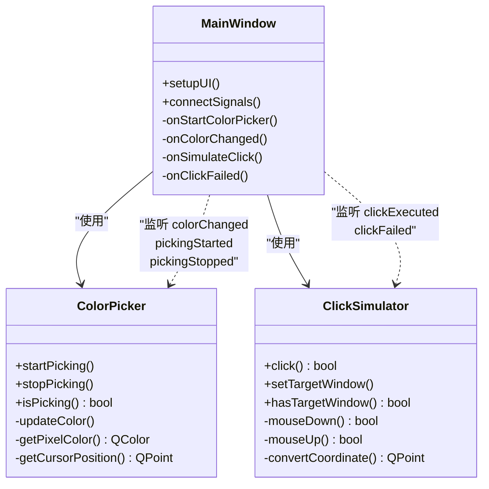
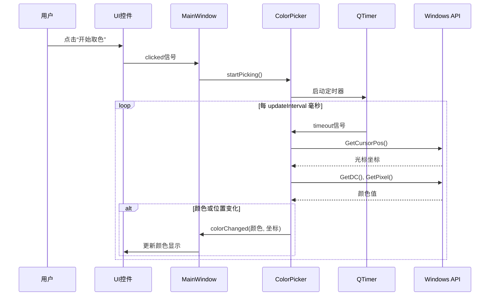
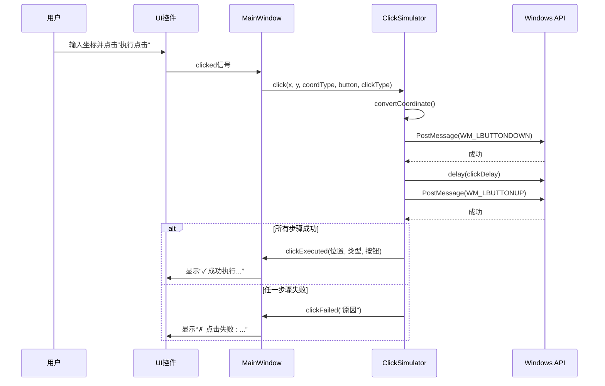

# 数据流动路径

<cite>
**Referenced Files in This Document **   
- [MainWindow.cpp](file://src/ui/MainWindow.cpp)
- [MainWindow.h](file://include/ui/MainWindow.h)
- [ColorPicker.cpp](file://src/core/ColorPicker.cpp)
- [ColorPicker.h](file://include/core/ColorPicker.h)
- [ClickSimulator.cpp](file://src/core/ClickSimulator.cpp)
- [ClickSimulator.h](file://include/core/ClickSimulator.h)
- [WindowManager.cpp](file://src/core/WindowManager.cpp)
- [WindowManager.h](file://include/core/WindowManager.h)
</cite>

## 目录
1. [数据流动概述](#数据流动概述)
2. [核心模块与信号槽机制](#核心模块与信号槽机制)
3. [异步取色操作的数据流](#异步取色操作的数据流)
4. [同步点击模拟的数据流](#同步点击模拟的数据流)
5. [错误处理路径](#错误处理路径)
6. [坐标转换与窗口管理](#坐标转换与窗口管理)
7. [总结](#总结)

## 数据流动概述

本系统采用Qt框架的信号与槽（Signal & Slot）机制实现组件间的松耦合通信。整个系统的数据流动始于用户在图形界面（UI）上的操作，这些操作触发相应的信号，进而激活`MainWindow`中的槽函数。槽函数作为控制中心，协调调用各个核心模块（如`ColorPicker`、`ClickSimulator`）的方法进行业务逻辑处理。处理结果通过自定义信号返回给`MainWindow`，最终更新UI或执行底层Windows API操作。

数据流主要分为两大类：
- **异步操作**：以定时器驱动的持续性任务，如颜色拾取。
- **同步操作**：立即执行并返回结果的任务，如单次鼠标点击。

所有核心模块均继承自`QObject`，确保了信号槽机制的正常工作，并且它们都封装了对Windows API的调用，实现了跨平台应用与操作系统底层功能的交互。

## 核心模块与信号槽机制

系统的核心由`MainWindow`、`ColorPicker`和`ClickSimulator`三个类构成，它们通过Qt的信号槽机制紧密协作。

**Diagram sources**
- [MainWindow.h](file://include/ui/MainWindow.h#L1-L109)
- [ColorPicker.h](file://include/core/ColorPicker.h#L1-L59)
- [ClickSimulator.h](file://include/core/ClickSimulator.h#L1-L99)

**Section sources**
- [MainWindow.cpp](file://src/ui/MainWindow.cpp#L1-L491)
- [ColorPicker.cpp](file://src/core/ColorPicker.cpp#L1-L126)
- [ClickSimulator.cpp](file://src/core/ClickSimulator.cpp#L1-L288)

## 异步取色操作的数据流

异步取色操作是一个典型的事件驱动、定时循环的数据流过程。其完整路径如下：

1.  **用户操作**：用户点击UI界面上的“开始取色”按钮。
2.  **信号触发**：该按钮的`clicked`信号被发射。
3.  **槽函数激活**：`MainWindow`中连接的`onStartColorPicker`槽函数被调用。
4.  **核心模块调用**：`onStartColorPicker`检查窗口绑定状态后，调用`ColorPicker::startPicking()`方法。
5.  **启动定时器**：`startPicking()`方法启动一个`QTimer`，设置为每`updateInterval`毫秒触发一次`timeout`信号。
6.  **定时获取数据**：`timeout`信号连接到`ColorPicker`内部的`updateColor()`槽函数。该函数执行以下操作：
    -   调用`getCursorPosition()`通过`GetCursorPos` Windows API获取当前鼠标光标在屏幕上的绝对坐标。
    -   调用`getColorAt()`，后者进一步调用`getPixelColor()`，通过`GetDC`和`GetPixel` Windows API获取指定坐标的像素颜色值。
    -   如果颜色或位置发生变化，则记录新值。
7.  **发出变化信号**：如果检测到颜色或位置变化，`updateColor()`会发射`colorChanged(const QColor&, const QPoint&)`信号。
8.  **UI更新**：`MainWindow`中连接的`onColorChanged`槽函数接收到信号，调用`updateColorDisplay()`方法，将新的颜色信息实时显示在UI上。

此过程将持续进行，直到用户再次点击按钮（此时`onStartColorPicker`会调用`stopPicking()`停止定时器）或按下ESC键。

**Diagram sources**
- [MainWindow.cpp](file://src/ui/MainWindow.cpp#L280-L299)
- [ColorPicker.cpp](file://src/core/ColorPicker.cpp#L30-L75)

**Section sources**
- [MainWindow.cpp](file://src/ui/MainWindow.cpp#L280-L299)
- [ColorPicker.cpp](file://src/core/ColorPicker.cpp#L30-L75)

## 同步点击模拟的数据流

同步点击模拟操作是即时响应的，其数据流相对直接：

1.  **用户操作**：用户在UI上输入坐标并点击“执行点击”按钮。
2.  **信号触发**：按钮的`clicked`信号被发射。
3.  **槽函数激活**：`MainWindow`中的`onSimulateClick`槽函数被调用。
4.  **参数解析与验证**：`onSimulateClick`解析输入的坐标字符串，验证目标窗口是否已绑定。
5.  **核心模块调用**：调用`ClickSimulator::click()`方法，传入解析后的坐标、坐标类型、鼠标按键和点击类型。
6.  **坐标转换**：`click()`方法根据指定的`CoordinateType`（屏幕、窗口、客户区），调用`convertCoordinate()`将输入坐标统一转换为目标窗口的客户区坐标。
7.  **发送Windows消息**：`click()`方法调用`mouseDown()`和`mouseUp()`，它们使用`PostMessage` Windows API向目标窗口句柄发送`WM_LBUTTONDOWN`、`WM_LBUTTONUP`等消息来模拟鼠标点击。
8.  **结果反馈**：如果`PostMessage`调用成功，`click()`方法返回`true`；否则返回`false`。
9.  **信号传播**：根据执行结果，`ClickSimulator`会发射`clickExecuted`或`clickFailed`信号。
10. **UI更新**：`MainWindow`中的`onClickExecuted`或`onClickFailed`槽函数更新状态栏显示操作结果。

**Diagram sources**
- [MainWindow.cpp](file://src/ui/MainWindow.cpp#L380-L430)
- [ClickSimulator.cpp](file://src/core/ClickSimulator.cpp#L50-L150)

**Section sources**
- [MainWindow.cpp](file://src/ui/MainWindow.cpp#L380-L430)
- [ClickSimulator.cpp](file://src/core/ClickSimulator.cpp#L50-L150)

## 错误处理路径

系统设计了明确的错误处理路径，确保用户能及时获知操作失败的原因。

1.  **错误检测**：在`ClickSimulator`的`click()`方法中，首先通过`hasTargetWindow()`检查目标窗口的有效性。如果无效，则立即判定为失败。
2.  **错误信号发射**：当检测到错误（如无目标窗口、`PostMessage`失败）时，`ClickSimulator`会调用`emit clickFailed(reason)`，发射带有具体原因字符串的信号。
3.  **错误信号接收**：`MainWindow`在`connectSignals()`中已将`ClickSimulator::clickFailed`信号连接到自身的`onClickFailed`槽函数。
4.  **UI反馈**：`onClickFailed`槽函数接收错误原因，调用`updateClickStatus(message, true)`，将状态栏文本更新为错误信息，并将其样式设置为红色背景，以视觉方式提示用户。

此路径清晰地将底层模块的错误信息逐级传递至UI层，实现了错误的集中处理和可视化。

**Section sources**
- [ClickSimulator.cpp](file://src/core/ClickSimulator.cpp#L50-L100)
- [MainWindow.cpp](file://src/ui/MainWindow.cpp#L430-L450)

## 坐标转换与窗口管理

`WindowManager`模块负责管理外部窗口的句柄和信息，为`ClickSimulator`提供必要的上下文。

1.  **窗口枚举**：`WindowManager`使用`EnumWindows` Windows API回调函数遍历所有可见窗口，收集其句柄、标题、类名和矩形区域。
2.  **窗口绑定**：用户选择一个窗口后，`MainWindow`调用`bindWindow(index)`，将选中的窗口句柄存储在`boundWindow`成员变量中。
3.  **坐标系支持**：`ClickSimulator`支持三种坐标系：
    -   **屏幕坐标 (Screen)**：相对于整个显示器左上角的绝对坐标。
    -   **窗口坐标 (Window)**：相对于目标窗口左上角的坐标。
    -   **客户区坐标 (Client)**：相对于目标窗口内容区域（不含标题栏和边框）左上角的坐标。
4.  **坐标转换**：`ClickSimulator`内部的`convertCoordinate()`方法利用`GetWindowRect`、`GetClientRect`、`ScreenToClient`和`ClientToScreen`等Windows API，在不同坐标系之间进行精确转换，确保点击指令能在正确的物理位置生效。

这种设计极大地提升了系统的灵活性和易用性，用户可以根据需要选择最方便的坐标输入方式。

**Section sources**
- [WindowManager.cpp](file://src/core/WindowManager.cpp#L1-L170)
- [ClickSimulator.cpp](file://src/core/ClickSimulator.cpp#L200-L280)

## 总结

本系统通过Qt的信号槽机制构建了一个清晰、高效的数据流动架构。从用户操作出发，事件被路由到`MainWindow`的槽函数，再分发给`ColorPicker`和`ClickSimulator`等核心模块进行处理。异步操作（如取色）依赖于定时器循环，而同步操作（如点击）则直接调用并返回结果。错误处理通过专门的信号链路进行传播，确保了良好的用户体验。`WindowManager`提供了关键的窗口管理和坐标转换能力，使得核心模块能够准确地与外部应用程序交互。整个流程体现了高内聚、低耦合的设计原则。