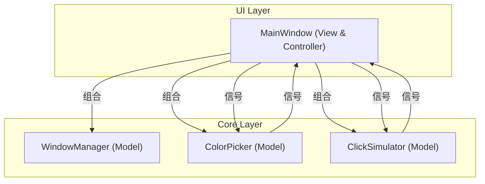
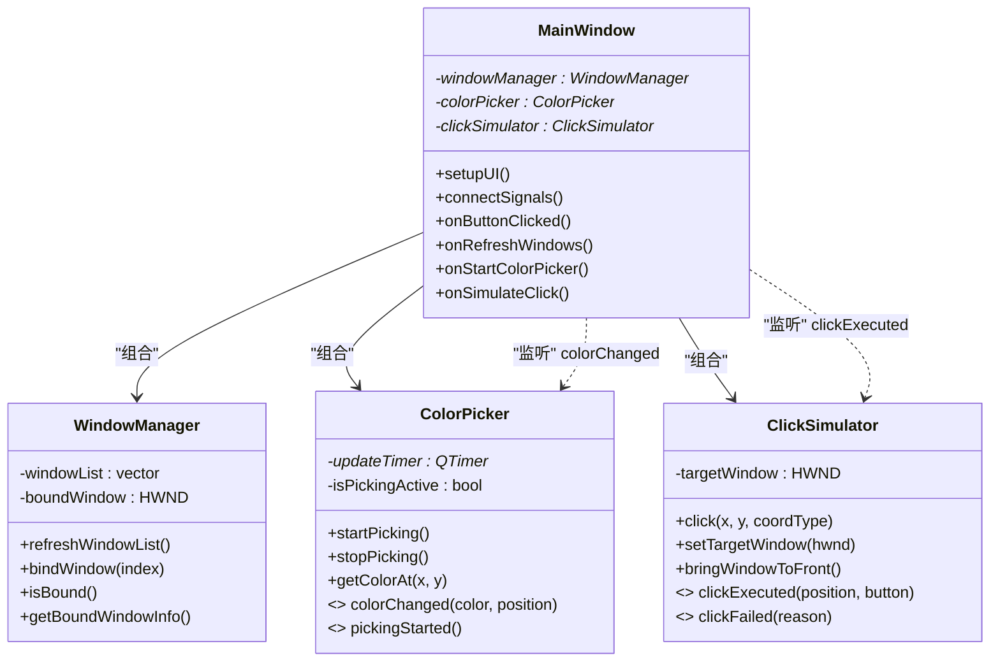
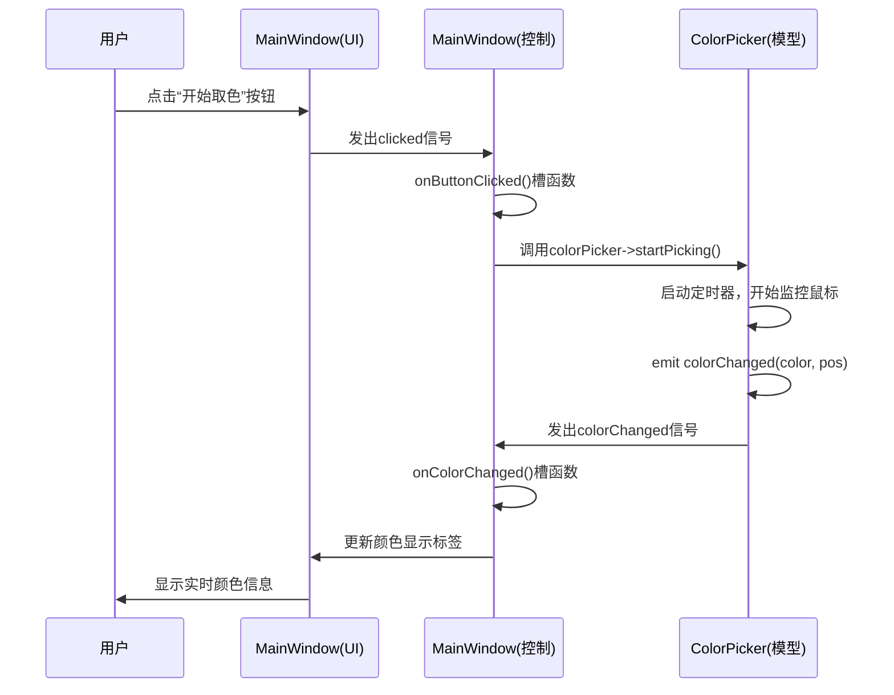
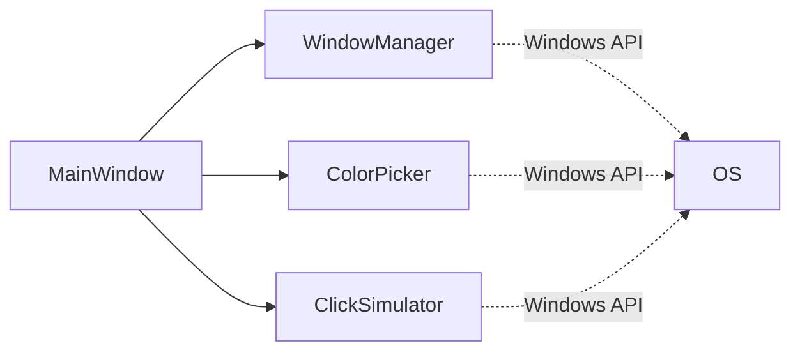

# 整体架构设计

<cite>
**Referenced Files in This Document **  
- [MainWindow.h](file://include/ui/MainWindow.h)
- [MainWindow.cpp](file://src/ui/MainWindow.cpp)
- [WindowManager.h](file://include/core/WindowManager.h)
- [WindowManager.cpp](file://src/core/WindowManager.cpp)
- [ColorPicker.h](file://include/core/ColorPicker.h)
- [ColorPicker.cpp](file://src/core/ColorPicker.cpp)
- [ClickSimulator.h](file://include/core/ClickSimulator.h)
- [ClickSimulator.cpp](file://src/core/ClickSimulator.cpp)
</cite>

## 目录
1. [引言](#引言)
2. [项目结构](#项目结构)
3. [核心组件](#核心组件)
4. [架构概览](#架构概览)
5. [详细组件分析](#详细组件分析)
6. [依赖关系分析](#依赖关系分析)
7. [性能考量](#性能考量)
8. [故障排除指南](#故障排除指南)
9. [结论](#结论)

## 引言

本系统采用类MVC（Model-View-Controller）的分层架构模式，旨在实现高内聚、低耦合的设计目标。该架构将应用程序划分为三个逻辑层次：视图层负责用户界面展示与交互，控制层处理用户事件并协调业务逻辑，模型层则专注于数据处理和核心功能实现。通过Qt框架的信号与槽机制，各层之间实现了松耦合通信，极大地提升了代码的可维护性和可扩展性。本文档旨在为开发者提供系统的全景认知，深入剖析各组件间的职责划分、调用关系与依赖方向。

## 项目结构

项目遵循清晰的目录结构，按功能模块进行组织：
- `include/` 和 `src/` 分别存放头文件和源文件。
- `ui/` 子目录包含视图层的核心类 `MainWindow`。
- `core/` 子目录包含模型层的三大核心模块：`WindowManager`、`ColorPicker` 和 `ClickSimulator`。
- 构建产物位于 `cmake-build-debug/` 目录下。

这种物理分离强化了逻辑分层，使代码结构一目了然。

**Diagram sources**
- [MainWindow.h](file://include/ui/MainWindow.h#L23-L106)
- [WindowManager.h](file://include/core/WindowManager.h#L22-L61)
- [ColorPicker.h](file://include/core/ColorPicker.h#L12-L56)
- [ClickSimulator.h](file://include/core/ClickSimulator.h#L27-L96)

**Section sources**
- [MainWindow.h](file://include/ui/MainWindow.h#L23-L106)
- [WindowManager.h](file://include/core/WindowManager.h#L22-L61)
- [ColorPicker.h](file://include/core/ColorPicker.h#L12-L56)
- [ClickSimulator.h](file://include/core/ClickSimulator.h#L27-L96)

## 核心组件

系统的核心由四个主要组件构成：`MainWindow` 作为视图与控制器的中心枢纽，以及 `WindowManager`、`ColorPicker` 和 `ClickSimulator` 三个独立的模型层模块。`MainWindow` 在其构造函数中通过指针成员变量聚合这三个核心模块的实例，形成一种组合关系，而非继承，这保证了模块间的独立性。

**Section sources**
- [MainWindow.cpp](file://src/ui/MainWindow.cpp#L10-L18)
- [MainWindow.h](file://include/ui/MainWindow.h#L70-L72)

## 架构概览

整个系统呈现出典型的类MVC架构。`MainWindow` 类不仅定义了所有UI控件，还包含了响应这些控件事件的槽函数，因此它同时承担了视图（View）和控制器（Controller）的角色。而 `WindowManager`、`ColorPicker` 和 `ClickSimulator` 这三个类则封装了具体的业务逻辑和数据操作，构成了模型（Model）层。

**Diagram sources**
- [MainWindow.h](file://include/ui/MainWindow.h#L23-L106)
- [WindowManager.h](file://include/core/WindowManager.h#L22-L61)
- [ColorPicker.h](file://include/core/ColorPicker.h#L12-L56)
- [ClickSimulator.h](file://include/core/ClickSimulator.h#L27-L96)

## 详细组件分析

### MainWindow 分析

`MainWindow` 是整个应用的入口和核心。它通过 `setupUI()` 方法构建复杂的用户界面，并在 `connectSignals()` 方法中建立完整的信号-槽连接网络，这是实现松耦合的关键。

#### 控制层逻辑
`MainWindow` 中的私有槽函数（如 `onRefreshWindows`, `onStartColorPicker`, `onSimulateClick`）是控制层的体现。当用户点击按钮时，这些槽函数被触发，它们不直接执行具体操作，而是调用模型层对象的方法或检查状态。

**Diagram sources**
- [MainWindow.cpp](file://src/ui/MainWindow.cpp#L178-L211)
- [ColorPicker.cpp](file://src/core/ColorPicker.cpp#L30-L38)
- [ColorPicker.h](file://include/core/ColorPicker.h#L45-L48)

**Section sources**
- [MainWindow.cpp](file://src/ui/MainWindow.cpp#L178-L211)
- [ColorPicker.cpp](file://src/core/ColorPicker.cpp#L30-L38)
- [ColorPicker.h](file://include/core/ColorPicker.h#L45-L48)

### 模型层模块分析

#### WindowManager 模块
`WindowManager` 负责枚举系统中的窗口列表、绑定目标窗口以及获取窗口信息。它利用Windows API (`EnumWindows`) 来发现窗口，并通过 `HWND` 句柄来标识和操作特定窗口。

**Section sources**
- [WindowManager.h](file://include/core/WindowManager.h#L22-L61)
- [WindowManager.cpp](file://src/core/WindowManager.cpp#L10-L169)

#### ColorPicker 模块
`ColorPicker` 的核心是一个 `QTimer`，当处于取色模式时，定时器会周期性地捕获鼠标当前位置的屏幕像素颜色。一旦检测到颜色或位置变化，它就会发出 `colorChanged` 信号，通知观察者。

**Section sources**
- [ColorPicker.h](file://include/core/ColorPicker.h#L12-L56)
- [ColorPicker.cpp](file://src/core/ColorPicker.cpp#L30-L125)

#### ClickSimulator 模块
`ClickSimulator` 封装了模拟鼠标点击的复杂性。它能够根据不同的坐标类型（屏幕、窗口、客户区）进行坐标转换，并使用 `PostMessage` API 向目标窗口发送鼠标消息。成功或失败后，它会通过 `clickExecuted` 或 `clickFailed` 信号向 `MainWindow` 报告结果。

**Section sources**
- [ClickSimulator.h](file://include/core/ClickSimulator.h#L27-L96)
- [ClickSimulator.cpp](file://src/core/ClickSimulator.cpp#L10-L287)

## 依赖关系分析

系统的依赖关系清晰且单向。`MainWindow` 依赖于三个核心模型模块，但模型模块之间完全独立，互不依赖。这种设计确保了任何一个模块的修改都不会直接影响其他模块。

**Diagram sources**
- [MainWindow.h](file://include/ui/MainWindow.h#L70-L72)
- [WindowManager.h](file://include/core/WindowManager.h#L10)
- [ColorPicker.h](file://include/core/ColorPicker.h#L10)
- [ClickSimulator.h](file://include/core/ClickSimulator.h#L10)

**Section sources**
- [MainWindow.h](file://include/ui/MainWindow.h#L70-L72)
- [WindowManager.h](file://include/core/WindowManager.h#L10)
- [ColorPicker.h](file://include/core/ColorPicker.h#L10)
- [ClickSimulator.h](file://include/core/ClickSimulator.h#L10)

## 性能考量

`ColorPicker` 使用了一个可配置的更新间隔（默认50ms），以平衡实时性和CPU占用率。过于频繁的取色会消耗大量CPU资源。`ClickSimulator` 中的 `delay()` 函数使用了 `QThread::msleep()`，这会阻塞当前线程，在需要高性能或并发操作的场景下可能需要优化为异步执行。

## 故障排除指南

- **无法刷新窗口列表**：检查 `WindowManager` 的 `isValidWindow()` 过滤逻辑，确保目标窗口未被过滤（例如，标题为空或为工具窗口）。
- **取色功能无反应**：确认是否已正确绑定窗口，因为 `onStartColorPicker()` 会检查绑定状态。
- **点击模拟失败**：首先检查 `hasTargetWindow()` 是否返回true，然后确认目标窗口句柄是否仍然有效（未被关闭）。

**Section sources**
- [MainWindow.cpp](file://src/ui/MainWindow.cpp#L250-L255)
- [MainWindow.cpp](file://src/ui/MainWindow.cpp#L270-L275)
- [ClickSimulator.cpp](file://src/core/ClickSimulator.cpp#L40-L45)

## 结论

该系统通过精心设计的类MVC架构，成功实现了关注点分离。`MainWindow` 作为中心协调者，通过组合方式集成并管理三个职责单一的模型模块，并利用Qt强大的信号-槽机制进行通信。这种高内聚、低耦合的设计使得系统易于理解、维护和扩展。任何新功能的添加都可以遵循相同的模式，即创建新的模型类，并在 `MainWindow` 中集成其信号与槽。