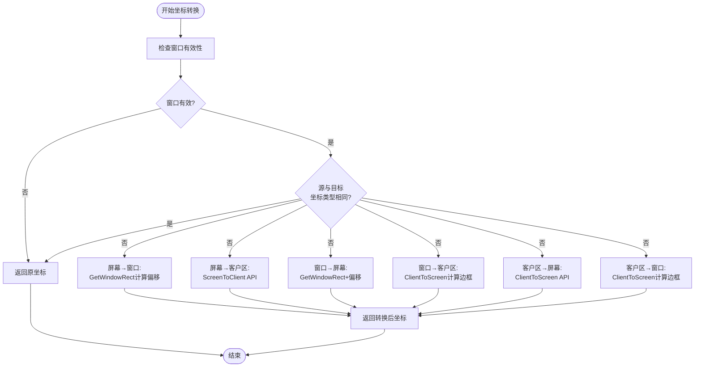
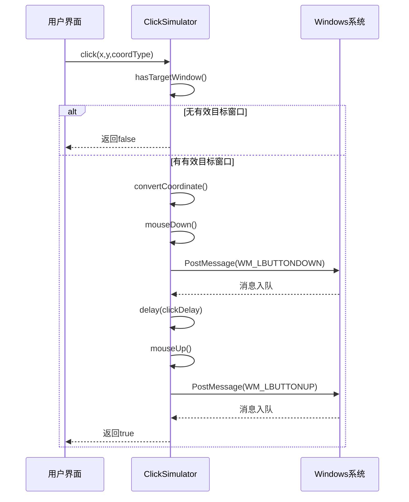
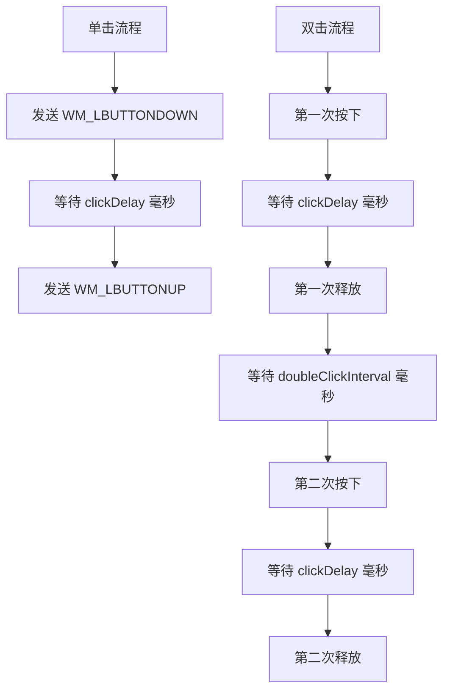
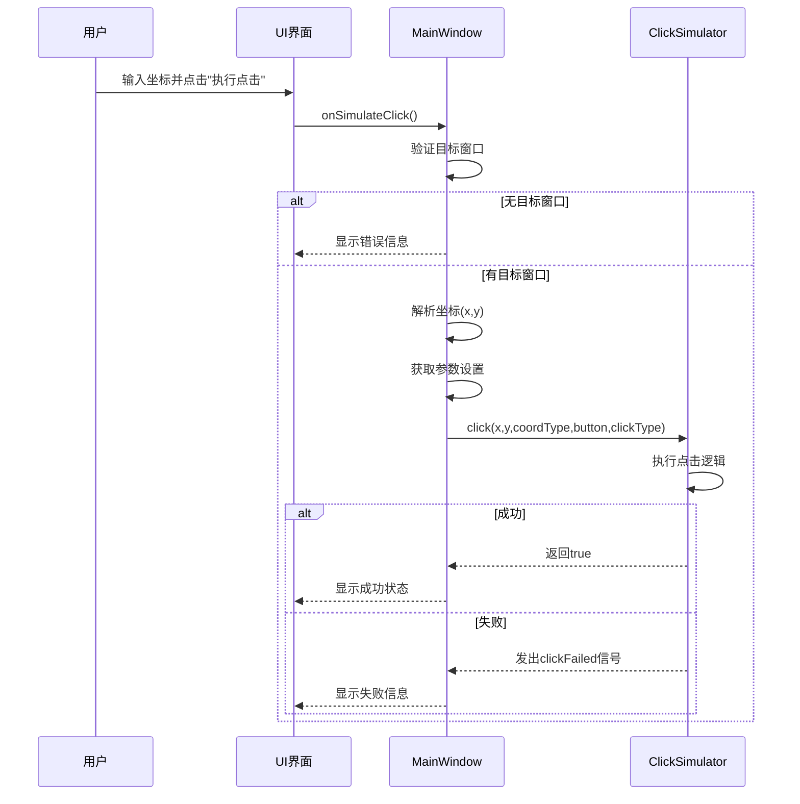

<cite>
**本文档引用文件**
- [ClickSimulator.h](file://include/core/ClickSimulator.h)
- [ClickSimulator.cpp](file://src/core/ClickSimulator.cpp)
- [MainWindow.cpp](file://src/ui/MainWindow.cpp)
</cite>

# ClickSimulator模块

## 目录
1. [核心功能概述](#核心功能概述)
2. [坐标系转换机制](#坐标系转换机制)
3. [点击模拟实现原理](#点击模拟实现原理)
4. [延迟控制与双击间隔](#延迟控制与双击间隔)
5. [实际调用链路分析](#实际调用链路分析)
6. [错误处理与诊断](#错误处理与诊断)

## 核心功能概述

`ClickSimulator`类是专为Windows平台设计的鼠标点击模拟器，其主要功能包括：目标窗口管理、多坐标系支持、鼠标事件模拟和操作节奏控制。该类通过封装Windows API实现了对指定窗口的精确点击操作。

类的核心职责是将用户提供的坐标（无论是屏幕坐标、窗口坐标还是客户区坐标）正确映射到目标窗口上下文中，并通过发送Windows消息来模拟真实的鼠标点击行为。这种设计使得开发者可以在不了解底层API细节的情况下，轻松实现自动化点击功能。

**Section sources**
- [ClickSimulator.h](file://include/core/ClickSimulator.h#L1-L98)

## 坐标系转换机制

`ClickSimulator`类支持三种坐标类型：`Screen`（屏幕绝对坐标）、`Window`（窗口相对坐标）和`Client`（客户区相对坐标）。这些坐标类型的转换由`convertCoordinate`方法统一处理，确保输入坐标能正确映射到目标窗口的客户区坐标系。

**Diagram sources**
- [ClickSimulator.cpp](file://src/core/ClickSimulator.cpp#L200-L275)

**Section sources**
- [ClickSimulator.h](file://include/core/ClickSimulator.h#L45-L50)
- [ClickSimulator.cpp](file://src/core/ClickSimulator.cpp#L200-L275)

## 点击模拟实现原理

点击模拟的核心在于`sendMouseMessage`方法的等效实现——通过`PostMessage`函数向目标窗口发送鼠标消息。虽然代码中没有显式定义`sendMouseMessage`，但`mouseDown`和`mouseUp`方法实现了相同的功能。

当执行点击操作时，系统会根据鼠标按键类型选择相应的Windows消息：
- 左键按下：`WM_LBUTTONDOWN`
- 左键释放：`WM_LBUTTONUP`
- 右键按下：`WM_RBUTTONDOWN`
- 右键释放：`WM_RBUTTONUP`
- 中键按下：`WM_MBUTTONDOWN`
- 中键释放：`WM_MBUTTONUP`

`makeLParam`方法负责将坐标转换为`LPARAM`参数，而`getButtonParam`则根据按键类型生成正确的`WPARAM`标志位。

**Diagram sources**
- [ClickSimulator.cpp](file://src/core/ClickSimulator.cpp#L100-L150)
- [ClickSimulator.cpp](file://src/core/ClickSimulator.cpp#L152-L180)

**Section sources**
- [ClickSimulator.h](file://include/core/ClickSimulator.h#L70-L75)
- [ClickSimulator.cpp](file://src/core/ClickSimulator.cpp#L100-L180)

## 延迟控制与双击间隔

`ClickSimulator`类提供了精细的操作节奏控制机制，通过两个关键参数实现：

1. **clickDelay**：控制鼠标按下和释放之间的延迟时间，默认值为50毫秒。这个延迟通过`delay`方法使用`QThread::msleep`实现，确保操作系统有足够时间处理鼠标按下事件。

2. **doubleClickInterval**：控制双击操作中两次单击之间的间隔时间，默认值为200毫秒。这个间隔需要符合Windows系统的双击识别标准。

**Section sources**
- [ClickSimulator.h](file://include/core/ClickSimulator.h#L60-L63)
- [ClickSimulator.cpp](file://src/core/ClickSimulator.cpp#L80-L95)

## 实际调用链路分析

在`MainWindow`类中，`onSimulateClick`槽函数展示了`ClickSimulator`的实际使用模式。该函数从UI控件获取用户输入，解析坐标和参数，然后调用`click`重载方法执行点击操作。

调用链路如下：
1. 用户点击"执行点击"按钮
2. 触发`onSimulateClick`槽函数
3. 验证目标窗口有效性
4. 解析输入坐标
5. 获取坐标类型、鼠标按键和点击类型设置
6. 调用`click(int x, y, coordType, button, clickType)`

**Diagram sources**
- [MainWindow.cpp](file://src/ui/MainWindow.cpp#L350-L400)
- [ClickSimulator.cpp](file://src/core/ClickSimulator.cpp#L100-L150)

**Section sources**
- [MainWindow.cpp](file://src/ui/MainWindow.cpp#L350-L400)
- [ClickSimulator.h](file://include/core/ClickSimulator.h#L65-L68)

## 错误处理与诊断

`ClickSimulator`类通过`clickFailed`信号提供详细的错误诊断信息。该信号在以下情况下被触发：

1. **窗口无效**：当`hasTargetWindow()`检查失败时，可能是由于：
   - 未设置目标窗口句柄
   - 目标窗口已被关闭或销毁
   - 目标窗口不可见

2. **权限不足**：某些受保护的系统窗口可能拒绝接收模拟消息。

3. **API调用失败**：`PostMessage`函数返回0表示消息发送失败。

错误信息分类包括：
- "没有设置有效的目标窗口"
- "点击执行失败"

这些错误信息帮助开发者快速定位问题根源，特别是在自动化测试或GUI自动化场景中尤为重要。

**Section sources**
- [ClickSimulator.cpp](file://src/core/ClickSimulator.cpp#L105-L115)
- [MainWindow.cpp](file://src/ui/MainWindow.cpp#L380-L390)