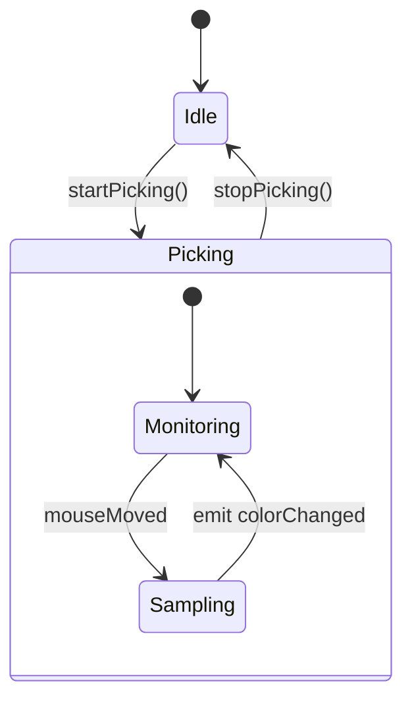
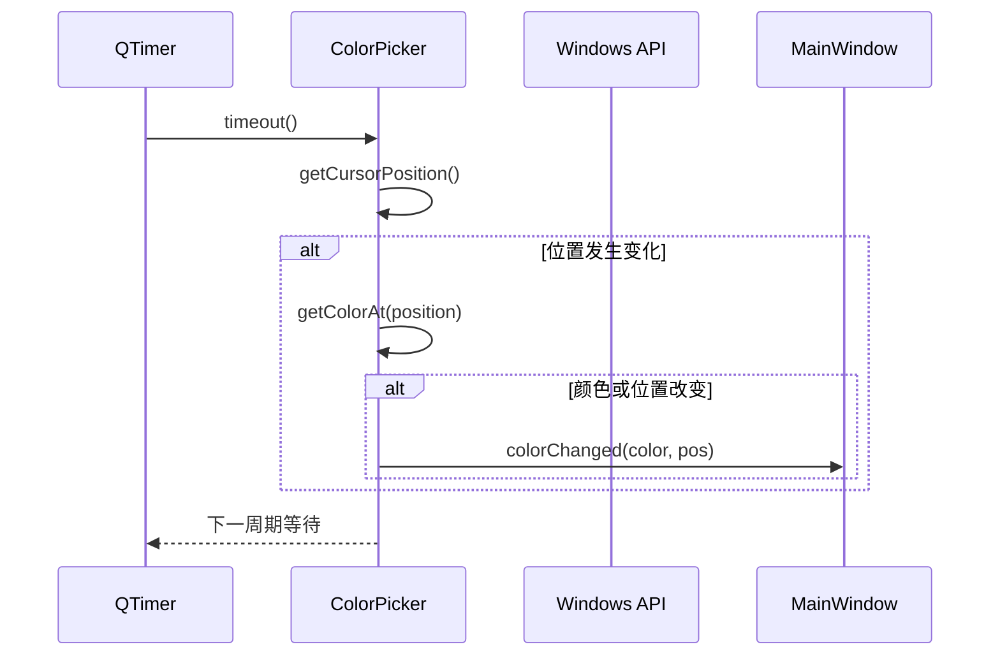
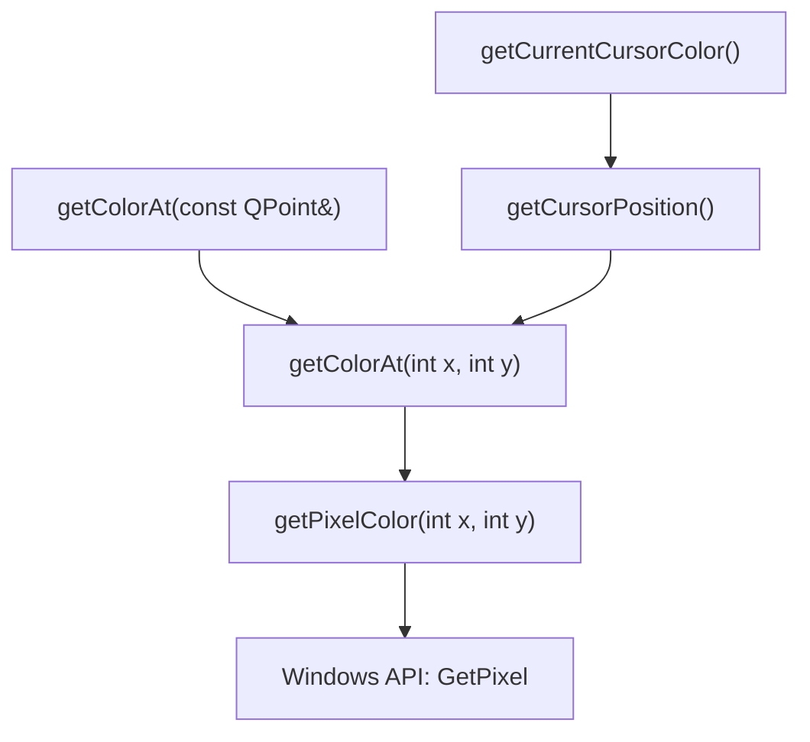
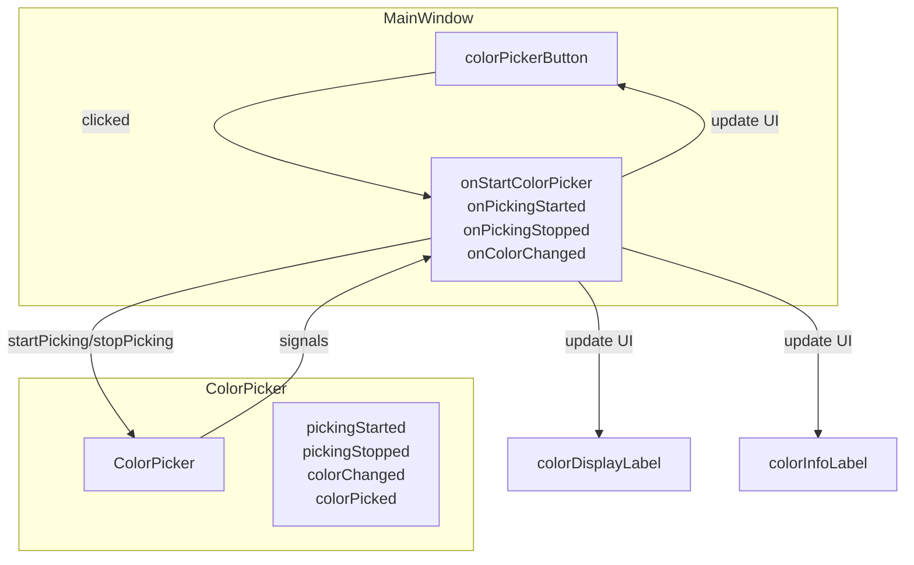

# ColorPicker模块

<cite>
**Referenced Files in This Document**   
- [ColorPicker.h](file://include/core/ColorPicker.h)
- [ColorPicker.cpp](file://src/core/ColorPicker.cpp)
- [MainWindow.h](file://include/ui/MainWindow.h)
- [MainWindow.cpp](file://src/ui/MainWindow.cpp)
</cite>

## 目录
1. [简介](#简介)
2. [核心组件分析](#核心组件分析)
3. [状态机与信号控制](#状态机与信号控制)
4. [实时颜色监控流程](#实时颜色监控流程)
5. [坐标转换与性能优化](#坐标转换与性能优化)
6. [UI集成与信号连接](#ui集成与信号连接)
7. [调试建议与常见问题](#调试建议与常见问题)

## 简介
`ColorPicker`类是本项目中实现屏幕取色功能的核心组件，基于Qt框架构建。该模块通过`QTimer`定时器机制实现了对鼠标指针位置颜色的实时监控，并提供了精确的颜色拾取能力。其设计目标是为用户提供一个高效、响应迅速且易于集成的取色工具。

该模块不仅支持持续性的颜色跟踪（picking mode），还提供单次取色功能，能够满足不同场景下的使用需求。通过与`MainWindow`界面的深度集成，用户可以直观地看到当前光标所在位置的颜色值及其详细信息。

整个系统采用事件驱动架构，利用Qt的信号与槽机制实现模块间的松耦合通信，确保了良好的可维护性和扩展性。

## 核心组件分析

`ColorPicker`类继承自`QObject`，封装了所有与屏幕颜色采集相关的逻辑。其主要职责包括：获取鼠标当前位置、读取指定坐标处的像素颜色、管理取色状态以及对外发射相关事件信号。

### 主要成员变量
- `updateTimer`: 用于周期性触发颜色更新的`QTimer`对象
- `isPickingActive`: 布尔标志，表示是否处于取色模式
- `updateInterval`: 定时器更新间隔（毫秒）
- `lastPosition`: 上一次检测到的鼠标位置
- `lastColor`: 上一次获取到的颜色值

### 关键方法分类
| 方法类型 | 方法名称 | 功能描述 |
|---------|--------|--------|
| 控制方法 | startPicking, stopPicking | 启动/停止取色模式 |
| 取色方法 | getColorAt, getCurrentCursorColor | 获取指定或当前光标位置的颜色 |
| 设置方法 | setUpdateInterval, getUpdateInterval | 配置和查询更新频率 |
| 槽函数 | updateColor, pickColorAtCursor | 内部私有槽，处理定时更新和单次取色 |

**Section sources**
- [ColorPicker.h](file://include/core/ColorPicker.h#L12-L56)

## 状态机与信号控制

`ColorPicker`通过内部状态变量`isPickingActive`实现了一个简单的状态机，用于管理取色过程的状态切换。该状态机仅有两个状态：**取色中** 和 **非取色状态**。



### 状态切换逻辑
当调用`startPicking()`时：
1. 检查当前是否已处于取色状态，避免重复启动
2. 将`isPickingActive`设为`true`
3. 启动`updateTimer`，开始周期性执行`updateColor()`槽函数
4. 发射`pickingStarted()`信号通知外部组件

当调用`stopPicking()`时：
1. 检查当前是否正在取色
2. 将`isPickingActive`设为`false`
3. 停止`updateTimer`
4. 发射`pickingStopped()`信号

### 信号同步机制
`ColorPicker`定义了四个关键信号用于UI状态同步：
- `pickingStarted()`: 取色开始 → UI应切换至取色模式（如更改按钮文本、设置十字光标）
- `pickingStopped()`: 取色结束 → UI恢复默认状态
- `colorChanged(color, position)`: 颜色变化 → 实时更新颜色显示
- `colorPicked(color, position)`: 成功拾取颜色 → 记录结果并可能终止取色

这些信号被`MainWindow`中的相应槽函数捕获，实现了逻辑层与表现层的有效解耦。

**Section sources**
- [ColorPicker.cpp](file://src/core/ColorPicker.cpp#L28-L40)
- [ColorPicker.h](file://include/core/ColorPicker.h#L40-L43)

## 实时颜色监控流程

`ColorPicker`的核心功能依赖于`QTimer`驱动的实时监控机制。其工作流程如下：



### updateColor私有槽函数详解
`updateColor()`作为`QTimer`超时事件的响应函数，承担着实时颜色采集的核心任务：

1. **状态检查**: 首先验证`isPickingActive`标志位，防止在非取色状态下误执行
2. **获取光标位置**: 调用`getCursorPosition()`通过Windows API `GetCursorPos`获取全局屏幕坐标
3. **变化检测**: 比较当前坐标与`lastPosition`，仅在位置变动时进行颜色读取以节省资源
4. **颜色获取**: 调用`getColorAt()`获取新位置的颜色值
5. **差异判断**: 若颜色值或位置与上次不同，则更新缓存并发射`colorChanged`信号

这种"仅在变化时更新"的策略显著降低了CPU占用率，提升了整体性能。

**Section sources**
- [ColorPicker.cpp](file://src/core/ColorPicker.cpp#L94-L110)

## 坐标转换与性能优化

### getColorAt系列方法的坐标转换逻辑
`getColorAt`方法族提供了多种接口形式，但最终都归结为调用底层`getPixelColor(int x, int y)`：



- `getColorAt(QPoint&)` → 转发至 → `getColorAt(int, int)`
- `getCurrentCursorColor()` → 先调用`getCursorPosition()`获取坐标，再调用`getColorAt`

所有坐标均为**全局屏幕坐标系**，无需额外转换即可直接用于Windows GDI函数。

### 性能优化策略
1. **条件更新机制**:
   - 仅当鼠标位置改变时才重新采样颜色
   - 即使位置未变，若颜色值不同也会触发更新（应对动态内容）

2. **资源复用**:
   - `QTimer`对象在构造函数中一次性创建，避免频繁分配
   - 使用成员变量缓存上一次的颜色和位置，便于比较

3. **低延迟设计**:
   - 默认更新间隔为50ms（20FPS），平衡流畅度与性能
   - 支持通过`setUpdateInterval()`动态调整刷新率

4. **异常处理**:
   - 对`GetPixel`返回的`CLR_INVALID`进行检查，防止无效颜色数据传播

**Section sources**
- [ColorPicker.cpp](file://src/core/ColorPicker.cpp#L68-L92)
- [ColorPicker.cpp](file://src/core/ColorPicker.cpp#L112-L130)

## UI集成与信号连接

`ColorPicker`通过`MainWindow::connectSignals()`方法与用户界面建立完整的信号-槽连接网络：



### 实际应用场景
1. **启动取色**:
   - 用户点击“开始取色”按钮
   - 触发`onStartColorPicker()`槽
   - 调用`colorPicker->startPicking()`
   - `colorPicker`发射`pickingStarted()`信号
   - `onPickingStarted()`更新按钮文本为“停止取色”，光标变为十字形

2. **实时预览**:
   - `updateColor()`检测到颜色变化
   - 发射`colorChanged(color, pos)`
   - `onColorChanged()`更新颜色显示区域和信息标签

3. **完成拾取**:
   - 用户在取色模式下左键点击
   - `mousePressEvent`调用`pickColorAtCursor()`
   - 执行单次取色并发射`colorPicked`信号
   - `onColorPicked()`记录颜色后自动调用`stopPicking()`

此设计实现了高度交互性的用户体验，同时保持了模块间的清晰边界。

**Section sources**
- [MainWindow.cpp](file://src/ui/MainWindow.cpp#L240-L260)
- [MainWindow.cpp](file://src/ui/MainWindow.cpp#L330-L350)

## 调试建议与常见问题

### 高DPI屏幕下的坐标偏移问题
**现象**: 在高DPI显示器上，获取的颜色位置与实际鼠标位置不符  
**原因**: Qt应用程序未正确处理DPI缩放，导致逻辑坐标与物理坐标不匹配  
**解决方案**:
1. 在`main()`函数中添加：
   ```cpp
   QCoreApplication::setAttribute(Qt::AA_EnableHighDpiScaling);
   ```
2. 或使用`QScreen::logicalDotsPerInch()`进行手动换算
3. 确保`.pro`文件包含`QT += widgets`以启用自动缩放

### 颜色精度误差
**现象**: 获取的颜色值与实际屏幕颜色存在微小偏差  
**原因**: 
- Windows `GetPixel`函数在某些显卡驱动下可能存在精度损失
- 显示器色彩配置文件影响
- DWM（桌面窗口管理器）合成效果干扰

**缓解措施**:
1. 多次采样取平均值提高准确性
2. 在纯色区域测试而非渐变区域
3. 关闭透明特效等视觉增强功能后重试

### 其他常见问题
| 问题 | 可能原因 | 解决方案 |
|------|--------|---------|
| 取色无反应 | 未正确绑定窗口 | 确保先完成窗口绑定操作 |
| CPU占用过高 | 更新间隔过短 | 将`updateInterval`设置为不低于30ms |
| 颜色始终无效 | 权限不足或API失败 | 以管理员权限运行程序 |
| ESC键无法退出 | 键盘焦点问题 | 确保主窗口具有输入焦点 |

建议在开发过程中启用日志记录功能，通过分析`LOG_COLOR_PICKED`等日志条目来追踪问题根源。

**Section sources**
- [MainWindow.cpp](file://src/ui/MainWindow.cpp#L450-L470)