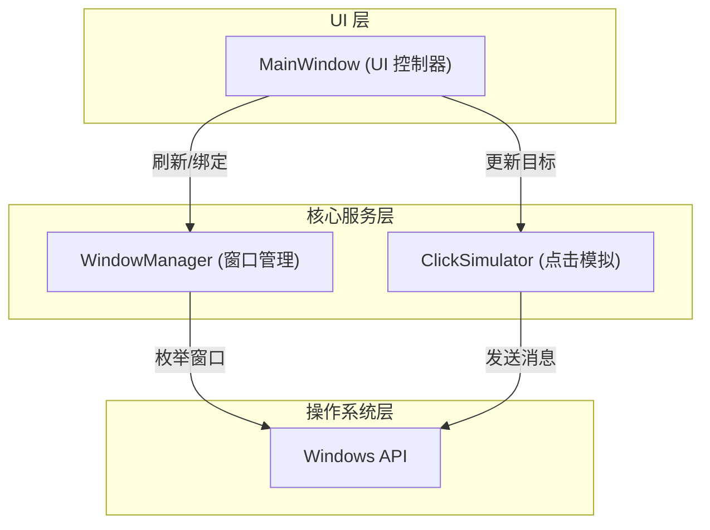
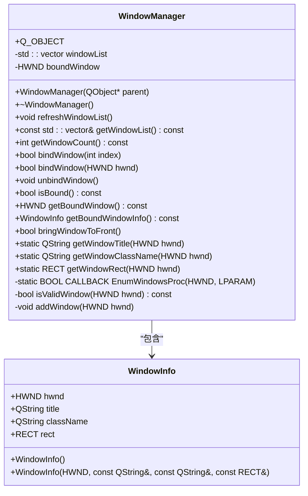
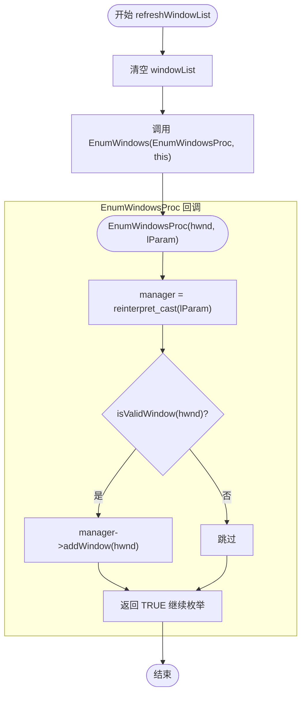
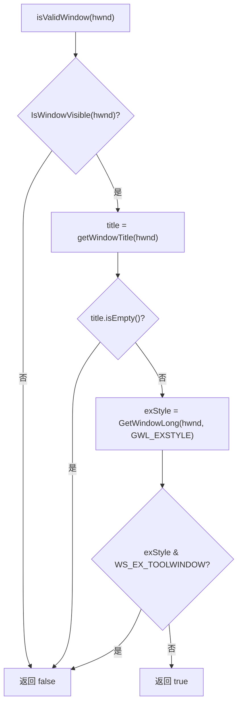
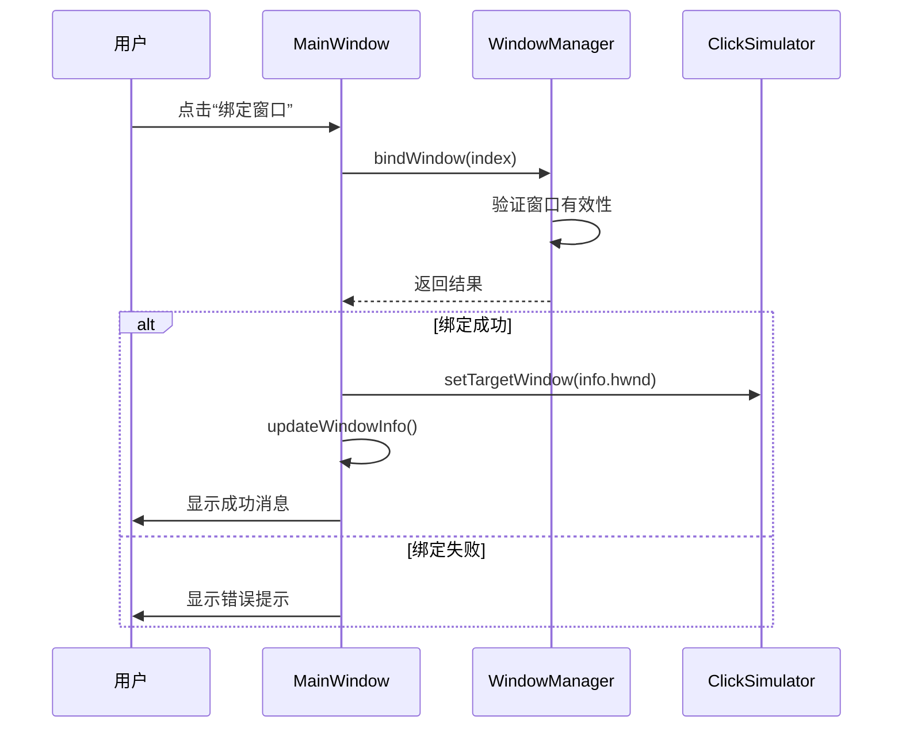

# WindowManager模块

<cite>
**Referenced Files in This Document**  
- [WindowManager.h](file://include/core/WindowManager.h)
- [WindowManager.cpp](file://src/core/WindowManager.cpp)
- [MainWindow.cpp](file://src/ui/MainWindow.cpp)
- [ClickSimulator.cpp](file://src/core/ClickSimulator.cpp)
</cite>

## 目录
1. [引言](#引言)
2. [核心组件分析](#核心组件分析)
3. [架构概览](#架构概览)
4. [详细组件分析](#详细组件分析)
5. [依赖关系分析](#依赖关系分析)
6. [性能考量](#性能考量)
7. [故障排查指南](#故障排查指南)
8. [结论](#结论)

## 引言

`WindowManager` 类是本项目中负责窗口管理的核心组件，其主要职责包括枚举系统所有可见窗口、维护当前窗口列表以及处理目标窗口的绑定状态。该类通过调用 Windows API 的 `EnumWindows` 函数实现对系统窗口的遍历，并结合自定义过滤逻辑筛选出有效窗口。同时，它通过 Qt 的信号槽机制与主界面 `MainWindow` 进行交互，确保 UI 能够实时反映窗口状态变化。本文档将深入剖析 `WindowManager` 的设计与实现细节，涵盖其关键方法的工作流程、数据结构定义及线程安全性考虑。

## 核心组件分析

`WindowManager` 类作为窗口操作的核心服务，封装了从底层 Windows API 到上层应用逻辑的桥梁功能。其核心职责包括：
- **窗口枚举**：通过 `refreshWindowList` 方法动态获取当前系统中所有符合条件的窗口。
- **窗口绑定**：提供 `bindWindow` 接口建立与特定窗口的关联，供后续操作（如点击模拟）使用。
- **信息查询**：暴露 `getWindowList` 和 `getBoundWindowInfo` 等接口供外部模块读取窗口元数据。

此外，`WindowManager` 与 `MainWindow` 和 `ClickSimulator` 存在紧密协作关系，前者用于展示窗口信息并触发用户操作，后者则依赖绑定的窗口句柄执行自动化任务。

**Section sources**
- [WindowManager.h](file://include/core/WindowManager.h#L22-L61)
- [MainWindow.cpp](file://src/ui/MainWindow.cpp#L221-L269)

## 架构概览



**Diagram sources**
- [WindowManager.h](file://include/core/WindowManager.h#L22-L61)
- [MainWindow.cpp](file://src/ui/MainWindow.cpp#L221-L269)
- [ClickSimulator.cpp](file://src/core/ClickSimulator.cpp#L16-L19)

## 详细组件分析

### WindowManager 类分析

#### 类结构与职责划分

`WindowManager` 是一个继承自 `QObject` 的 Qt 对象，利用 Qt 的元对象系统支持信号槽通信。其内部维护两个核心成员变量：
- `windowList`：存储当前枚举到的所有有效窗口信息（`WindowInfo` 结构体）。
- `boundWindow`：记录当前已绑定的目标窗口句柄（HWND）。

公共接口分为三类：
1. **窗口枚举与查询**：`refreshWindowList`, `getWindowList`, `getWindowCount`
2. **绑定控制**：`bindWindow`, `unbindWindow`, `isBound`
3. **辅助工具**：`getWindowTitle`, `getWindowClassName`, `getWindowRect`



**Diagram sources**
- [WindowManager.h](file://include/core/WindowManager.h#L22-L61)

**Section sources**
- [WindowManager.h](file://include/core/WindowManager.h#L22-L61)
- [WindowManager.cpp](file://src/core/WindowManager.cpp#L10-L15)

#### refreshWindowList 方法执行流程

`refreshWindowList` 方法是窗口枚举的入口点，其工作流程如下：



该方法首先清空现有窗口列表，然后调用 Windows API 的 `EnumWindows` 函数，传入静态回调函数 `EnumWindowsProc` 和当前对象指针 `this` 作为参数。对于每一个被枚举到的窗口句柄，都会进入回调函数进行有效性验证。

**Diagram sources**
- [WindowManager.cpp](file://src/core/WindowManager.cpp#L10-L15)
- [WindowManager.cpp](file://src/core/WindowManager.cpp#L129-L136)

**Section sources**
- [WindowManager.cpp](file://src/core/WindowManager.cpp#L10-L15)
- [WindowManager.cpp](file://src/core/WindowManager.cpp#L129-L136)

#### isValidWindow 过滤逻辑

`isValidWindow` 方法用于判断一个窗口是否应被纳入管理范围，其过滤条件包括：
1. 窗口必须可见（`IsWindowVisible`）
2. 窗口标题不能为空
3. 不是工具窗口（检查 `WS_EX_TOOLWINDOW` 扩展样式）



此逻辑确保只有用户可感知的应用程序窗口才会出现在选择列表中，避免系统托盘图标或隐藏对话框干扰用户体验。

**Diagram sources**
- [WindowManager.cpp](file://src/core/WindowManager.cpp#L138-L158)

**Section sources**
- [WindowManager.cpp](file://src/core/WindowManager.cpp#L138-L158)

#### bindWindow 绑定机制与信号通知

`bindWindow` 方法支持两种方式绑定窗口：通过索引或直接传入句柄。成功绑定后，会通过信号槽机制通知 `MainWindow` 更新 UI 并同步至 `ClickSimulator`。



这种设计实现了关注点分离：`WindowManager` 仅负责状态管理，而 UI 更新和业务联动由 `MainWindow` 协调完成。

**Diagram sources**
- [MainWindow.cpp](file://src/ui/MainWindow.cpp#L241-L269)
- [ClickSimulator.cpp](file://src/core/ClickSimulator.cpp#L16-L19)

**Section sources**
- [MainWindow.cpp](file://src/ui/MainWindow.cpp#L241-L269)

### WindowInfo 结构体字段映射

`WindowInfo` 结构体用于封装单个窗口的关键属性，各字段在 UI 中的映射关系如下表所示：

| 字段名 | 数据类型 | 含义 | UI 显示位置 |
|--------|--------|------|------------|
| hwnd | HWND | 窗口句柄 | 窗口信息标签（十六进制格式） |
| title | QString | 窗口标题 | 下拉框显示文本、信息面板 |
| className | QString | 窗口类名 | 下拉框附加信息、信息面板 |
| rect | RECT | 窗口矩形区域 | 信息面板（位置与大小） |

这些信息共同构成了用户识别和选择目标窗口的基础依据。

**Section sources**
- [WindowManager.h](file://include/core/WindowManager.h#L11-L20)

## 依赖关系分析

```mermaid
graph LR
A[MainWindow] --> B[WindowManager]
A --> C[ClickSimulator]
B --> D[Windows API]
C --> D
B --> C : setTargetWindow
```

`WindowManager` 本身不依赖其他业务组件，但被 `MainWindow` 和 `ClickSimulator` 共同使用。`MainWindow` 在初始化时创建 `WindowManager` 实例，并在其生命周期内持续调用其接口；`ClickSimulator` 则通过 `setTargetWindow` 接收绑定事件，形成完整的功能链路。

**Diagram sources**
- [MainWindow.cpp](file://src/ui/MainWindow.cpp#L6-L23)
- [ClickSimulator.cpp](file://src/core/ClickSimulator.cpp#L16-L19)

**Section sources**
- [MainWindow.cpp](file://src/ui/MainWindow.cpp#L6-L23)

## 性能考量

- **线程安全**：当前实现未显式涉及多线程操作，所有方法均在主线程调用，因此无需额外同步机制。
- **枚举开销**：`EnumWindows` 为系统级调用，性能良好，通常可在毫秒级完成数千窗口的遍历。
- **内存占用**：`windowList` 存储窗口快照，每个 `WindowInfo` 约占用数百字节，常规场景下内存消耗可忽略。
- **频繁调用建议**：若需周期性刷新，建议添加最小间隔限制（如 500ms），避免过度占用 CPU。

## 故障排查指南

### 常见问题及解决方案

| 问题现象 | 可能原因 | 解决方案 |
|---------|--------|----------|
| 窗口无法绑定 | 未选择有效项或窗口已关闭 | 检查下拉框是否有选项，确认目标程序仍在运行 |
| 句柄失效 | 目标窗口已被关闭 | 重新执行 `refreshWindowList` 获取最新列表 |
| 绑定后操作无效 | 权限不足或窗口处于特殊状态 | 尝试以管理员身份运行程序，或检查目标窗口是否响应消息 |
| 列表为空 | 所有窗口均被过滤 | 检查 `isValidWindow` 过滤条件，临时放宽规则调试 |

### 日志诊断建议

启用日志输出可帮助定位问题根源：
- `LOG_BUTTON_CLICK` 记录用户操作轨迹
- `LOG_WINDOW_BOUND` 跟踪绑定事件详情
- `LOG_ERROR` 捕获异常情况

通过分析日志时间线，可快速还原问题发生上下文。

**Section sources**
- [MainWindow.cpp](file://src/ui/MainWindow.cpp#L241-L269)
- [MainWindow.cpp](file://src/ui/MainWindow.cpp#L221-L239)

## 结论

`WindowManager` 模块设计清晰、职责明确，有效封装了 Windows 窗口管理的复杂性。其通过标准 API 实现稳定可靠的窗口枚举与绑定功能，并借助 Qt 信号槽机制实现松耦合的跨组件通信。整体架构具备良好的扩展性和可维护性，为上层自动化功能提供了坚实基础。未来可考虑增加异步刷新支持以进一步提升响应性能。