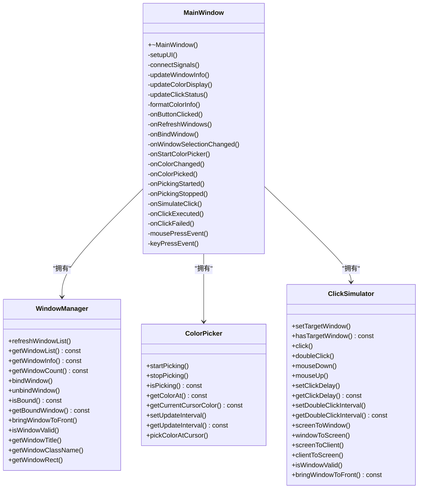
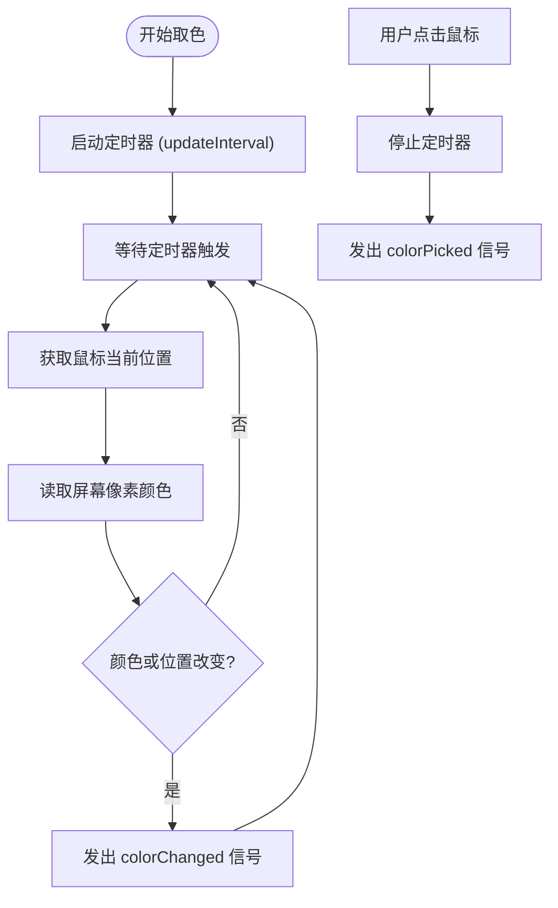
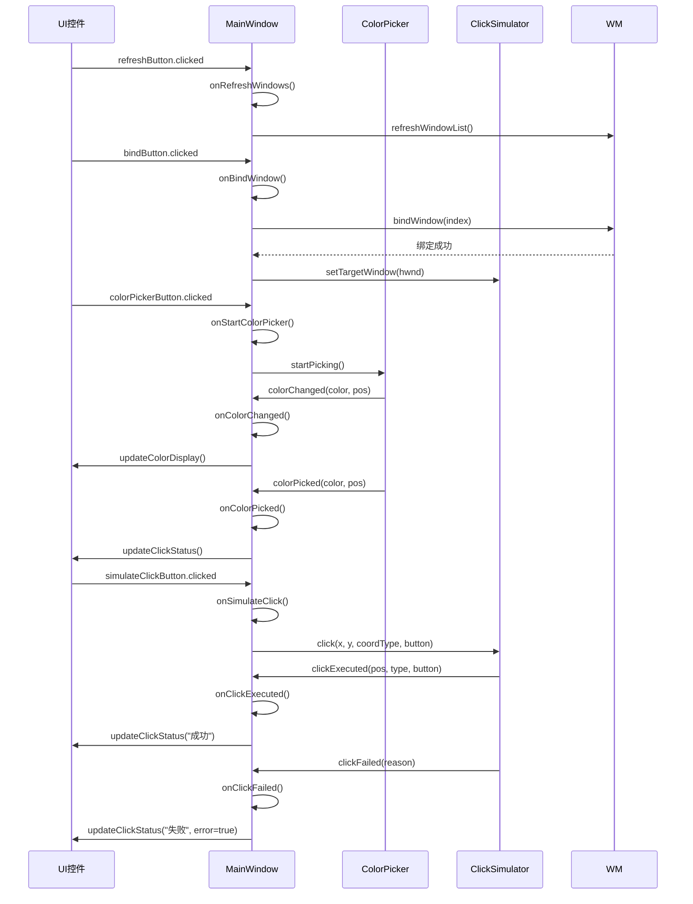

# 模块划分与职责

<cite>
**Referenced Files in This Document **  
- [MainWindow.h](file://include/ui/MainWindow.h)
- [MainWindow.cpp](file://src/ui/MainWindow.cpp)
- [WindowManager.h](file://include/core/WindowManager.h)
- [WindowManager.cpp](file://src/core/WindowManager.cpp)
- [ColorPicker.h](file://include/core/ColorPicker.h)
- [ColorPicker.cpp](file://src/core/ColorPicker.cpp)
- [ClickSimulator.h](file://include/core/ClickSimulator.h)
- [ClickSimulator.cpp](file://src/core/ClickSimulator.cpp)
</cite>

## 项目结构概述

本项目采用分层模块化设计，核心功能被划分为独立的组件，分别位于 `include/core` 和 `src/core` 目录下。UI 层位于 `include/ui` 和 `src/ui` 目录中，通过 `MainWindow` 类进行统一调度和管理。

**Section sources**  
- [MainWindow.h](file://include/ui/MainWindow.h)
- [WindowManager.h](file://include/core/WindowManager.h)
- [ColorPicker.h](file://include/core/ColorPicker.h)
- [ClickSimulator.h](file://include/core/ClickSimulator.h)

## 核心模块职责

### MainWindow：主控制器与用户交互中心

`MainWindow` 类作为应用程序的主窗口和控制中枢，主要承担以下职责：

1. **UI展示与布局管理**：负责构建和维护整个应用程序的图形用户界面，包括按钮、标签、组合框等控件的创建与布局。
2. **用户交互处理**：响应用户的点击、键盘输入等操作，并触发相应的业务逻辑。
3. **核心模块初始化与持有**：在构造函数中创建并持有 `WindowManager`、`ColorPicker` 和 `ClickSimulator` 实例，作为这些模块的父对象，实现内存自动管理。
4. **信号槽连接**：通过 `connectSignals()` 方法建立 UI 控件、核心模块之间的信号与槽函数的连接，实现跨模块通信。



**Diagram sources **  
- [MainWindow.h](file://include/ui/MainWindow.h#L23-L106)
- [WindowManager.h](file://include/core/WindowManager.h#L22-L61)
- [ColorPicker.h](file://include/core/ColorPicker.h#L12-L56)
- [ClickSimulator.h](file://include/core/ClickSimulator.h#L27-L96)

**Section sources**  
- [MainWindow.h](file://include/ui/MainWindow.h#L23-L106)
- [MainWindow.cpp](file://src/ui/MainWindow.cpp#L1-L50)

### WindowManager：系统窗口管理器

`WindowManager` 类负责与操作系统底层交互，管理和枚举系统中的窗口。其核心职责包括：

1. **窗口枚举**：通过 Windows API 的 `EnumWindows` 函数遍历所有可见窗口，并使用 `EnumWindowsProc` 回调函数筛选有效窗口（排除工具窗口、空标题窗口等）。
2. **窗口列表管理**：维护一个 `std::vector<WindowInfo>` 容器，存储当前系统中所有符合条件的窗口信息（句柄、标题、类名、矩形区域）。
3. **窗口绑定**：提供 `bindWindow()` 方法，允许用户选择一个特定窗口进行绑定，后续操作将针对该目标窗口执行。
4. **窗口状态检查**：提供 `isWindowValid()` 等方法，用于验证窗口句柄的有效性和可见性。

**Section sources**  
- [WindowManager.h](file://include/core/WindowManager.h#L22-L61)
- [WindowManager.cpp](file://src/core/WindowManager.cpp#L1-L20)

### ColorPicker：实时屏幕取色器

`ColorPicker` 类专注于实时监控鼠标位置并获取屏幕像素颜色。其工作流程如下：

1. **启动取色模式**：调用 `startPicking()` 启动一个定时器 (`QTimer`)，以设定的间隔（默认50ms）重复执行 `updateColor()`。
2. **获取鼠标位置**：在每次定时器触发时，通过 `GetCursorPos` API 获取当前鼠标指针的屏幕坐标。
3. **读取像素颜色**：利用 `GetDC` 和 `GetPixel` API，从屏幕设备上下文中读取指定坐标的像素颜色值。
4. **信号通知**：当检测到颜色或位置变化时，通过 `colorChanged` 信号将新的颜色和位置信息发送给监听者（如 `MainWindow`）。
5. **单次取色**：用户点击鼠标时，触发 `pickColorAtCursor()`，发出 `colorPicked` 信号并停止取色。



**Diagram sources **  
- [ColorPicker.h](file://include/core/ColorPicker.h#L12-L56)
- [ColorPicker.cpp](file://src/core/ColorPicker.cpp#L1-L20)

**Section sources**  
- [ColorPicker.h](file://include/core/ColorPicker.h#L12-L56)
- [ColorPicker.cpp](file://src/core/ColorPicker.cpp#L1-L125)

### ClickSimulator：鼠标点击模拟器

`ClickSimulator` 类负责在指定坐标执行鼠标点击操作，并处理复杂的坐标转换逻辑。其关键功能包括：

1. **目标窗口设置**：通过 `setTargetWindow()` 设置要操作的目标窗口句柄。
2. **坐标类型支持**：支持三种坐标系：
   - **屏幕坐标 (Screen)**：相对于整个屏幕左上角的绝对坐标。
   - **窗口坐标 (Window)**：相对于目标窗口左上角的相对坐标。
   - **客户区坐标 (Client)**：相对于目标窗口客户区（不含标题栏和边框）左上角的相对坐标。
3. **坐标转换**：`convertCoordinate()` 方法实现了不同坐标系之间的相互转换，确保点击指令能准确送达。
4. **点击执行**：通过 `PostMessage` API 向目标窗口发送 `WM_LBUTTONDOWN` 和 `WM_LBUTTONUP` 等消息来模拟鼠标点击。支持单击和双击。
5. **延迟控制**：`clickDelay` 和 `doubleClickInterval` 参数允许精细控制点击动作的时间间隔。

**Section sources**  
- [ClickSimulator.h](file://include/core/ClickSimulator.h#L27-L96)
- [ClickSimulator.cpp](file://src/core/ClickSimulator.cpp#L1-L20)

## 模块间协作机制

各模块之间通过 Qt 的信号与槽（Signal & Slot）机制进行松耦合通信，`MainWindow` 充当协调者的角色。

### 初始化与持有关系

`MainWindow` 在其构造函数中直接创建了三个核心模块的实例，并将自身作为它们的父对象（`this`），这不仅建立了所有权关系，也确保了当 `MainWindow` 被销毁时，这些模块会自动被清理。

```cpp
MainWindow::MainWindow(QWidget *parent)
    : QMainWindow(parent)
    , windowManager(new WindowManager(this))
    , colorPicker(new ColorPicker(this))
    , clickSimulator(new ClickSimulator(this))
{
    // ...
}
```

**Section sources**  
- [MainWindow.cpp](file://src/ui/MainWindow.cpp#L10-L18)

### 信号槽通信流程

`MainWindow` 的 `connectSignals()` 方法是模块间通信的核心枢纽，它定义了事件的流向。



**Diagram sources **  
- [MainWindow.cpp](file://src/ui/MainWindow.cpp#L180-L205)
- [ColorPicker.cpp](file://src/core/ColorPicker.cpp#L50-L60)
- [ClickSimulator.cpp](file://src/core/ClickSimulator.cpp#L50-L60)

#### 具体连接示例分析

根据代码中的 `connectSignals()` 实现，以下是关键的信号槽连接：

- **UI 到 MainWindow**：UI 按钮的 `clicked` 信号连接到 `MainWindow` 的私有槽函数，例如 `refreshButton` 连接到 `onRefreshWindows`。
- **MainWindow 到 Core Module**：`MainWindow` 的槽函数调用核心模块的方法，例如 `onBindWindow` 调用 `windowManager->bindWindow()`。
- **Core Module 到 MainWindow**：核心模块通过信号通知 `MainWindow` 状态变化，例如 `ColorPicker` 发出 `colorChanged` 信号，由 `MainWindow` 的 `onColorChanged` 槽函数接收并更新 UI。
- **MainWindow 到 Core Module (参数传递)**：`MainWindow` 将用户设置（如更新间隔）通过槽函数直接传递给核心模块，例如 `updateIntervalSpinBox` 的 `valueChanged` 信号连接到 `colorPicker->setUpdateInterval`。

这种设计模式清晰地分离了关注点：UI 只负责展示和捕获输入，核心模块负责具体的业务逻辑，而 `MainWindow` 作为胶水层，负责协调和数据流转。