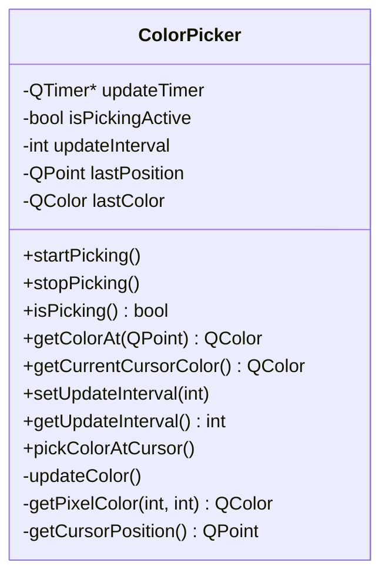
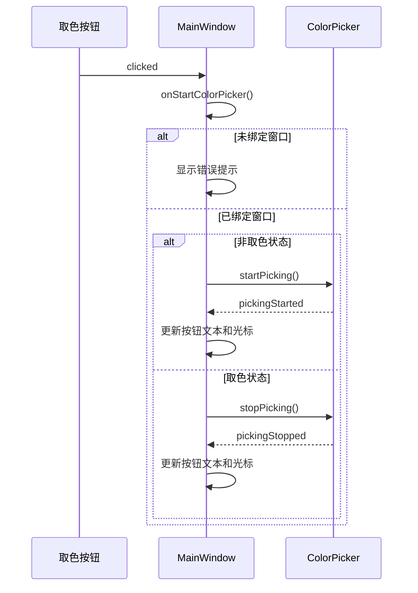
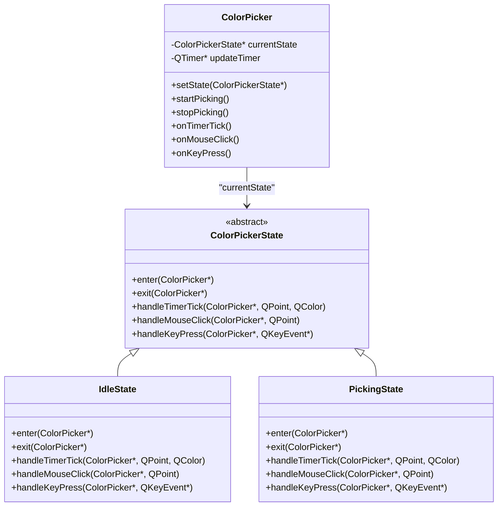

# 状态模式思想应用

<cite>
**本文档引用的文件**
- [ColorPicker.h](file://include/core/ColorPicker.h)
- [ColorPicker.cpp](file://src/core/ColorPicker.cpp)
- [MainWindow.cpp](file://src/ui/MainWindow.cpp)
</cite>

## 目录
1. [引言](#引言)
2. [核心状态控制机制分析](#核心状态控制机制分析)
3. [ColorPicker类中的状态标志实现](#colorpicker类中的状态标志实现)
4. [MainWindow中按钮行为的状态切换逻辑](#mainwindow中按钮行为的状态切换逻辑)
5. [状态模式思想的应用与局限性](#状态模式思想的应用与局限性)
6. [未来改进方向：显式状态类设计](#未来改进方向：显式状态类设计)

## 引言
本项目通过布尔标志 `isPickingActive` 实现了取色功能的状态控制，体现了状态模式的核心思想。虽然未采用经典的多态状态类结构，但通过清晰的状态标志和条件分支，有效分离了“取色中”与“非取色”两种行为模式。这种设计提升了代码的可读性和状态一致性，避免了状态混乱导致的逻辑错误。

## 核心状态控制机制分析
系统通过 `ColorPicker` 类管理取色状态，其核心在于使用布尔成员变量 `isPickingActive` 作为状态标志，结合 `startPicking()` 和 `stopPicking()` 方法进行状态转换。`MainWindow` 类则根据该状态动态调整UI行为，形成完整的状态控制闭环。

**Section sources**
- [ColorPicker.h](file://include/core/ColorPicker.h#L0-L58)
- [ColorPicker.cpp](file://src/core/ColorPicker.cpp#L0-L125)

## ColorPicker类中的状态标志实现
`ColorPicker` 类通过私有成员 `bool isPickingActive` 明确表示当前是否处于取色状态。该标志在构造函数中初始化为 `false`，确保初始状态为非取色模式。

**Diagram sources**
- [ColorPicker.h](file://include/core/ColorPicker.h#L0-L58)
- [ColorPicker.cpp](file://src/core/ColorPicker.cpp#L0-L125)

### 状态启动逻辑
`startPicking()` 方法检查当前状态，仅当 `!isPickingActive` 时才执行状态转换：
1. 将 `isPickingActive` 设置为 `true`
2. 启动定时器 `updateTimer` 开始周期性取色
3. 发出 `pickingStarted` 信号通知状态变更

此方法确保了状态的幂等性，防止重复启动。

### 状态停止逻辑
`stopPicking()` 方法在 `isPickingActive` 为真时执行清理操作：
1. 将 `isPickingActive` 设置为 `false`
2. 停止定时器 `updateTimer`
3. 发出 `pickingStopped` 信号

析构函数中也调用了 `stopPicking()`，确保对象销毁时能正确释放资源。

### 状态查询与内部使用
`isPicking()` 方法提供公共接口查询当前状态。私有槽函数 `updateColor()` 在每次定时器触发时首先检查 `isPickingActive`，若为假则直接返回，避免不必要的计算。

**Section sources**
- [ColorPicker.cpp](file://src/core/ColorPicker.cpp#L17-L78)

## MainWindow中按钮行为的状态切换逻辑
`MainWindow` 类通过 `onStartColorPicker` 槽函数响应取色按钮点击事件，实现了基于当前状态的行为切换。

**Diagram sources**
- [MainWindow.cpp](file://src/ui/MainWindow.cpp#L286-L289)
- [ColorPicker.cpp](file://src/core/ColorPicker.cpp#L17-L30)

### 状态感知的交互逻辑
`onStartColorPicker` 方法首先验证窗口绑定状态，然后根据 `colorPicker->isPicking()` 的返回值决定执行路径：
- 当前非取色状态：调用 `startPicking()` 启动取色
- 当前取色状态：调用 `stopPicking()` 停止取色

这种方法实现了按钮的双重功能（开始/停止），减少了UI元素数量。

### 状态变化的视觉反馈
通过连接 `pickingStarted` 和 `pickingStopped` 信号到 `onPickingStarted` 和 `onPickingStopped` 槽函数，系统实现了状态变化的视觉反馈：
- **开始取色**：按钮文本变为"停止取色 (或按ESC)"，光标变为十字准星
- **停止取色**：按钮文本恢复为"开始取色 (按ESC停止)"，光标恢复为箭头

此外，键盘事件处理 `keyPressEvent` 中也监听 `ESC` 键，允许用户通过快捷键退出取色模式，增强了用户体验。

**Section sources**
- [MainWindow.cpp](file://src/ui/MainWindow.cpp#L286-L305)
- [MainWindow.cpp](file://src/ui/MainWindow.cpp#L432-L434)

## 状态模式思想的应用与局限性
本实现体现了状态模式的核心思想——将对象的行为与其状态关联，但采用了更轻量级的布尔标志方案而非经典的多态状态类。

### 应用优势
1. **状态分离**：明确区分了取色与非取色两种行为模式
2. **代码可读性**：通过 `isPickingActive` 标志使状态逻辑清晰易懂
3. **状态一致性**：集中管理状态转换，避免了分散的状态判断
4. **资源管理**：确保定时器等资源在状态切换时正确启停

### 设计局限性
1. **扩展性差**：若需增加更多状态（如暂停、预览等），布尔标志无法满足需求
2. **条件分支增多**：随着状态复杂度提升，`if-else` 分支会变得难以维护
3. **行为耦合**：所有状态相关的行为仍集中在单一类中

## 未来改进方向：显式状态类设计
为增强系统的可扩展性，建议引入显式的状态类设计，将当前的布尔状态机重构为经典的状态模式。

**Diagram sources**
- [ColorPicker.h](file://include/core/ColorPicker.h#L0-L58)
- [ColorPicker.cpp](file://src/core/ColorPicker.cpp#L0-L125)

新设计将带来以下优势：
1. **高内聚低耦合**：每个状态类封装自身的行为逻辑
2. **易于扩展**：新增状态只需添加新的状态类
3. **符合开闭原则**：对扩展开放，对修改关闭
4. **更好的测试性**：可独立测试每个状态类

尽管当前实现已能满足基本需求，但向显式状态模式的演进将为系统未来的功能扩展奠定坚实基础。