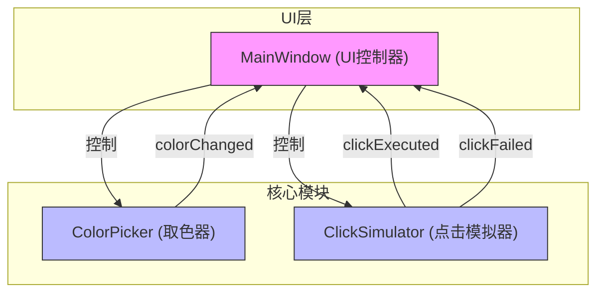
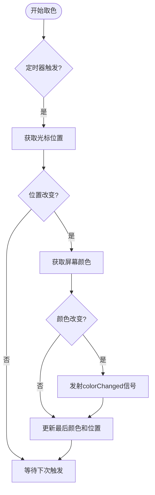
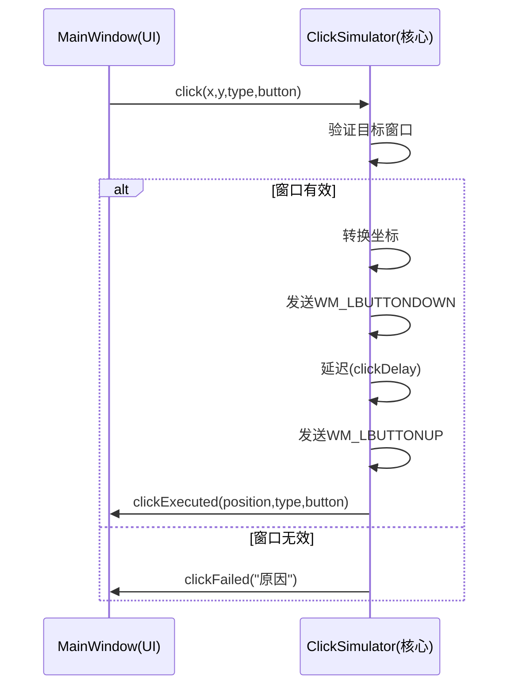
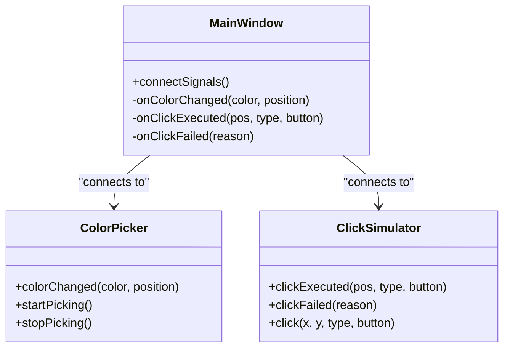
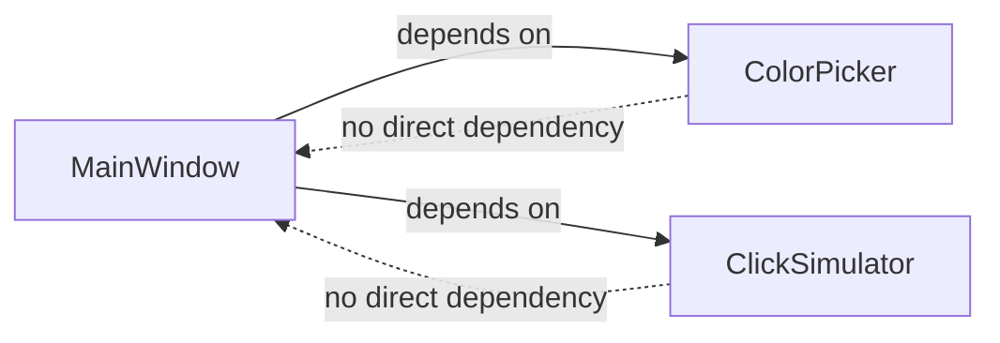

<cite>
**本文档中引用的文件**
- [ColorPicker.h](file://include/core/ColorPicker.h)
- [ColorPicker.cpp](file://src/core/ColorPicker.cpp)
- [MainWindow.h](file://include/ui/MainWindow.h)
- [MainWindow.cpp](file://src/ui/MainWindow.cpp)
- [ClickSimulator.h](file://include/core/ClickSimulator.h)
- [ClickSimulator.cpp](file://src/core/ClickSimulator.cpp)
</cite>

# 观察者模式（Qt信号槽机制）

## 目录
1. [引言](#引言)
2. [核心组件分析](#核心组件分析)
3. [架构概览](#架构概览)
4. [详细组件分析](#详细组件分析)
5. [依赖关系分析](#依赖关系分析)
6. [性能考量](#性能考量)
7. [结论](#结论)

## 引言

Qt框架中的信号与槽机制是观察者设计模式的经典实现，它提供了一种类型安全、松耦合的对象间通信方式。本文档深入分析`ColorPicker`模块中`colorChanged`信号与`MainWindow`中`onColorChanged`槽函数的连接关系，以及`ClickSimulator`模块中`clickExecuted`和`clickFailed`信号如何驱动UI状态更新。通过`connectSignals()`方法中的`QObject::connect`调用，展示了该模式在事件驱动架构中的优势。

## 核心组件分析

`ColorPicker`类作为颜色拾取的核心模块，定义了`colorChanged`信号，当鼠标在屏幕上移动时，会持续发射此信号以通知监听者当前光标位置的颜色变化。`MainWindow`类则作为主窗口控制器，包含多个UI组件和业务逻辑模块，通过槽函数响应来自不同模块的信号。

`ClickSimulator`类负责模拟鼠标点击操作，其`clickExecuted`和`clickFailed`信号分别在点击成功或失败时被触发，用于向UI层反馈操作结果。

**Section sources**
- [ColorPicker.h](file://include/core/ColorPicker.h#L40-L43)
- [MainWindow.h](file://include/ui/MainWindow.h#L80-L90)
- [ClickSimulator.h](file://include/core/ClickSimulator.h#L80-L83)

## 架构概览

**Diagram sources**
- [MainWindow.h](file://include/ui/MainWindow.h#L80-L90)
- [ColorPicker.h](file://include/core/ColorPicker.h#L40-L43)
- [ClickSimulator.h](file://include/core/ClickSimulator.h#L80-L83)

**Section sources**
- [MainWindow.h](file://include/ui/MainWindow.h#L80-L90)
- [ColorPicker.h](file://include/core/ColorPicker.h#L40-L43)
- [ClickSimulator.h](file://include/core/ClickSimulator.h#L80-L83)

## 详细组件分析

### ColorPicker模块分析

`ColorPicker`模块通过一个定时器(`updateTimer`)周期性地检查鼠标位置，并在位置发生变化时获取屏幕像素颜色。当检测到颜色或位置变化时，通过`emit colorChanged(currentColor, currentPos)`发射信号。

**Diagram sources**
- [ColorPicker.cpp](file://src/core/ColorPicker.cpp#L105-L120)

**Section sources**
- [ColorPicker.h](file://include/core/ColorPicker.h#L40-L43)
- [ColorPicker.cpp](file://src/core/ColorPicker.cpp#L105-L120)

### ClickSimulator模块分析

`ClickSimulator`模块负责执行鼠标点击操作。当`click()`方法被调用时，它会根据目标窗口句柄和坐标类型将坐标转换为客户区坐标，然后使用Windows API发送鼠标消息。操作完成后，根据结果发射相应的信号。

**Diagram sources**
- [ClickSimulator.cpp](file://src/core/ClickSimulator.cpp#L55-L90)
- [MainWindow.cpp](file://src/ui/MainWindow.cpp#L430-L450)

**Section sources**
- [ClickSimulator.h](file://include/core/ClickSimulator.h#L80-L83)
- [ClickSimulator.cpp](file://src/core/ClickSimulator.cpp#L55-L90)
- [MainWindow.cpp](file://src/ui/MainWindow.cpp#L430-L450)

### 信号槽连接机制分析

`MainWindow`类中的`connectSignals()`方法集中管理了所有信号与槽的连接。这种集中式连接方式提高了代码的可维护性和可读性。

**Diagram sources**
- [MainWindow.cpp](file://src/ui/MainWindow.cpp#L250-L280)

**Section sources**
- [MainWindow.cpp](file://src/ui/MainWindow.cpp#L250-L280)

## 依赖关系分析

系统采用分层架构，UI层(`MainWindow`)依赖于核心业务逻辑层(`ColorPicker`, `ClickSimulator`)，但核心模块不直接依赖UI层。这种单向依赖关系确保了系统的松耦合特性。

**Diagram sources**
- [MainWindow.h](file://include/ui/MainWindow.h#L70-L72)
- [ColorPicker.h](file://include/core/ColorPicker.h#L15-L16)
- [ClickSimulator.h](file://include/core/ClickSimulator.h#L15-L16)

**Section sources**
- [MainWindow.h](file://include/ui/MainWindow.h#L70-L72)
- [ColorPicker.h](file://include/core/ColorPicker.h#L15-L16)
- [ClickSimulator.h](file://include/core/ClickSimulator.h#L15-L16)

## 性能考量

信号槽机制虽然提供了优雅的解耦方案，但也带来一定的性能开销。`ColorPicker`模块通过仅在颜色或位置发生变化时才发射信号来优化性能。此外，`QThread::msleep()`用于实现延迟，避免了忙等待，但可能影响主线程响应性。

线程安全方面，所有信号槽连接均在同一事件循环中处理，避免了多线程竞争问题。若需跨线程通信，应使用`Qt::QueuedConnection`类型。

**Section sources**
- [ColorPicker.cpp](file://src/core/ColorPicker.cpp#L110-L115)
- [ClickSimulator.cpp](file://src/core/ClickSimulator.cpp#L280-L285)

## 结论

Qt的信号槽机制完美实现了观察者模式，使得`ColorPicker`和`ClickSimulator`等核心模块能够与`MainWindow`UI组件保持松耦合。通过`connectSignals()`方法的集中管理，系统实现了清晰的职责分离和良好的可维护性。该模式支持灵活的事件驱动架构，同时需要注意性能优化和线程安全问题。