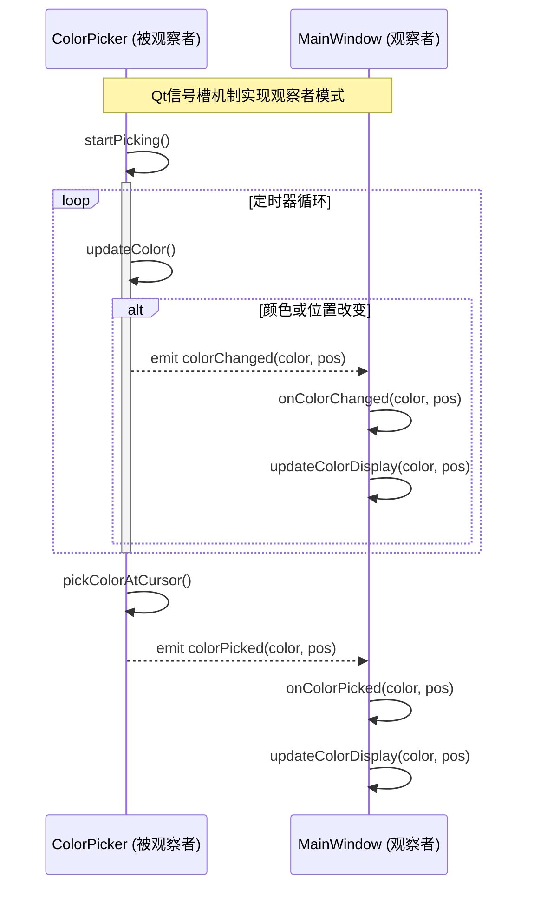
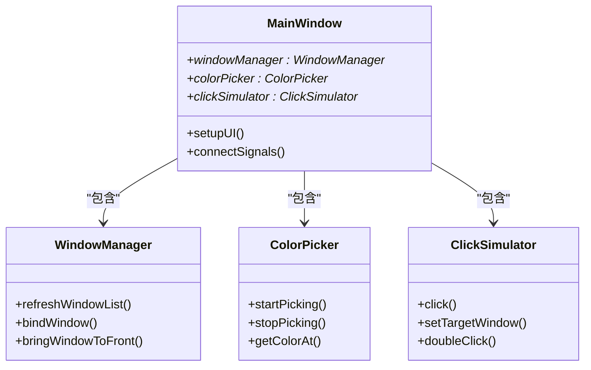
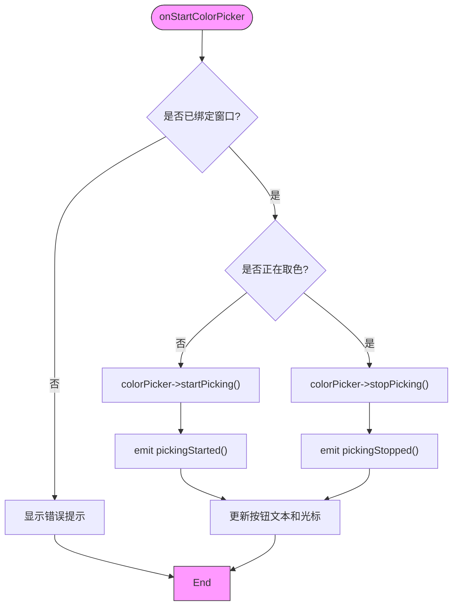

# 设计模式应用

<cite>
**Referenced Files in This Document **   
- [MainWindow.cpp](file://src/ui/MainWindow.cpp)
- [MainWindow.h](file://include/ui/MainWindow.h)
- [ColorPicker.cpp](file://src/core/ColorPicker.cpp)
- [ColorPicker.h](file://include/core/ColorPicker.h)
- [WindowManager.cpp](file://src/core/WindowManager.cpp)
- [WindowManager.h](file://include/core/WindowManager.h)
- [ClickSimulator.cpp](file://src/core/ClickSimulator.cpp)
- [ClickSimulator.h](file://include/core/ClickSimulator.h)
</cite>

## 目录
1. [引言](#引言)
2. [观察者模式：Qt信号槽机制](#观察者模式qt信号槽机制)
3. [组合模式：MainWindow的模块化结构](#组合模式mainwindow的模块化结构)
4. [状态模式：功能模块的状态管理](#状态模式功能模块的状态管理)
5. [设计模式协同效应](#设计模式协同效应)
6. [结论](#结论)

## 引言

本项目通过精心设计的架构，系统性地应用了多种经典设计模式。这些模式不仅提升了代码的可维护性和可扩展性，还实现了关注点的有效分离。本文将深入分析三种核心设计模式在项目中的实际应用：**观察者模式**通过Qt信号与槽机制实现UI更新与业务逻辑的解耦；**组合模式**通过`MainWindow`对`WindowManager`、`ColorPicker`和`ClickSimulator`的持有关系，构建了一个灵活且可复用的模块化结构；**状态模式**的思想则体现在各功能模块内部的状态标志（如`ColorPicker`的`isPickingActive`）中，用于管理功能的启用与禁用。通过对具体代码实现的剖析，我们将展示这些设计模式如何共同作用，打造出一个健壮、清晰且易于维护的应用程序。

## 观察者模式：Qt信号槽机制

### 模式原理与实现

观察者模式定义了一种一对多的依赖关系，当一个对象的状态发生改变时，所有依赖于它的对象都会得到通知并自动更新。在本项目中，Qt框架原生的**信号（Signal）与槽（Slot）** 机制完美地体现了这一模式。

`ColorPicker`类作为被观察的对象（Subject），在其头文件`ColorPicker.h`中声明了多个信号：
- `colorChanged(const QColor&, const QPoint&)`
- `colorPicked(const QColor&, const QPoint&)`
- `pickingStarted()`
- `pickingStopped()`

当取色器内部状态变化时（例如鼠标移动导致颜色改变或用户点击完成取色），它会通过`emit`关键字发出相应的信号。而`MainWindow`类作为观察者（Observer），通过`connectSignals()`函数中的`connect`语句，将自身的槽函数与`ColorPicker`的信号进行绑定。



**Diagram sources**
- [ColorPicker.cpp](file://src/core/ColorPicker.cpp#L70-L88)
- [MainWindow.cpp](file://src/ui/MainWindow.cpp#L290-L293)

**Section sources**
- [ColorPicker.h](file://include/core/ColorPicker.h#L35-L38)
- [MainWindow.cpp](file://src/ui/MainWindow.cpp#L280-L293)

### 解耦优势分析

这种机制的核心优势在于**彻底解耦了业务逻辑与UI更新**。
1.  **低耦合**：`ColorPicker`完全不知道`MainWindow`的存在，它只负责在适当的时候发出信号。这使得`ColorPicker`可以独立开发、测试和复用。
2.  **高内聚**：`MainWindow`的职责是响应事件并更新UI，其`onColorChanged`等槽函数专注于视图层的处理。
3.  **灵活性**：如果未来需要增加一个新的观察者（例如一个日志记录器），只需将其槽函数连接到`ColorPicker`的信号上即可，无需修改`ColorPicker`的任何代码。

## 组合模式：MainWindow的模块化结构

### 模式原理与实现

组合模式允许你将对象组合成树形结构来表示“部分-整体”的层次结构。组合模式让客户端可以统一对待单个对象和组合对象。在本项目中，`MainWindow`类扮演了“容器”角色，而`WindowManager`、`ColorPicker`和`ClickSimulator`则是“叶子”组件。

`MainWindow`的构造函数清晰地展示了这种组合关系：

```cpp
MainWindow::MainWindow(QWidget *parent)
    : QMainWindow(parent)
    , windowManager(new WindowManager(this))
    , colorPicker(new ColorPicker(this))
    , clickSimulator(new ClickSimulator(this))
{
    // ...
}
```

`MainWindow`通过指针成员变量持有了这三个核心功能模块，并在初始化时为它们传递`this`作为父对象，由Qt的父子对象机制自动管理内存。



**Diagram sources**
- [MainWindow.h](file://include/ui/MainWindow.h#L60-L62)
- [MainWindow.cpp](file://src/ui/MainWindow.cpp#L15-L20)

**Section sources**
- [MainWindow.h](file://include/ui/MainWindow.h#L60-L62)
- [MainWindow.cpp](file://src/ui/MainWindow.cpp#L15-L20)

### 复用性与灵活性

这种设计带来了显著的好处：
1.  **增强复用性**：`WindowManager`、`ColorPicker`和`ClickSimulator`都是独立的、高内聚的类。它们可以在其他项目中直接复用，因为它们不依赖于特定的UI。
2.  **提升结构灵活性**：`MainWindow`的结构变得非常灵活。可以轻松地添加新的功能模块（如`ImageProcessor`），只需在`MainWindow`中声明一个新指针，并在构造函数中初始化即可。
3.  **简化维护**：每个模块的职责单一，代码分散在各自的`.h`和`.cpp`文件中，便于团队协作和独立维护。

## 状态模式：功能模块的状态管理

### 模式思想与实现

状态模式允许一个对象在其内部状态改变时改变其行为。虽然本项目没有使用经典的“状态类”继承体系，但其核心思想——**根据内部状态决定行为**——得到了充分体现。

以`ColorPicker`类为例，其内部通过一个布尔标志`isPickingActive`来管理取色功能的两种状态：**激活**和**非激活**。

```cpp
// ColorPicker.h
private:
    QTimer* updateTimer;
    bool isPickingActive; // 核心状态标志
    int updateInterval;
```

这个状态直接影响了`startPicking()`和`stopPicking()`方法的行为：

```cpp
void ColorPicker::startPicking()
{
    if (!isPickingActive) { // 检查当前状态
        isPickingActive = true; // 改变状态
        updateTimer->start(updateInterval); // 根据新状态执行不同操作
        emit pickingStarted();
    }
}

void ColorPicker::stopPicking()
{
    if (isPickingActive) { // 检查当前状态
        isPickingActive = false; // 改变状态
        updateTimer->stop(); // 根据新状态执行不同操作
        emit pickingStopped();
    }
}
```

`MainWindow`的`onStartColorPicker`槽函数也体现了对状态的判断：

```cpp
void MainWindow::onStartColorPicker()
{
    if (!windowManager->isBound()) {
        // ... 错误处理
        return;
    }
    
    if (!colorPicker->isPicking()) { // 查询ColorPicker的内部状态
        LOG_BUTTON_CLICK("开始取色", "启动颜色拾取模式");
        colorPicker->startPicking(); // 转换到"正在取色"状态
    } else {
        LOG_BUTTON_CLICK("停止取色", "停止颜色拾取模式");
        colorPicker->stopPicking(); // 转换到"未取色"状态
    }
}
```



**Diagram sources**
- [ColorPicker.cpp](file://src/core/ColorPicker.cpp#L45-L65)
- [MainWindow.cpp](file://src/ui/MainWindow.cpp#L310-L325)

**Section sources**
- [ColorPicker.h](file://include/core/ColorPicker.h#L50)
- [ColorPicker.cpp](file://src/core/ColorPicker.cpp#L45-L65)
- [MainWindow.cpp](file://src/ui/MainWindow.cpp#L310-L325)

### 可维护性提升

这种基于状态的设计极大地提升了代码的可维护性：
1.  **逻辑清晰**：状态相关的逻辑被集中管理。`ColorPicker`知道何时启动和停止定时器，`MainWindow`知道何时允许启动取色。
2.  **避免竞态条件**：通过检查`isPicking()`状态，确保了`startPicking()`不会在已经运行时被重复调用，防止了资源浪费和潜在的bug。
3.  **易于扩展**：如果未来需要更复杂的状态（如“暂停取色”），可以在此基础上轻松扩展，而不会影响现有代码。

## 设计模式协同效应

上述三种设计模式并非孤立存在，而是相互协作，共同构建了一个优雅的软件架构。

1.  **组合与观察者的结合**：`MainWindow`通过组合模式集成了各个功能模块。这些模块之间并不直接通信，而是通过**观察者模式**进行交互。例如，`ColorPicker`状态改变时，通过信号通知`MainWindow`，而不是直接调用`MainWindow`的方法。这保证了组合结构的松散耦合。
2.  **状态与观察者的结合**：状态的变化是触发观察者模式的关键。`ColorPicker`的`isPickingActive`状态从`false`变为`true`时，会发出`pickingStarted`信号，从而驱动UI更新。状态是“因”，信号是“果”。

这种协同工作方式创造了一个高度模块化、低耦合、高内聚的系统，使得代码易于理解、测试和长期维护。

## 结论

本项目成功地将观察者模式、组合模式和状态模式的思想融入到了实际代码中。Qt的信号槽机制为观察者模式提供了完美的基础设施，实现了业务逻辑与UI的完全解耦。`MainWindow`对核心模块的持有关系体现了组合模式的精髓，构建了一个灵活、可复用的模块化架构。而各模块内部的状态标志则运用了状态模式的核心思想，使代码能够根据内部状态智能地改变行为。这三种模式的有机结合，不仅解决了具体的编程问题，更重要的是，它们共同塑造了一种清晰、健壮且可持续发展的代码结构，为项目的长期演进奠定了坚实的基础。