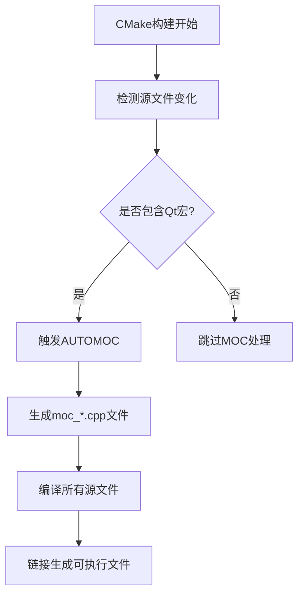

# 构建与部署

<cite>
**本文档引用的文件**   
- [CMakeLists.txt](file://CMakeLists.txt) - *在最近提交中更新*
- [README.md](file://README.md)
- [build-qt.bat](file://build-qt.bat) - *构建脚本已更新*
- [cmake-build-debug/cmake_install.cmake](file://cmake-build-debug\cmake_install.cmake)
- [.qt/QtDeploySupport.cmake](file://cmake-build-debug\.qt\QtDeploySupport.cmake)
- [.qt/QtDeployTargets.cmake](file://cmake-build-debug\.qt\QtDeployTargets.cmake)
- [src/ui/WindowPreviewPage.cpp](file://src\ui\WindowPreviewPage.cpp) - *新增预览功能*
- [include/ui/WindowPreviewPage.h](file://include\ui\WindowPreviewPage.h) - *新增头文件*
</cite>

## 更新摘要
**变更内容**   
- 项目名称从`QtDemo`更新为`qoder4huhu`
- 新增窗口预览功能模块，支持实时捕获和显示目标窗口内容
- 移除了Qt项目文件（`.pro`），转向纯CMake管理
- 清理了旧的构建脚本`build.bat`，保留`build-qt.bat`
- 输出目录从`bin`更改为绝对路径`d:/ws/out`
- 添加了对MinGW平台的特殊配置处理

## 目录
1. [项目构建系统概述](#项目构建系统概述)
2. [CMake核心配置解析](#cmake核心配置解析)
3. [跨平台适配与Windows特定设置](#跨平台适配与windows特定设置)
4. [输出目录与可执行文件属性配置](#输出目录与可执行文件属性配置)
5. [编译版本差异与调试支持](#编译版本差异与调试支持)
6. [IDE集成与项目导入指南](#ide集成与项目导入指南)
7. [部署与发布扩展建议](#部署与发布扩展建议)

## 项目构建系统概述

本项目采用CMake作为跨平台构建系统，通过`CMakeLists.txt`文件定义项目的构建流程。构建系统设计遵循模块化原则，能够自动处理Qt框架的元对象编译（MOC）、用户界面编译（UIC）和资源编译（RCC）。项目结构清晰，源代码位于`src/`目录，头文件位于`include/`目录，构建产物将被放置在`d:/ws/out/`目录下。

构建系统支持多种编译环境，包括CLion、Visual Studio以及命令行工具链。通过CMake的抽象层，开发者可以在不同平台上使用统一的构建指令，同时保留对特定平台特性的支持能力。项目已完全转向纯CMake管理，移除了传统的Qt项目文件（`.pro`），简化了构建配置。

**中文(中文)**
- [CMakeLists.txt](file://CMakeLists.txt#L1-L55)
- [README.md](file://README.md#L1-L187)

## CMake核心配置解析

### 项目定义与标准设置
`project(qoder4huhu)`指令定义了项目名称为"qoder4huhu"，这是整个构建系统的根标识符。项目要求C++17标准，通过`set(CMAKE_CXX_STANDARD 17)`和`set(CMAKE_CXX_STANDARD_REQUIRED ON)`确保编译器使用现代C++特性。

### Qt依赖管理
`find_package(Qt6 REQUIRED COMPONENTS Core Widgets)`是关键的依赖声明指令，它指示CMake查找已安装的Qt6框架，并确保Core和Widgets组件可用。此指令会导入相应的Qt目标，使得后续可以直接引用`Qt6::Core`和`Qt6::Widgets`进行链接。

### 自动化工具集成


如上图所示，`set(CMAKE_AUTOMOC ON)`、`set(CMAKE_AUTOUIC ON)`和`set(CMAKE_AUTORCC ON)`启用了Qt的自动化处理机制：
- **AUTOMOC**: 自动处理Q_OBJECT宏，生成必要的元对象代码
- **AUTOUIC**: 自动编译.ui文件为C++代码
- **AUTORCC**: 自动编译.qrc资源文件

这些设置极大地简化了Qt项目的构建流程，开发者无需手动管理MOC、UIC和RCC的调用。

**Diagram sources**
- [CMakeLists.txt](file://CMakeLists.txt#L10-L14)

**Section sources**
- [CMakeLists.txt](file://CMakeLists.txt#L1-L20)

## 跨平台适配与Windows特定设置

尽管CMake本身是跨平台的，但本项目目前仅支持Windows平台，主要原因在于代码中使用了HWND、RECT等Windows API类型。这种平台依赖性在构建系统中通过条件判断来处理：

```cmake
if(WIN32)
    set_target_properties(qoder4huhu PROPERTIES
        WIN32_EXECUTABLE TRUE
    )
    
    # MinGW特定设置：嵌入管理员权限清单
    if(MINGW)
        set_target_properties(qoder4huhu PROPERTIES
            LINK_FLAGS "-Wl,--subsystem,windows"
        )
        
        add_custom_command(TARGET qoder4huhu POST_BUILD
            COMMAND ${CMAKE_COMMAND} -E echo "正在尝试嵌入管理员权限清单..."
            COMMENT "嵌入清单文件"
        )
    endif()
    
    target_link_libraries(qoder4huhu user32 gdi32)
endif()
```

当在Windows系统上构建时，上述条件块会被激活：
- `WIN32_EXECUTABLE TRUE`标志告诉链接器生成一个Windows GUI应用程序，而不是控制台应用程序，这意味着程序启动时不会显示控制台窗口
- 对于MinGW编译器，添加了特殊的链接标志`-Wl,--subsystem,windows`以确保正确的子系统设置
- 链接`user32`和`gdi32`库以支持Windows图形界面操作和设备上下文功能

这种条件编译模式允许项目在未来轻松扩展到其他平台，只需添加相应的平台特定配置即可。

**Section sources**
- [CMakeLists.txt](file://CMakeLists.txt#L39-L52)

## 输出目录与可执行文件属性配置

### 运行时输出目录设置
`RUNTIME_OUTPUT_DIRECTORY`属性用于指定可执行文件的输出位置。当前配置为：
```cmake
set(OUTPUT_DIRECTORY "d:/ws/out")
file(MAKE_DIRECTORY ${OUTPUT_DIRECTORY})
set_target_properties(qoder4huhu PROPERTIES
    RUNTIME_OUTPUT_DIRECTORY ${OUTPUT_DIRECTORY}
    RUNTIME_OUTPUT_DIRECTORY_DEBUG ${OUTPUT_DIRECTORY}
    RUNTIME_OUTPUT_DIRECTORY_RELEASE ${OUTPUT_DIRECTORY}
)
```
这确保了所有构建生成的可执行文件都被集中放置在`d:/ws/out`目录中，便于管理和分发。`${OUTPUT_DIRECTORY}`变量指向固定的输出路径，这种绝对路径设置保证了构建产物的一致性和可预测性。

### 编译器警告级别配置
构建系统根据不同的编译器设置了适当的警告级别：
- 对于MSVC（Microsoft Visual C++），使用`/W4`开启最高级别的警告
- 对于GCC/Clang等编译器，使用`-Wall -Wextra -Wpedantic`组合选项

这些警告配置有助于在开发过程中捕获潜在的代码问题，提高代码质量。

**Section sources**
- [CMakeLists.txt](file://CMakeLists.txt#L90-L98)

## 编译版本差异与调试支持

项目支持Debug和Release两种主要构建配置，这在CMake缓存文件中有明确体现。默认情况下，`CMAKE_INSTALL_CONFIG_NAME`被设置为"Debug"，这会影响最终的安装行为和二进制文件的生成。

在Debug模式下，生成的可执行文件包含完整的调试信息，便于使用调试器进行问题排查。项目状态文档中提到的`d:/ws/out/qoder4huhu.exe`正是Debug版本的输出文件。

虽然当前构建脚本没有显式定义Release配置，但CMake默认支持多配置生成。可以通过在构建时指定`-DCMAKE_BUILD_TYPE=Release`来生成优化的发布版本，该版本通常具有更好的性能和更小的体积。

**Section sources**
- [CMakeLists.txt](file://CMakeLists.txt#L95-L98)
- [build-qt.bat](file://build-qt.bat#L30-L35)

## IDE集成与项目导入指南

### CLion集成
项目已在CLion环境中验证可用。导入步骤如下：
1. 打开CLion，选择"Open"并导航到项目根目录
2. CLion会自动识别`CMakeLists.txt`并启动CMake配置
3. 如果Qt未自动找到，可在Settings → Build, Execution, Deployment → CMake中添加：`-DCMAKE_PREFIX_PATH="你的Qt安装路径"`

### Visual Studio支持
虽然项目主要在CLion中开发，但也支持Visual Studio。可通过命令行生成Visual Studio项目文件：
```powershell
cmake -G "Visual Studio 17 2022" -DCMAKE_PREFIX_PATH="D:/Qt/6.9.2/msvc2019_64" ..
```

### Qt Creator兼容性
由于项目使用标准的CMake配置，理论上可以在Qt Creator中直接打开。Qt Creator对CMake项目有良好的原生支持，能够正确解析Qt依赖和构建目标。

**Section sources**
- [build-qt.bat](file://build-qt.bat#L1-L44)
- [README.md](file://README.md#L1-L187)

## 部署与发布扩展建议

### 当前部署机制分析
项目已经具备基本的安装支持，`cmake_install.cmake`脚本定义了安装流程。默认安装前缀为`C:/Program Files (x86)/qoder4huhu`，安装过程会生成`install_manifest.txt`记录安装的文件列表。

Qt特有的部署支持文件（如`.qt/QtDeploySupport.cmake`）表明项目利用了Qt的windeployqt工具自动收集运行时依赖。这些文件中包含了Qt库的路径信息，确保部署时能正确复制所需的DLL文件。

### 安装规则扩展
建议添加显式的安装规则以增强发布能力：
```cmake
install(TARGETS qoder4huhu DESTINATION bin)
install(DIRECTORY include/ DESTINATION include)
install(FILES README.md DESTINATION .)
```

### CPack集成建议
为了生成专业的安装程序，推荐集成CPack：
```cmake
include(CPack)
set(CPACK_PACKAGE_NAME "qoder4huhu")
set(CPACK_PACKAGE_VERSION "1.0.0")
set(CPACK_GENERATOR "ZIP;NSIS")
```
这将允许生成ZIP压缩包或NSIS安装程序，极大地方便软件分发。

**Section sources**
- [cmake_install.cmake](file://cmake-build-debug\cmake_install.cmake#L1-L61)
- [.qt/QtDeploySupport.cmake](file://cmake-build-debug\.qt\QtDeploySupport.cmake#L1-L70)
- [.qt/QtDeployTargets.cmake](file://cmake-build-debug\.qt\QtDeployTargets.cmake#L1-L3)