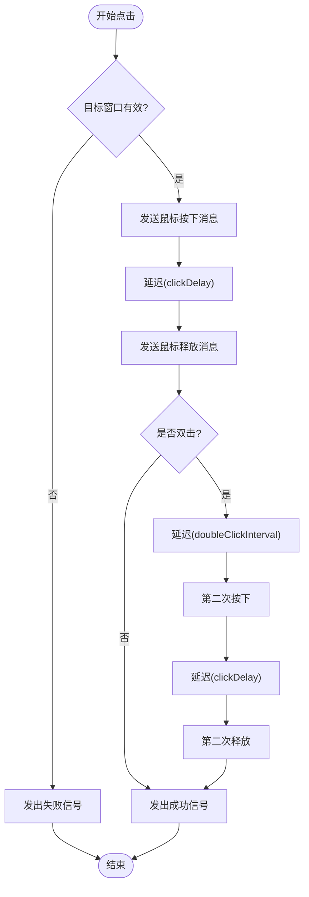
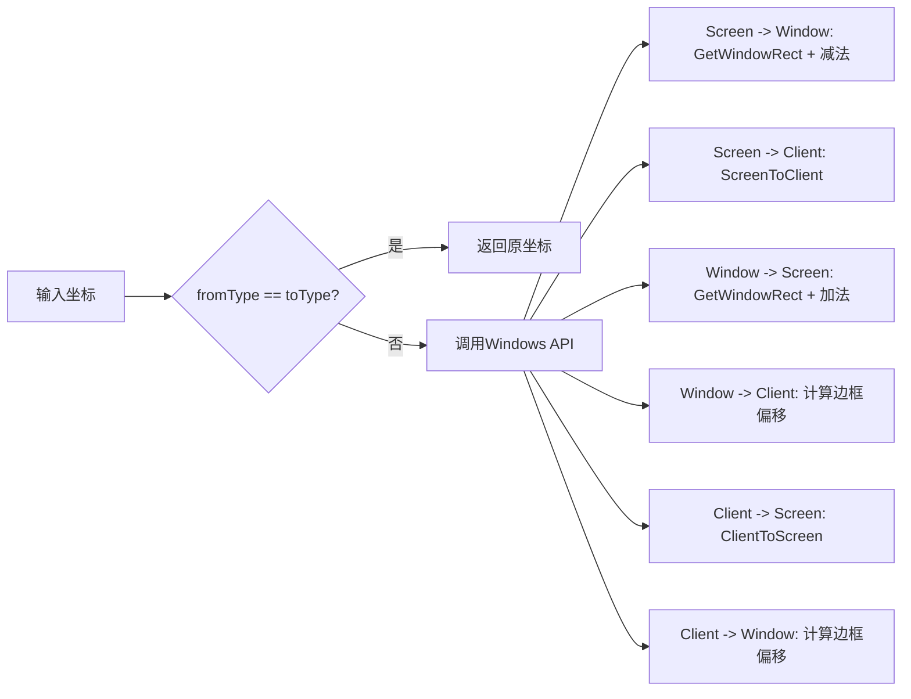

# ClickSimulator模块设计

<cite>
**本文档引用文件**
- [ClickSimulator.h](file://include/core/ClickSimulator.h)
- [ClickSimulator.cpp](file://src/core/ClickSimulator.cpp)
- [WindowManager.h](file://include/core/WindowManager.h)
- [WindowManager.cpp](file://src/core/WindowManager.cpp)
- [MainWindow.cpp](file://src/ui/MainWindow.cpp)
</cite>

## 目录
1. [简介](#简介)
2. [核心功能剖析](#核心功能剖析)
3. [坐标转换机制](#坐标转换机制)
4. [鼠标消息构造与发送](#鼠标消息构造与发送)
5. [点击类型与延时控制](#点击类型与延时控制)
6. [目标窗口状态管理](#目标窗口状态管理)
7. [使用示例](#使用示例)
8. [常见问题与解决方案](#常见问题与解决方案)
9. [结论](#结论)

## 简介
ClickSimulator模块是用于在Windows平台上模拟鼠标点击操作的核心组件。该模块通过向目标窗口句柄发送Windows消息来实现精确的用户行为模拟，支持多种坐标系统、鼠标按键和点击类型。本技术文档将深入分析其内部实现机制，重点阐述`click`函数的工作流程、坐标映射逻辑、消息参数构造以及前置条件检查等关键设计。

## 核心功能剖析

ClickSimulator的核心功能由`click`方法驱动，该方法根据传入的坐标、坐标类型、鼠标按键和点击类型执行完整的点击序列。整个过程包括坐标转换、消息构造、延迟控制和结果反馈。



**图来源**
- [ClickSimulator.cpp](file://src/core/ClickSimulator.cpp#L50-L100)

**本节来源**
- [ClickSimulator.h](file://include/core/ClickSimulator.h#L40-L55)
- [ClickSimulator.cpp](file://src/core/ClickSimulator.cpp#L50-L100)

## 坐标转换机制

ClickSimulator支持三种坐标类型：屏幕坐标、窗口坐标和客户区坐标。所有输入坐标最终都会被转换为客户区坐标，因为Windows的鼠标消息（如WM_LBUTTONDOWN）期望的是相对于客户区左上角的位置。

### 坐标类型定义
- **屏幕坐标**: 从主显示器左上角(0,0)开始的绝对位置
- **窗口坐标**: 相对于窗口外框左上角的位置（包含标题栏和边框）
- **客户区坐标**: 相对于客户区左上角的位置（不包含非客户区元素）

### 转换流程
坐标转换由`convertCoordinate`方法统一处理，它根据源类型和目标类型调用相应的Windows API：



**图来源**
- [ClickSimulator.cpp](file://src/core/ClickSimulator.cpp#L220-L280)

**本节来源**
- [ClickSimulator.h](file://include/core/ClickSimulator.h#L20-L30)
- [ClickSimulator.cpp](file://src/core/ClickSimulator.cpp#L220-L280)

## 鼠标消息构造与发送

### LPARAM参数构造
`makeLParam`方法使用Windows API宏`MAKELPARAM(x, y)`将x和y坐标打包成一个32位的LPARAM值，其中低16位存储x坐标，高16位存储y坐标。

```cpp
[SPEC SYMBOL](file://src/core/ClickSimulator.cpp#L215-L218)
```

### WPARAM参数构造
`getButtonParam`方法根据`MouseButton`枚举返回对应的WPARAM标志：
- `MouseButton::Left` → `MK_LBUTTON`
- `MouseButton::Right` → `MK_RBUTTON`
- `MouseButton::Middle` → `MK_MBUTTON`

这些标志在鼠标按下时指示哪个按钮被按下，在释放时通常为0。

```cpp
[SPEC SYMBOL](file://src/core/ClickSimulator.cpp#L208-L213)
```

### 消息发送机制
`sendMouseMessage`（实际为`mouseDown`和`mouseUp`方法）使用`PostMessage`函数异步发送鼠标消息到目标窗口的消息队列。这种方法不会阻塞调用线程，适合模拟用户操作。

```cpp
[SPEC SYMBOL](file://src/core/ClickSimulator.cpp#L123-L124)
[SPEC SYMBOL](file://src/core/ClickSimulator.cpp#L151-L152)
```

**本节来源**
- [ClickSimulator.h](file://include/core/ClickSimulator.h#L80-L85)
- [ClickSimulator.cpp](file://src/core/ClickSimulator.cpp#L208-L218)

## 点击类型与延时控制

### 单击与双击逻辑
- **单击**: 发送`WM_LBUTTONDOWN` → 延迟 → 发送`WM_LBUTTONUP`
- **双击**: 完整单击序列 → 延迟`doubleClickInterval` → 再次执行单击序列

双击间隔时间必须足够短才能被操作系统识别为双击事件。

### 延时参数
- **clickDelay**: 控制鼠标按下和释放之间的延迟，默认50ms
- **doubleClickInterval**: 控制两次单击之间的最大间隔，默认200ms

```cpp
[SPEC SYMBOL](file://src/core/ClickSimulator.cpp#L40-L41)
[SPEC SYMBOL](file://src/core/ClickSimulator.cpp#L170-L177)
[SPEC SYMBOL](file://src/core/ClickSimulator.cpp#L180-L187)
```

调整这些参数可以模拟不同速度的用户操作，提高自动化测试的真实性。

**本节来源**
- [ClickSimulator.h](file://include/core/ClickSimulator.h#L65-L75)
- [ClickSimulator.cpp](file://src/core/ClickSimulator.cpp#L40-L41)

## 目标窗口状态管理

### 窗口有效性检查
`isWindowValid`方法确保目标窗口处于可用状态：
1. 句柄不为空
2. 是有效的Windows窗口句柄（`IsWindow`）
3. 窗口可见（`IsWindowVisible`）

```cpp
[SPEC SYMBOL](file://src/core/ClickSimulator.cpp#L196-L198)
```

### 窗口置顶操作
`bringWindowToFront`方法使用`SetForegroundWindow`将目标窗口带到前台，确保鼠标事件能正确传递。

```cpp
[SPEC SYMBOL](file://src/core/ClickSimulator.cpp#L204-L206)
```

这两个检查在每次点击前自动执行，构成了安全的操作前置条件。

**本节来源**
- [ClickSimulator.h](file://include/core/ClickSimulator.h#L90-L95)
- [ClickSimulator.cpp](file://src/core/ClickSimulator.cpp#L196-L206)
- [WindowManager.cpp](file://src/core/WindowManager.cpp#L93-L95)

## 使用示例

以下代码演示如何设置目标窗口并执行客户区坐标的左键单击：

```cpp
// 获取目标窗口句柄（通常通过WindowManager获取）
HWND targetHwnd = windowManager->getBoundWindow();

// 创建ClickSimulator实例
ClickSimulator simulator;

// 设置目标窗口
simulator.setTargetWindow(targetHwnd);

// 执行客户区坐标(100, 150)的左键单击
bool success = simulator.click(100, 150, CoordinateType::Client, MouseButton::Left, ClickType::Single);

if (success) {
    qDebug() << "点击执行成功";
} else {
    qDebug() << "点击执行失败";
}
```

在UI中，可以通过`MainWindow`的点击模拟界面直接配置参数并执行操作。

**本节来源**
- [MainWindow.cpp](file://src/ui/MainWindow.cpp#L300-L350)
- [ClickSimulator.h](file://include/core/ClickSimulator.h#L40-L55)

## 常见问题与解决方案

### 权限不足导致消息发送失败
**现象**: `PostMessage`返回false，点击无响应  
**原因**: 目标进程具有更高权限或运行在不同会话中  
**解决方案**: 
- 以管理员身份运行应用程序
- 检查UAC设置
- 使用`SendMessage`替代（但可能阻塞）

### 前台窗口抢占失败
**现象**: `SetForegroundWindow`失败，窗口无法置顶  
**解决方案**:
- 确保当前进程有焦点
- 使用`AllowSetForegroundWindow` API
- 在后台模式下直接发送消息而不置顶

### 高DPI环境下坐标偏移
**现象**: 点击位置与预期不符  
**原因**: DPI缩放导致屏幕坐标与客户区坐标转换错误  
**解决方案**:
- 启用DPI感知（manifest文件）
- 使用`GetDC`和`GetDeviceCaps`获取DPI信息进行校正
- 在高DPI系统上优先使用客户区坐标

**本节来源**
- [ClickSimulator.cpp](file://src/core/ClickSimulator.cpp#L123-L124)
- [ClickSimulator.cpp](file://src/core/ClickSimulator.cpp#L204-L206)
- [WindowManager.cpp](file://src/core/WindowManager.cpp#L88-L90)

## 结论
ClickSimulator模块通过精心设计的坐标转换、消息构造和状态检查机制，实现了可靠的鼠标点击模拟功能。其灵活的API设计支持多种使用场景，从简单的单击到复杂的双击序列。通过合理配置延时参数和正确处理窗口状态，可以实现高度真实的用户行为模拟。未来可扩展支持键盘事件模拟和更复杂的输入序列编排。