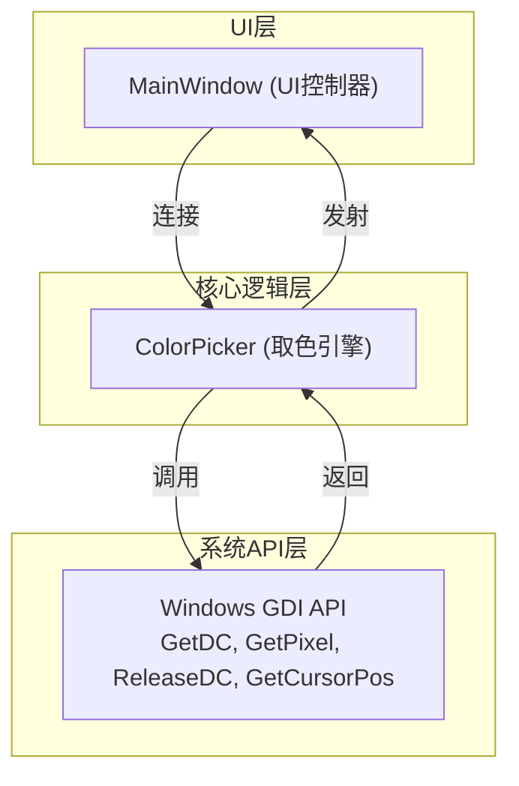
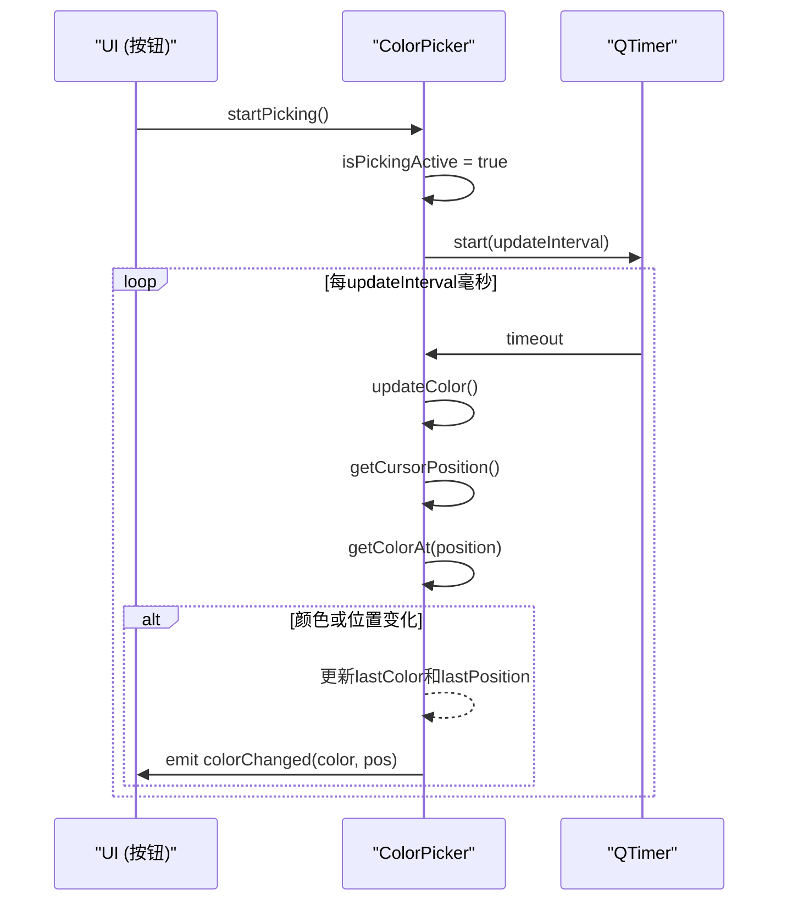
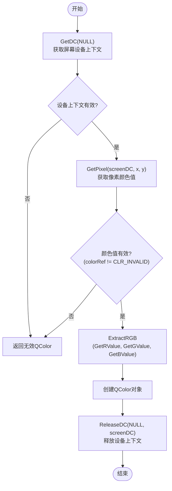

# ColorPicker模块设计

<cite>
**Referenced Files in This Document**   
- [ColorPicker.h](file://include/core/ColorPicker.h)
- [ColorPicker.cpp](file://src/core/ColorPicker.cpp)
- [MainWindow.cpp](file://src/ui/MainWindow.cpp)
</cite>

## 目录
1. [引言](#引言)
2. [核心组件分析](#核心组件分析)
3. [架构概览](#架构概览)
4. [详细组件分析](#详细组件分析)
5. [依赖关系分析](#依赖关系分析)
6. [性能考量](#性能考量)
7. [故障排除指南](#故障排除指南)
8. [结论](#结论)

## 引言

ColorPicker模块是一个专为Qt应用程序设计的屏幕取色工具，其核心功能是通过周期性采样和即时查询两种模式获取屏幕上任意位置的像素颜色。该模块利用Windows GDI API实现底层像素读取，并通过Qt信号与槽机制提供事件驱动的编程接口。本技术文档将深入解析其内部工作机制、关键设计决策以及在实际应用中的集成方式。

## 核心组件分析

ColorPicker模块的核心在于其实现了连续取色与单次取色两种工作模式。连续取色由`startPicking`方法启动，触发一个基于`QTimer`的周期性采样循环；而单次取色则通过`pickColorAtCursor`槽函数响应用户交互（如鼠标点击）来获取当前光标下的颜色值。模块通过`getPixelColor`私有方法封装了对`GetDC`、`GetPixel`和`ReleaseDC`这三个Windows API的调用流程，确保GDI设备上下文资源的正确申请与释放，防止资源泄漏。

**Section sources**
- [ColorPicker.h](file://include/core/ColorPicker.h#L1-L59)
- [ColorPicker.cpp](file://src/core/ColorPicker.cpp#L1-L126)

## 架构概览



**Diagram sources **
- [ColorPicker.h](file://include/core/ColorPicker.h#L1-L59)
- [ColorPicker.cpp](file://src/core/ColorPicker.cpp#L1-L126)
- [MainWindow.cpp](file://src/ui/MainWindow.cpp#L1-L491)

## 详细组件分析

### 周期性采样机制分析

#### 定时器驱动的更新流程


**Diagram sources **
- [ColorPicker.cpp](file://src/core/ColorPicker.cpp#L17-L24)
- [ColorPicker.cpp](file://src/core/ColorPicker.cpp#L76-L94)

**Section sources**
- [ColorPicker.cpp](file://src/core/ColorPicker.cpp#L17-L24)
- [ColorPicker.cpp](file://src/core/ColorPicker.cpp#L76-L94)

### 底层像素读取分析

#### Windows API调用流程


**Diagram sources **
- [ColorPicker.cpp](file://src/core/ColorPicker.cpp#L96-L114)

**Section sources**
- [ColorPicker.cpp](file://src/core/ColorPicker.cpp#L96-L114)

### 信号与槽机制设计意图

ColorPicker模块定义了两个关键信号：`colorChanged`和`colorPicked`，它们的设计意图明确区分了不同的使用场景。
- `colorChanged`信号用于**连续取色反馈**。当`updateTimer`定时触发`updateColor`槽函数时，如果检测到光标位置或颜色发生变化，便会发射此信号。这适用于需要实时显示光标下颜色的应用场景，例如取色器的预览功能。
- `colorPicked`信号用于**单次手动取色结果通知**。它仅在用户主动触发`pickColorAtCursor`槽函数（通常由鼠标点击事件触发）时发射。这表示一次明确的“拾取”动作完成，客户端应接收并处理这个最终选定的颜色值。

这种分离设计使得UI可以根据不同信号做出差异化响应，例如在连续取色时更新预览框，在单次取色后关闭取色模式并记录颜色。

**Section sources**
- [ColorPicker.h](file://include/core/ColorPicker.h#L30-L33)

### 性能与响应性权衡

`setUpdateInterval`方法允许用户设置`updateTimer`的触发间隔（以毫秒为单位），这直接决定了采样频率。这是一个典型的性能与响应性之间的权衡：
- **较短的间隔（如10ms）**：提供更高的响应速度和更流畅的实时预览体验，但会显著增加CPU占用率，因为`GetDC`和`GetPixel`是相对昂贵的系统调用。
- **较长的间隔（如500ms）**：大幅降低CPU负载，适合对实时性要求不高的场景，但会导致颜色更新出现明显延迟，用户体验变差。

默认值设为50ms，旨在平衡流畅度和性能开销。代码中还包含了一个优化：只有在光标位置发生改变时才进行颜色读取和比较，进一步减少了不必要的计算。

**Section sources**
- [ColorPicker.cpp](file://src/core/ColorPicker.cpp#L56-L62)

## 依赖关系分析

```mermaid
classDiagram
class ColorPicker {
+startPicking()
+stopPicking()
+isPicking() bool
+getColorAt(QPoint) QColor
+getCurrentCursorColor() QColor
+setUpdateInterval(int)
+getUpdateInterval() int
+pickColorAtCursor()
-updateColor()
-getPixelColor(int,int) QColor
-getCursorPosition() QPoint
#updateTimer QTimer*
#isPickingActive bool
#updateInterval int
#lastPosition QPoint
#lastColor QColor
}
class MainWindow {
+onStartColorPicker()
+onColorChanged(QColor,QPoint)
+onColorPicked(QColor,QPoint)
-colorPicker ColorPicker*
}
ColorPicker --> QTimer : "使用"
ColorPicker --> "Windows GDI API" : "调用"
MainWindow --> ColorPicker : "拥有指针"
MainWindow ..> ColorPicker : "连接信号槽"
```

**Diagram sources **
- [ColorPicker.h](file://include/core/ColorPicker.h#L1-L59)
- [MainWindow.cpp](file://src/ui/MainWindow.cpp#L276-L314)

**Section sources**
- [ColorPicker.h](file://include/core/ColorPicker.h#L1-L59)
- [MainWindow.cpp](file://src/ui/MainWindow.cpp#L276-L314)

## 典型使用示例

在`MainWindow`类中，实现了ColorPicker模块的典型集成方式：
1.  **实例化**：在`MainWindow`的构造函数中，通过`new ColorPicker(this)`创建`ColorPicker`实例。
2.  **信号连接**：在`connectSignals`方法中，将`colorPickerButton`的`clicked`信号连接到`onStartColorPicker`槽函数。
3.  **控制逻辑**：`onStartColorPicker`槽函数检查窗口绑定状态后，调用`colorPicker->startPicking()`或`stopPicking()`来切换取色模式。
4.  **结果处理**：将`ColorPicker`的`colorChanged`和`colorPicked`信号分别连接到`MainWindow`的`onColorChanged`和`onColorPicked`槽函数，用于更新UI显示。

此外，`mousePressEvent`被重写，以便在取色模式激活时，左键点击即可触发`pickColorAtCursor`，完成一次手动取色。

**Section sources**
- [MainWindow.cpp](file://src/ui/MainWindow.cpp#L276-L291)
- [MainWindow.cpp](file://src/ui/MainWindow.cpp#L293-L314)

## 故障排除指南

### 设备上下文获取失败
当`GetDC(NULL)`调用失败时，`getPixelColor`方法会返回一个无效的`QColor`对象（即`QColor().isValid()`为`false`）。上层逻辑（如`updateColorDisplay`）应检查颜色的有效性，避免使用无效颜色更新UI。

### 取色功能无法启动
根据`MainWindow::onStartColorPicker`的实现，若未成功绑定目标窗口，则会弹出警告对话框并阻止启动取色。这是为了确保操作的安全性，开发者需确认`windowManager`已正确初始化并绑定了有效的窗口句柄。

### 资源泄漏风险
虽然`getPixelColor`方法正确地调用了`ReleaseDC`，但如果`GetDC`成功而后续代码因异常提前退出，仍可能导致资源泄漏。建议在`getPixelColor`中使用RAII（资源获取即初始化）模式，例如创建一个简单的`ScopedDC`类来自动管理设备上下文的生命周期。

**Section sources**
- [ColorPicker.cpp](file://src/core/ColorPicker.cpp#L96-L114)
- [MainWindow.cpp](file://src/ui/MainWindow.cpp#L276-L291)

## 结论

ColorPicker模块通过精巧的设计，实现了高效且易用的屏幕取色功能。其基于`QTimer`的周期性采样机制提供了实时反馈能力，而对Windows GDI API的正确封装保证了系统资源的安全。信号`colorChanged`和`colorPicked`的分离设计清晰地划分了连续监控与单次拾取的语义。尽管存在对特定平台API的依赖，但其模块化结构和独立于具体窗口绑定的特性使其具有良好的复用性。未来可考虑添加跨平台支持（如macOS的CGImage或Linux的X11库）以增强其通用性。