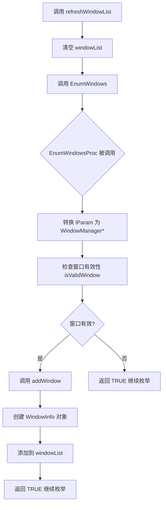
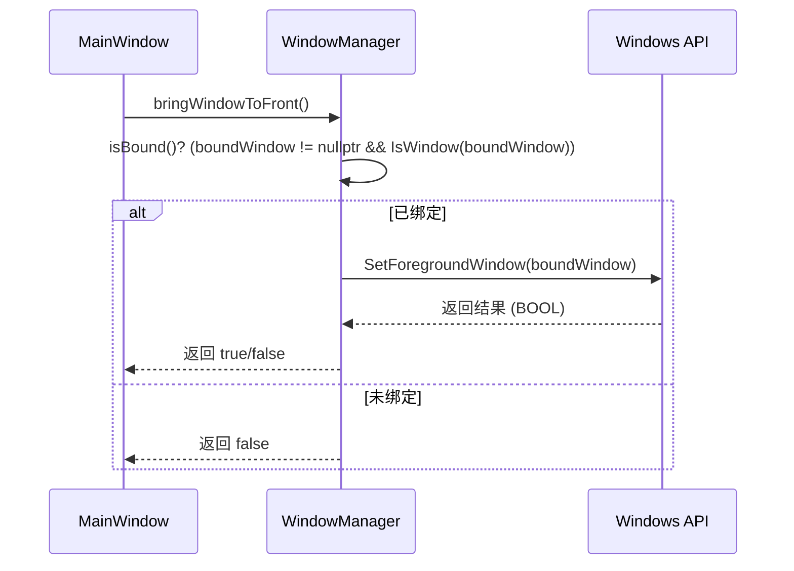
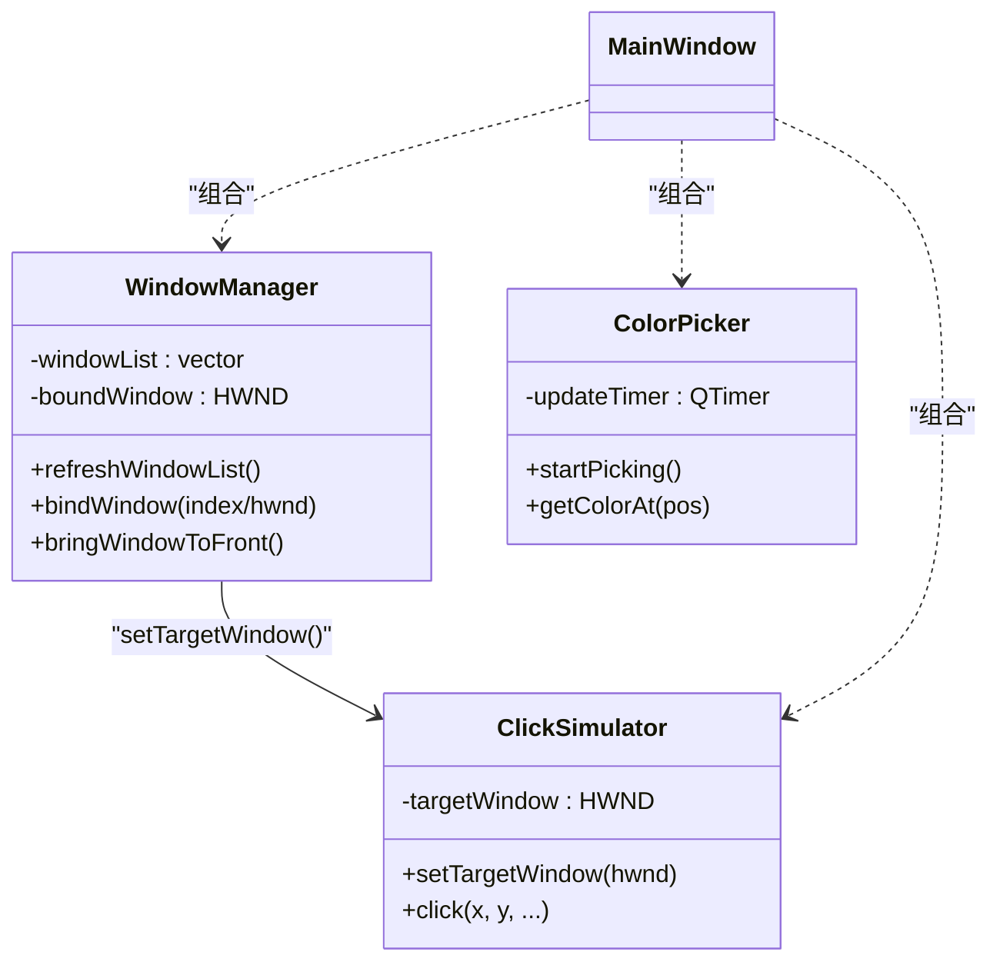

# WindowManager模块设计

<cite>
**Referenced Files in This Document**   
- [WindowManager.h](file://include/core/WindowManager.h)
- [WindowManager.cpp](file://src/core/WindowManager.cpp)
- [MainWindow.cpp](file://src/ui/MainWindow.cpp)
- [ClickSimulator.h](file://include/core/ClickSimulator.h)
- [ColorPicker.h](file://include/core/ColorPicker.h)
</cite>

## 目录
1. [引言](#引言)
2. [核心数据结构与类定义](#核心数据结构与类定义)
3. [窗口枚举机制](#窗口枚举机制)
4. [窗口绑定与状态管理](#窗口绑定与状态管理)
5. [窗口操作功能](#窗口操作功能)
6. [Q_OBJECT宏与信号槽机制](#q_object宏与信号槽机制)
7. [错误处理与日志记录](#错误处理与日志记录)
8. [模块协作关系分析](#模块协作关系分析)
9. [在主界面中的集成与使用](#在主界面中的集成与使用)
10. [结论](#结论)

## 引言

`WindowManager` 模块是整个应用程序的核心组件之一，负责管理和操作Windows系统中的顶层窗口。该模块通过调用Windows API实现了对系统所有可见窗口的枚举、筛选和绑定，并为上层UI提供了清晰的接口来展示和选择目标窗口。其主要职责包括：获取当前所有有效窗口列表、允许用户将某个窗口设置为目标窗口（即“绑定”）、提供查询已绑定窗口信息的接口，以及执行如“置顶”等窗口操作。

本技术文档将深入剖析 `WindowManager` 模块的实现原理，详细解释其关键方法的工作流程，并阐述它如何与 `ClickSimulator` 和 `ColorPicker` 等其他核心模块协同工作，共同构建一个功能完整的自动化工具。

## 核心数据结构与类定义

### WindowInfo 结构体

`WindowInfo` 是一个简单的POD（Plain Old Data）结构体，用于封装单个窗口的关键信息。它包含四个成员：
- `hwnd`: 窗口句柄（HWND），操作系统中窗口的唯一标识。
- `title`: 窗口标题（QString），显示在窗口标题栏上的文本。
- `className`: 窗口类名（QString），由创建窗口的应用程序定义，用于标识窗口类型。
- `rect`: 窗口矩形区域（RECT），描述了窗口在屏幕上的位置和大小。

该结构体提供了两个构造函数：一个默认构造函数将 `hwnd` 初始化为 `nullptr`，另一个重载构造函数允许在创建时一次性初始化所有字段。

### WindowManager 类

`WindowManager` 继承自 `QObject`，这使其能够利用Qt框架的元对象系统（Meta-Object System）。类的主要成员变量有两个：
- `windowList`: 一个 `std::vector<WindowInfo>` 容器，用于存储通过 `refreshWindowList` 方法获取的所有有效窗口的信息。
- `boundWindow`: 一个 `HWND` 类型的变量，用于保存当前被选中的目标窗口句柄。如果未绑定任何窗口，则其值为 `nullptr`。

**Section sources**
- [WindowManager.h](file://include/core/WindowManager.h#L1-L63)

## 窗口枚举机制

### EnumWindowsProc 静态回调函数

`WindowManager` 的核心功能依赖于Windows API的 `EnumWindows` 函数。该函数会遍历系统中所有的顶级窗口，并为每个窗口调用一次指定的回调函数。在此模块中，这个回调函数就是静态成员 `EnumWindowsProc`。

`EnumWindowsProc` 接收两个参数：`hwnd`（当前窗口的句柄）和 `lParam`（一个用户定义的参数）。在调用 `EnumWindows` 时，`this` 指针被作为 `lParam` 传递进去。因此，回调函数首先将 `lParam` 转换回 `WindowManager*` 类型，从而获得对当前实例的访问权限。

**Diagram sources**
- [WindowManager.cpp](file://src/core/WindowManager.cpp#L50-L55)
- [WindowManager.cpp](file://src/core/WindowManager.cpp#L150-L158)

### 窗口有效性验证

并非所有枚举到的窗口都对用户有用。`isValidWindow` 方法负责过滤掉无效或无意义的窗口。其判断逻辑如下：
1. **可见性检查**: 使用 `IsWindowVisible(hwnd)` 确保窗口是可见的。
2. **标题检查**: 调用 `getWindowTitle(hwnd)` 获取窗口标题，如果标题为空字符串，则认为该窗口无效。
3. **工具窗口检查**: 通过 `GetWindowLong(hwnd, GWL_EXSTYLE)` 获取窗口的扩展样式，并检查是否设置了 `WS_EX_TOOLWINDOW` 标志。这类窗口（如任务栏、托盘图标）通常不应被用户选择。

只有同时满足以上三个条件的窗口才会被认为是“有效”的。

### 构建窗口列表

对于每一个通过 `isValidWindow` 检查的窗口，`EnumWindowsProc` 会调用私有方法 `addWindow`。该方法使用 `getWindowTitle`、`getWindowClassName` 和 `getWindowRect` 这三个静态辅助方法分别获取窗口的标题、类名和矩形区域，然后用这些信息构造一个 `WindowInfo` 对象，并将其添加到 `windowList` 向量中。

**Section sources**
- [WindowManager.cpp](file://src/core/WindowManager.cpp#L50-L55)
- [WindowManager.cpp](file://src/core/WindowManager.cpp#L150-L158)
- [WindowManager.cpp](file://src/core/WindowManager.cpp#L160-L168)

## 窗口绑定与状态管理

### bindWindow 方法

`bindWindow` 提供了两种重载方式来绑定目标窗口：
- `bool bindWindow(int index)`: 通过索引绑定。该方法首先检查索引是否在 `windowList` 的有效范围内，然后从列表中取出对应索引的 `WindowInfo`，将其 `hwnd` 赋值给 `boundWindow`，并再次调用 `isWindowValid` 进行最终验证。只有验证通过才返回 `true`。
- `bool bindWindow(HWND hwnd)`: 通过句柄直接绑定。该方法直接检查传入的 `hwnd` 是否有效，如果有效则进行绑定并返回 `true`。

这两种方法都体现了防御性编程的思想，在绑定前进行充分的校验。

### 状态查询接口

模块提供了多个接口来查询当前的绑定状态：
- `bool isBound() const`: 检查 `boundWindow` 是否不为 `nullptr` 且仍然有效。
- `HWND getBoundWindow() const`: 直接返回 `boundWindow` 句柄。
- `WindowInfo getBoundWindowInfo() const`: 如果已绑定，则返回一个包含当前绑定窗口完整信息的 `WindowInfo` 对象；否则返回一个 `hwnd` 为 `nullptr` 的默认 `WindowInfo`。

这些接口使得外部代码可以方便地获取目标窗口的状态和信息。

**Section sources**
- [WindowManager.h](file://include/core/WindowManager.h#L30-L40)
- [WindowManager.cpp](file://src/core/WindowManager.cpp#L70-L90)

## 窗口操作功能

### bringWindowToFront 方法

此方法用于将已绑定的目标窗口带到前台并激活。其实现非常直接：首先调用 `isBound()` 确认存在有效的绑定窗口，然后调用Windows API的 `SetForegroundWindow(boundWindow)`。该API成功时返回非零值，因此方法通过比较返回值与0来决定最终的布尔返回值。

**Diagram sources**
- [WindowManager.cpp](file://src/core/WindowManager.cpp#L92-L100)

## Q_OBJECT宏与信号槽机制

虽然 `WindowManager` 类本身没有定义任何信号（signals），但它继承自 `QObject` 并使用了 `Q_OBJECT` 宏。这表明该类的设计具有潜在的扩展性。

`Q_OBJECT` 宏启用了Qt的元对象系统，其主要作用包括：
1. **信号与槽（Signals & Slots）**: 允许该类在未来轻松地添加信号，以便在内部状态发生变化时通知其他对象。例如，未来可以添加 `windowBound(const WindowInfo&)` 或 `windowListUpdated(int count)` 等信号。
2. **运行时类型信息（RTTI）**: 支持 `qobject_cast` 等安全的向下转型。
3. **动态属性系统**: 允许在运行时为对象添加属性。

尽管当前版本的 `WindowManager` 主要通过直接的方法调用来与 `MainWindow` 交互，但其基于 `QObject` 的设计为未来的异步事件驱动架构升级奠定了基础。

**Section sources**
- [WindowManager.h](file://include/core/WindowManager.h#L25)

## 错误处理与日志记录

`WindowManager` 模块的错误处理策略主要体现在其方法的返回值上。例如，`bindWindow` 在失败时会返回 `false`，这为调用者提供了明确的反馈。

然而，具体的日志记录行为是由其调用者 `MainWindow` 来完成的。当 `onBindWindow` 槽函数调用 `bindWindow` 失败时，它会记录一条错误日志（`LOG_ERROR`）并弹出警告对话框提示用户。这种设计将业务逻辑（绑定窗口）与用户交互（显示错误）分离，符合关注点分离的原则。

**Section sources**
- [WindowManager.cpp](file://src/core/WindowManager.cpp#L70-L90)
- [MainWindow.cpp](file://src/ui/MainWindow.cpp#L250-L270)

## 模块协作关系分析

`WindowManager` 与 `ClickSimulator` 和 `ColorPicker` 模块构成了一个紧密协作的功能链。

### 与 ClickSimulator 的协作

`ClickSimulator` 模块负责模拟鼠标点击事件。为了正确地向目标窗口发送消息，它必须知道目标窗口的句柄。在 `MainWindow` 中，当 `bindWindow` 成功后，会立即调用 `clickSimulator->setTargetWindow(info.hwnd)` 将同一个窗口句柄传递给 `ClickSimulator`。

**Diagram sources**
- [MainWindow.cpp](file://src/ui/MainWindow.cpp#L260)
- [ClickSimulator.h](file://include/core/ClickSimulator.h#L30)

### 与 ColorPicker 的协作

`ColorPicker` 模块用于实时拾取屏幕上的颜色。虽然它可以独立运行，但在实际应用中，它的启动受到 `WindowManager` 状态的约束。在 `onStartColorPicker` 槽函数中，首先会检查 `windowManager->isBound()`，只有在已绑定窗口的情况下才允许启动取色模式。这确保了用户是在一个有意义的上下文中进行取色操作。

**Section sources**
- [MainWindow.cpp](file://src/ui/MainWindow.cpp#L275-L285)
- [ClickSimulator.h](file://include/core/ClickSimulator.h#L30)
- [ColorPicker.h](file://include/core/ColorPicker.h#L20)

## 在主界面中的集成与使用

`WindowManager` 在 `MainWindow` 类中被实例化为一个成员指针 `windowManager`，并在构造函数中通过 `new WindowManager(this)` 创建。`this` 作为父对象传递，确保了内存的自动管理。

最关键的集成点是 `onRefreshWindows` 槽函数。当用户点击“刷新列表”按钮时，该函数被触发，其核心步骤如下：
1. 调用 `windowManager->refreshWindowList()` 更新内部的窗口列表。
2. 清空UI中的 `windowComboBox`。
3. 遍历 `windowManager->getWindowCount()` 和 `getWindowInfo(i)`，将每个窗口的标题和类名格式化后添加到下拉框中。

这一过程完美地展示了如何将底层的窗口枚举功能与上层的UI展示相结合。

**Section sources**
- [MainWindow.cpp](file://src/ui/MainWindow.cpp#L15-L25)
- [MainWindow.cpp](file://src/ui/MainWindow.cpp#L200-L220)

## 结论

`WindowManager` 模块是一个设计精良、职责明确的核心组件。它通过巧妙地结合Windows API的 `EnumWindows` 回调机制和Qt的面向对象特性，高效地完成了系统窗口的发现、筛选和管理任务。其提供的简洁API使得上层UI能够轻松地集成窗口选择功能。同时，它与 `ClickSimulator` 和 `ColorPicker` 模块的协作，展现了整个应用程序模块化、高内聚低耦合的优秀架构设计。