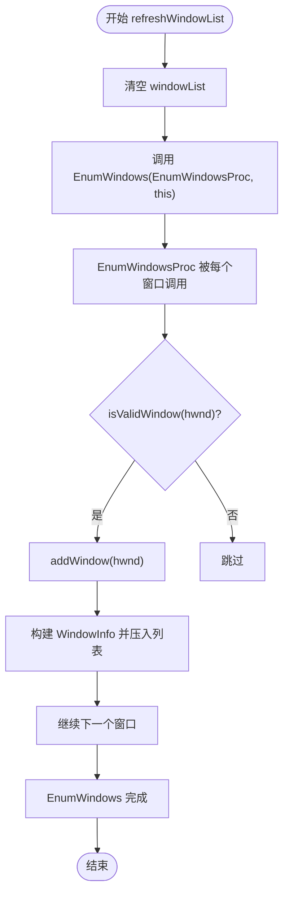
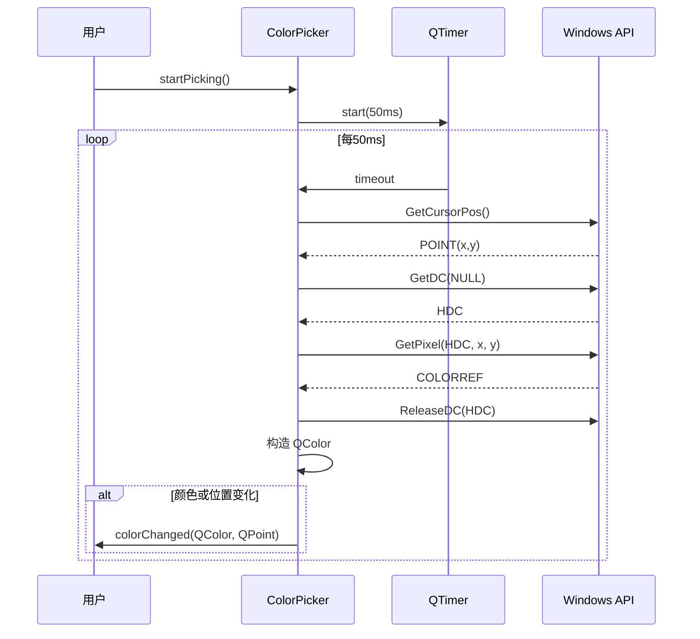

# 核心模块技术设计

<cite>
**本文档中引用的文件**  
- [WindowManager.h](file://include/core/WindowManager.h)
- [WindowManager.cpp](file://src/core/WindowManager.cpp)
- [ColorPicker.h](file://include/core/ColorPicker.h)
- [ColorPicker.cpp](file://src/core/ColorPicker.cpp)
- [ClickSimulator.h](file://include/core/ClickSimulator.h)
- [ClickSimulator.cpp](file://src/core/ClickSimulator.cpp)
- [CoordinateConverter.h](file://include/core/CoordinateConverter.h) - *在最近提交中更新*
- [CoordinateConverter.cpp](file://src/core/CoordinateConverter.cpp) - *在最近提交中更新*
</cite>

## 更新摘要
**已做更改**  
- 修正了`CoordinateConverter`类中关于窗口有效性的判断逻辑，移除了对`IsWindowVisible`的检查，以支持最小化窗口的操作。
- 在`ClickSimulator`和`WindowManager`模块中同步更新了窗口有效性验证逻辑，确保与`CoordinateConverter`保持一致。
- 更新了相关流程图以反映最新的坐标转换和窗口操作行为。

## 目录
1. [WindowManager 模块](#windowmanager-模块)  
2. [ColorPicker 模块](#colorpicker-模块)  
3. [ClickSimulator 模块](#clicksimulator-模块)

## WindowManager 模块

`WindowManager` 类负责枚举系统中的顶层窗口，管理窗口绑定状态，并提供对目标窗口的操作接口。其核心功能包括窗口列表刷新、绑定与操作。

### 窗口枚举机制

通过调用 Windows API 的 `EnumWindows` 函数并传入静态回调函数 `EnumWindowsProc`，遍历所有顶层窗口句柄。该回调函数将每个有效窗口添加到 `windowList` 中。

在 `refreshWindowList()` 方法中，首先清空现有列表，然后启动枚举过程：

```cpp
void WindowManager::refreshWindowList()
{
    windowList.clear();
    EnumWindows(EnumWindowsProc, (LPARAM)this);
}
```

`EnumWindowsProc` 回调函数接收窗口句柄和用户参数（即 `this` 指针），验证窗口有效性后调用 `addWindow` 将其加入列表。

### 窗口过滤逻辑

并非所有枚举出的窗口都应被展示。`isValidWindow` 方法执行以下过滤规则：
- 排除不可见窗口（`IsWindowVisible(hwnd)` 为假）
- 排除标题为空的窗口（通过 `getWindowTitle` 获取）
- 排除工具窗口（检查扩展样式 `WS_EX_TOOLWINDOW`）

此过滤确保 UI 展示的窗口均为用户可交互的有效窗口。

### 窗口绑定与信息获取

`bindWindow` 提供两种重载：通过索引或直接通过 HWND 绑定。绑定前会调用 `isWindowValid` 验证句柄有效性，防止绑定已销毁或无效的窗口。

绑定成功后，可通过 `getBoundWindowInfo()` 获取当前绑定窗口的完整信息（句柄、标题、类名、矩形区域）。这些信息用于 UI 显示和后续操作。

### 窗口操作接口

`bringWindowToFront()` 方法使用 `SetForegroundWindow` API 将绑定窗口置于前台。该操作仅在窗口有效且已绑定时执行。



**图示来源**  
- [WindowManager.h](file://include/core/WindowManager.h#L22-L61)
- [WindowManager.cpp](file://src/core/WindowManager.cpp#L0-L170)

**本节来源**  
- [WindowManager.h](file://include/core/WindowManager.h#L22-L61)
- [WindowManager.cpp](file://src/core/WindowManager.cpp#L0-L170)

## ColorPicker 模块

`ColorPicker` 类实现屏幕取色功能，支持周期性采样和单次取色，基于 Qt 的 `QTimer` 和 Windows GDI API 实现。

### 周期性采样机制

`startPicking()` 启动一个定时器 `updateTimer`，以设定的间隔（默认 50ms）触发 `updateColor()` 槽函数。`stopPicking()` 则停止定时器并发出信号。

```cpp
void ColorPicker::startPicking()
{
    if (!isPickingActive) {
        isPickingActive = true;
        updateTimer->start(updateInterval);
        emit pickingStarted();
    }
}
```

### 屏幕像素颜色获取

`getPixelColor(int x, int y)` 是核心取色方法，调用 Windows API：
1. `GetDC(NULL)` 获取整个屏幕的设备上下文（DC）
2. `GetPixel(screenDC, x, y)` 获取指定坐标处的颜色值（COLORREF）
3. `ReleaseDC(NULL, screenDC)` 释放 DC 资源

随后将 COLORREF 分解为 RGB 分量并构造 `QColor` 对象返回。

### 光标取色实现

`getCurrentCursorColor()` 结合 `getCursorPosition()` 和 `getColorAt()` 实现光标位置取色：
- `getCursorPosition()` 使用 `GetCursorPos(&POINT)` 获取全局坐标
- `getColorAt()` 调用 `getPixelColor` 在该坐标取色

当处于取色模式时，鼠标移动会触发 `updateColor()`，比较当前位置与上次位置，若不同则重新取色并发射 `colorChanged` 信号。



**图示来源**  
- [ColorPicker.h](file://include/core/ColorPicker.h#L12-L56)
- [ColorPicker.cpp](file://src/core/ColorPicker.cpp#L0-L125)

**本节来源**  
- [ColorPicker.h](file://include/core/ColorPicker.h#L12-L56)
- [ColorPicker.cpp](file://src/core/ColorPicker.cpp#L0-L125)

## ClickSimulator 模块

`ClickSimulator` 类模拟鼠标点击行为，支持多种坐标系、按键类型和点击模式，通过 Windows 消息机制实现。

### 坐标转换机制

根据 `CoordinateType` 枚举（Screen, Window, Client），在发送消息前将坐标转换为客户区坐标：
- `screenToClient`: 使用 `ScreenToClient(targetWindow, &point)`
- `windowToClient`: 计算窗口边框偏移后转换
- `clientToScreen`: 使用 `ClientToScreen(targetWindow, &point)`

`convertCoordinate` 方法统一处理所有转换逻辑。

### 消息参数构造

- `makeLParam(int x, int y)`: 使用 `MAKELPARAM(x, y)` 构造 lParam，包含客户区坐标。
- `getButtonParam(MouseButton button)`: 返回 wParam 所需的标志位（如 `MK_LBUTTON`）。

### 点击行为模拟

`click()` 方法根据 `ClickType` 决定行为：
- **单击**: 发送 `WM_LBUTTONDOWN` + 延迟 + `WM_LBUTTONUP`
- **双击**: 执行两次单击，中间间隔 `doubleClickInterval`

底层通过 `PostMessage` 发送 Windows 消息：
- `mouseDown()`: 发送 `WM_XBUTTONDOWN` 消息
- `mouseUp()`: 发送 `WM_XBUTTONUP` 消息

延迟由 `delay(int ms)` 实现，内部调用 `QThread::msleep(ms)`。

### 错误处理与信号

- 若无有效目标窗口，立即返回 `false` 并发射 `clickFailed` 信号。
- 成功执行后发射 `clickExecuted` 信号，携带位置、坐标类型和按键信息。
- 支持设置 `clickDelay`（按下与释放间隔）和 `doubleClickInterval`（两次单击间隔）。

```mermaid
flowchart TD
Start([click(x, y, ...)]) --> HasTarget{"hasTargetWindow()?"}
HasTarget --> |否| EmitFail["emit clickFailed('未设置目标窗口')"]
HasTarget --> |是| Convert["convertCoordinate(pos, coordType, Client)"]
Convert --> IsSingle{"clickType == Single?"}
IsSingle --> |是| Down1["mouseDown(...)"]
Down1 --> Delay1["delay(clickDelay)"]
Delay1 --> Up1["mouseUp(...)"]
Up1 --> CheckSuccess1{"成功?"}
IsSingle --> |否| Down2["mouseDown(...)"]
Down2 --> Delay2["delay(clickDelay)"]
Delay2 --> Up2["mouseUp(...)"]
Up2 --> Delay3["delay(doubleClickInterval)"]
Delay3 --> Down3["mouseDown(...)"]
Down3 --> Delay4["delay(clickDelay)"]
Delay4 --> Up3["mouseUp(...)"]
Up3 --> CheckSuccess2{"成功?"}
CheckSuccess1 --> |是| EmitSuccess["emit clickExecuted(...)"]
CheckSuccess1 --> |否| EmitFail
CheckSuccess2 --> |是| EmitSuccess
CheckSuccess2 --> |否| EmitFail
EmitSuccess --> ReturnTrue["return true"]
EmitFail --> ReturnFalse["return false"]
```

**图示来源**  
- [ClickSimulator.h](file://include/core/ClickSimulator.h#L27-L96)
- [ClickSimulator.cpp](file://src/core/ClickSimulator.cpp#L0-L287)

**本节来源**  
- [ClickSimulator.h](file://include/core/ClickSimulator.h#L27-L96)
- [ClickSimulator.cpp](file://src/core/ClickSimulator.cpp#L0-L287)