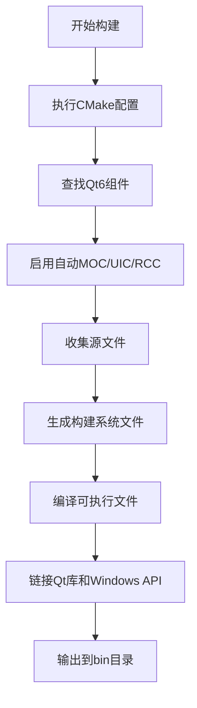

# 贡献指南

<cite>
**本文档引用的文件**
- [CMakeLists.txt](file://CMakeLists.txt)
- [COMPILE_FIX.md](file://COMPILE_FIX.md)
- [README.md](file://README.md)
- [include/core/WindowManager.h](file://include/core/WindowManager.h)
- [include/core/ClickSimulator.h](file://include/core/ClickSimulator.h)
- [include/ui/MainWindow.h](file://include/ui/MainWindow.h)
- [src/main.cpp](file://src/main.cpp)
</cite>

## 目录
1. [引言](#引言)
2. [代码风格规范](#代码风格规范)
3. [提交流程要求](#提交流程要求)
4. [测试与验证标准](#测试与验证标准)
5. [构建系统注意事项](#构建系统注意事项)
6. [贡献流程示例](#贡献流程示例)
7. [代码审查流程](#代码审查流程)

## 引言
本贡献指南旨在为开发者提供清晰、一致的项目参与规范。通过遵循统一的代码风格、提交格式和测试要求，确保代码库的可维护性和稳定性。本项目采用模块化设计，核心功能包括窗口管理、颜色拾取和点击模拟，基于Qt6框架开发。

## 代码风格规范

### 命名约定
本项目遵循Google C++ Style Guide并结合Qt框架惯例：

- **类名**：采用大驼峰命名法（PascalCase），如 `MainWindow`、`WindowManager`
- **成员变量**：以下划线结尾，如 `windowManager_`、`clickSimulator_`
- **信号与槽函数**：使用动词短语命名，如 `onStartColorPicker()`、`onSimulateClick()`
- **枚举类型**：使用 `enum class` 定义作用域枚举，如 `CoordinateType`、`MouseButton`

```cpp
// 示例：类定义
class ClickSimulator : public QObject
{
    Q_OBJECT
public:
    explicit ClickSimulator(QObject *parent = nullptr);
    
private slots:
    void onStartColorPicker();
    void onSimulateClick();

private:
    WindowManager* windowManager_;
    ColorPicker* colorPicker_;
};
```

### 头文件结构
所有头文件必须包含守卫宏，并按以下顺序组织：
1. 自身头文件包含
2. Qt系统头文件
3. 第三方库头文件
4. 本项目其他头文件

**Section sources**
- [include/core/WindowManager.h](file://include/core/WindowManager.h#L1-L63)
- [include/core/ClickSimulator.h](file://include/core/ClickSimulator.h#L1-L98)
- [include/ui/MainWindow.h](file://include/ui/MainWindow.h#L1-L108)

## 提交流程要求

### Git提交信息格式
所有提交必须遵循以下格式：

```
简明摘要（不超过50字符）

详细描述内容，解释修改原因、影响范围和实现方式。
如果涉及特定问题，关联相关issue编号。

Fixes #123
```

#### 示例
```
修复WindowManager构造函数参数错误

原WindowManager未继承QObject，导致无法接受parent参数。
修改后继承QObject并添加Q_OBJECT宏，确保MOC正确处理。
同时修正MainWindow中对WindowManager的初始化调用。

Fixes #45
```

### 分支管理策略
- 主分支 (`main`)：受保护，仅允许通过PR合并
- 功能分支：以 `feature/` 开头，如 `feature/keyboard-simulator`
- 修复分支：以 `fix/` 开头，如 `fix/window-binding-bug`
- 发布分支：以 `release/` 开头，用于版本发布

**Section sources**
- [COMPILE_FIX.md](file://COMPILE_FIX.md#L1-L61)

## 测试与验证标准

### 编译要求
所有新增或修改的代码必须满足：
- 可成功编译通过
- 不引入任何编译警告
- 在MSVC和MinGW环境下均能正常构建

CMake配置中已启用严格警告选项：
```cmake
if(MSVC)
    target_compile_options(QtDemo PRIVATE /W4)
else()
    target_compile_options(QtDemo PRIVATE -Wall -Wextra -Wpedantic)
endif()
```

### 测试覆盖要求
- **新功能**：必须提供相应的单元测试或集成测试
- **问题修复**：必须附带复现原问题的测试用例，证明修复有效
- **关键路径**：核心功能模块需保持高测试覆盖率

参考 `COMPILE_FIX.md` 中记录的已知问题修复方案，贡献者应学习类似模式进行问题定位和修复验证。

**Section sources**
- [CMakeLists.txt](file://CMakeLists.txt#L50-L55)
- [COMPILE_FIX.md](file://COMPILE_FIX.md#L1-L61)

## 构建系统注意事项

### CMakeLists.txt 修改原则
对构建文件的修改必须确保：
- 兼容主流编译器（MSVC、GCC、Clang）
- 支持Qt6.2及以上版本
- 保持跨平台构建能力（当前主要支持Windows）

关键构建配置说明：
- 启用C++17标准
- 自动处理MOC、UIC、RCC
- 链接必要的Windows API库（user32、gdi32）
- 设置统一的输出目录



**Diagram sources**
- [CMakeLists.txt](file://CMakeLists.txt#L1-L55)

**Section sources**
- [CMakeLists.txt](file://CMakeLists.txt#L1-L55)

## 贡献流程示例

### 新增功能：键盘模拟器
1. 创建功能分支：`git checkout -b feature/keyboard-simulator`
2. 实现 `KeyboardSimulator` 类，遵循命名规范
3. 添加UI控件和信号槽连接
4. 编写测试用例验证按键发送功能
5. 更新 `CMakeLists.txt` 包含新文件
6. 提交PR，关联需求issue

### 问题修复：窗口绑定异常
参考 `COMPILE_FIX.md` 中的修复模式：
1. 定位问题根源（缺少QObject继承）
2. 修改类定义并更新构造函数
3. 修正调用点代码
4. 验证编译通过且功能正常
5. 提交包含详细说明的commit

**Section sources**
- [COMPILE_FIX.md](file://COMPILE_FIX.md#L1-L61)
- [README.md](file://README.md#L1-L187)

## 代码审查流程

### PR审查要求
所有Pull Request必须经过至少一位维护者审核才能合并，审查重点包括：
- 是否符合代码风格规范
- 是否通过所有CI检查
- 是否包含适当的测试
- 文档是否同步更新
- 是否存在潜在性能问题

### 鼓励的贡献类型
- **文档完善**：补充API说明、使用示例
- **性能优化**：改进算法效率、减少资源消耗
- **新特性开发**：如键盘模拟、图像识别等未来扩展功能
- **工具改进**：增强日志系统、添加调试工具

维护团队将定期回顾贡献记录，对持续高质量贡献者授予协作权限。

**Section sources**
- [README.md](file://README.md#L150-L180)
- [COMPILE_FIX.md](file://COMPILE_FIX.md#L1-L61)