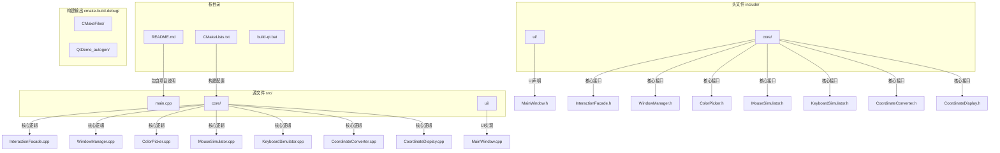

<docs>
# 项目概述

<cite>
**本文档引用的文件**   
- [README.md](file://README.md)
- [InteractionFacade.h](file://include/core/InteractionFacade.h) - *在最近提交中更新*
- [WindowManager.h](file://include/core/WindowManager.h) - *在最近提交中更新*
- [ColorPicker.h](file://include/core/ColorPicker.h) - *在最近提交中更新*
- [MouseSimulator.h](file://include/core/MouseSimulator.h) - *在最近提交中更新*
- [KeyboardSimulator.h](file://include/core/KeyboardSimulator.h) - *在最近提交中更新*
- [CoordinateConverter.h](file://include/core/CoordinateConverter.h) - *在最近提交中更新*
- [CoordinateDisplay.h](file://include/core/CoordinateDisplay.h) - *在最近提交中更新*
- [MainWindow.cpp](file://src/ui/MainWindow.cpp) - *在最近提交中更新*
- [InteractionFacade.cpp](file://src/core/InteractionFacade.cpp) - *在最近提交中更新*
</cite>

## 更新摘要
**已做更改**   
- 根据最新的架构变更，将核心组件从独立模块重构为外观模式统一接口
- 新增了`InteractionFacade`作为统一入口点，并更新了所有相关功能描述
- 更新了架构概览图以反映新的分层设计
- 重写了核心组件分析部分，详细说明了外观模式的设计与实现
- 更新了依赖关系分析以展示新的模块间依赖结构
- 移除了过时的`ClickSimulator`单独分析，整合到新的架构描述中
- 增加了对坐标显示功能的完整描述

## 目录
1. [简介](#简介)
2. [项目结构](#项目结构)
3. [核心组件](#核心组件)
4. [架构概览](#架构概览)
5. [详细组件分析](#详细组件分析)
6. [依赖关系分析](#依赖关系分析)
7. [性能考量](#性能考量)
8. [故障排除指南](#故障排除指南)
9. [结论](#结论)

## 简介

new项目是一个基于Qt6框架的桌面应用程序，旨在为开发者和技术人员提供一套强大的窗口操作工具集。该项目专注于实现三大核心功能：系统级窗口管理、实时屏幕颜色拾取和精确鼠标点击模拟。这些功能特别适用于自动化测试、辅助工具开发以及需要精细控制用户界面交互的技术场景。

目标用户群体主要包括C++开发者、Qt初学者以及需要进行窗口操作的技术人员。对于初学者，该项目提供了清晰的模块化设计和直观的用户界面，便于学习和理解；对于高级用户，则展示了如何利用Windows API与Qt信号槽机制相结合来实现复杂的系统级操作。

项目通过**外观模式(Facade Pattern)** 架构，将多个核心功能模块统一封装在`InteractionFacade`中，包括`WindowManager`、`ColorPicker`、`CoordinateConverter`、`MouseSimulator`、`KeyboardSimulator`和`CoordinateDisplay`等组件。这种设计模式简化了客户端代码的使用复杂性，同时保持了各模块的独立性和可维护性。每个组件都遵循单一职责原则，确保代码的可维护性和扩展性。此外，项目采用现代C++标准（C++17）并结合Qt6的强大功能，保证了跨平台兼容性和高性能表现。

## 项目结构

该项目采用了清晰的模块化目录结构，将源代码、头文件和构建配置分离，便于管理和维护。整体结构分为四个主要部分：源文件目录(src)、头文件目录(include)、构建脚本和项目文档。



**图示来源**
- [README.md](file://README.md#L1-L143)

**章节来源**
- [README.md](file://README.md#L1-L143)

## 核心组件

本项目的核心由一个统一的外观接口和六个精心设计的功能模块构成：`InteractionFacade`作为统一入口点，`WindowManager`负责系统级窗口的枚举与绑定，`ColorPicker`提供实时屏幕取色功能，`CoordinateConverter`处理不同坐标系之间的转换，`MouseSimulator`实现了精确的鼠标点击模拟，`KeyboardSimulator`支持键盘按键模拟，而`CoordinateDisplay`则提供了实时坐标显示与捕获功能。这七个组件共同构成了一个完整的窗口操作工具链，满足了从窗口识别到交互模拟的全流程需求。

`InteractionFacade`组件通过外观模式封装了所有核心功能模块，为上层应用提供了一个简洁统一的API接口。它不仅协调各个模块的工作，还处理模块间的依赖关系和数据传递，大大降低了客户端代码的复杂性。

`WindowManager`组件通过调用Windows API中的`EnumWindows`函数实现对系统中所有可见窗口的枚举，并过滤掉工具窗口和无标题窗口以提高实用性。它能够获取每个窗口的详细信息，包括句柄、标题、类名以及位置尺寸等属性。该组件还提供了安全的窗口绑定机制，在绑定前会验证窗口的有效性和可见性。

`ColorPicker`组件利用Windows GDI API中的`GetPixel`函数实现屏幕像素颜色的读取，支持以RGB和十六进制格式显示颜色值。通过一个可调节更新频率的定时器，它可以实现实时的颜色预览功能。当用户在取色模式下点击鼠标时，即可捕获当前光标位置的颜色信息。

`MouseSimulator`组件是整个项目中最复杂的功能模块之一，它使用Windows消息机制（`PostMessage`）来模拟鼠标点击事件。该组件支持多种坐标系转换，包括屏幕绝对坐标、窗口相对坐标和客户区相对坐标，确保点击操作能够在正确的上下文中执行。同时，它还支持左键、右键、中键的单击和双击操作，并可通过设置延迟参数来调整点击速度。

`KeyboardSimulator`组件同样基于Windows消息机制，用于模拟键盘按键操作。它支持单个按键、组合键（如Ctrl+C）以及文本输入等多种操作方式。通过`keyPressWithModifiers`等便捷接口，可以轻松实现复杂的键盘输入模拟。

`CoordinateConverter`组件专门负责处理不同坐标系之间的转换工作。由于Windows系统的坐标系统较为复杂，涉及屏幕坐标、窗口坐标和客户区坐标等多种类型，该组件提供了统一的转换接口，简化了坐标计算的复杂性。

`CoordinateDisplay`组件实现了实时坐标显示功能，允许用户在目标窗口内移动鼠标时实时查看当前位置的三种坐标值（屏幕、窗口、客户区）。它还支持通过快捷键捕获当前坐标，方便用户快速获取精确的位置信息。

**章节来源**
- [InteractionFacade.h](file://include/core/InteractionFacade.h#L29-L116)
- [WindowManager.h](file://include/core/WindowManager.h#L22-L61)
- [ColorPicker.h](file://include/core/ColorPicker.h#L12-L56)
- [MouseSimulator.h](file://include/core/MouseSimulator.h#L12-L70)
- [KeyboardSimulator.h](file://include/core/KeyboardSimulator.h#L11-L64)
- [CoordinateConverter.h](file://include/core/CoordinateConverter.h#L11-L54)
- [CoordinateDisplay.h](file://include/core/CoordinateDisplay.h#L13-L70)

## 架构概览

该项目的整体架构体现了典型的分层设计思想和外观模式的应用，将用户界面、业务逻辑和系统交互清晰地分离。顶层是基于Qt Widgets的用户界面层，中间是外观统一入口层，下面是具体的功能模块层，底层则是与操作系统交互的系统调用层。

```mermaid
graph TD
UI[用户界面层<br/>MainWindow] --> Facade[InteractionFacade<br/>外观统一入口]

subgraph Core[核心模块层]
    WM[WindowManager<br/>窗口管理]
    CP[ColorPicker<br/>颜色拾取] 
    CC[CoordinateConverter<br/>坐标转换]
    MS[MouseSimulator<br/>鼠标模拟]
    KS[KeyboardSimulator<br/>键盘模拟]
    CD[CoordinateDisplay<br/>坐标显示]
end

Facade --> WM
Facade --> CP
Facade --> CC
Facade --> MS
Facade --> KS  
Facade --> CD

Core --> OS[系统调用层<br/>Windows API]
WM --> |EnumWindows| OS
WM --> |IsWindowVisible| OS
WM --> |GetWindowTextW| OS
WM --> |GetClassNameW| OS
WM --> |GetWindowRect| OS
CP --> |GetDC| OS
CP --> |GetPixel| OS
CP --> |GetCursorPos| OS
CC --> |GetWindowRect| OS
CC --> |GetClientRect| OS
MS --> |PostMessage| OS
MS --> |SetForegroundWindow| OS
MS --> |ScreenToClient|