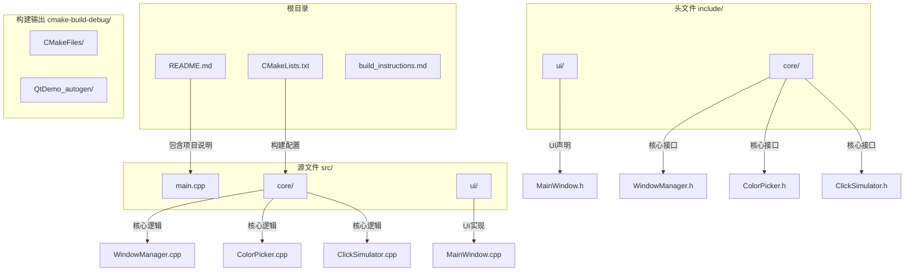
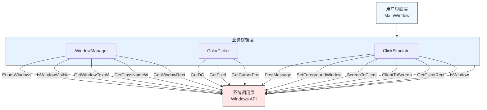
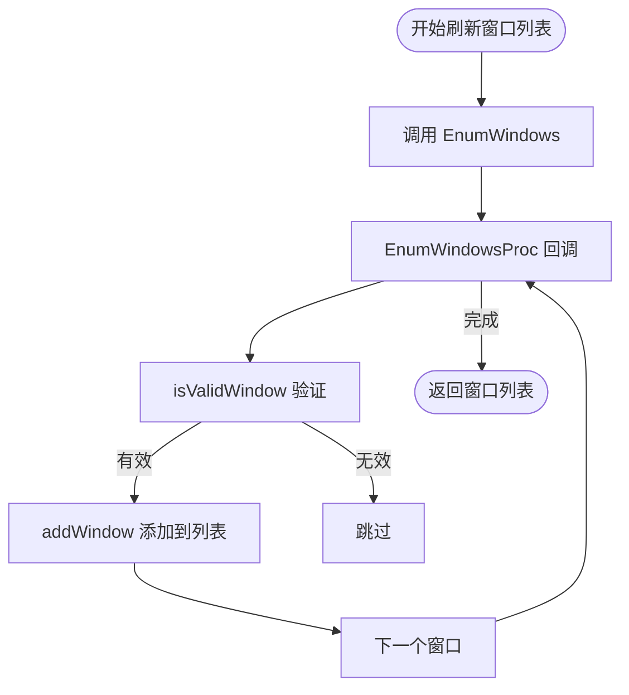
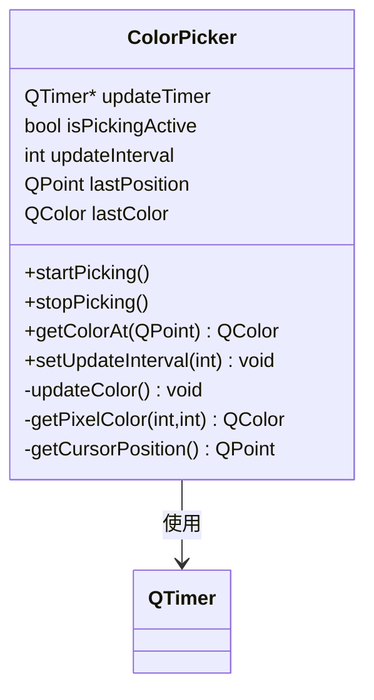
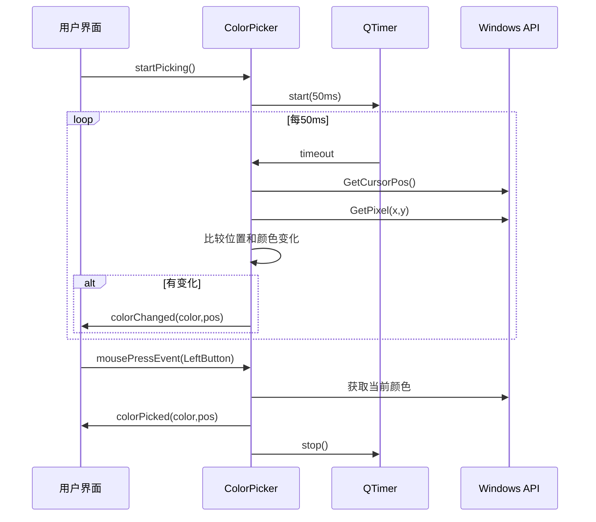
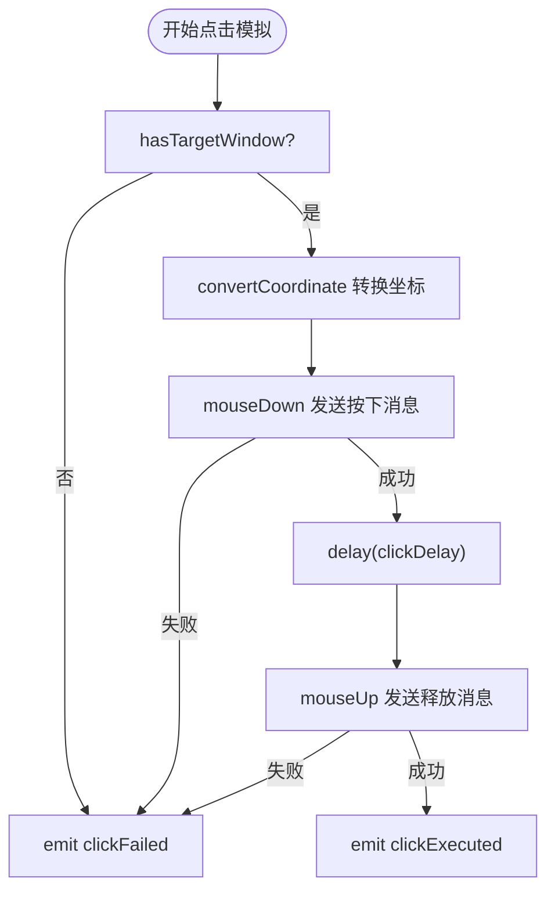
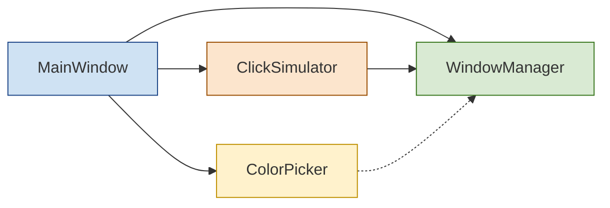

# 项目概述

<cite>
**Referenced Files in This Document**   
- [README.md](file://README.md)
- [WindowManager.h](file://include/core/WindowManager.h)
- [ColorPicker.h](file://include/core/ColorPicker.h)
- [ClickSimulator.h](file://include/core/ClickSimulator.h)
- [WindowManager.cpp](file://src/core/WindowManager.cpp)
- [ColorPicker.cpp](file://src/core/ColorPicker.cpp)
- [ClickSimulator.cpp](file://src/core/ClickSimulator.cpp)
- [MainWindow.cpp](file://src/ui/MainWindow.cpp)
</cite>

## 目录
1. [简介](#简介)
2. [项目结构](#项目结构)
3. [核心组件](#核心组件)
4. [架构概览](#架构概览)
5. [详细组件分析](#详细组件分析)
6. [依赖关系分析](#依赖关系分析)
7. [性能考量](#性能考量)
8. [故障排除指南](#故障排除指南)
9. [结论](#结论)

## 简介

new项目是一个基于Qt6框架的桌面应用程序，旨在为开发者和技术人员提供一套强大的窗口操作工具集。该项目专注于实现三大核心功能：系统级窗口管理、实时屏幕颜色拾取和精确鼠标点击模拟。这些功能特别适用于自动化测试、辅助工具开发以及需要精细控制用户界面交互的技术场景。

目标用户群体主要包括C++开发者、Qt初学者以及需要进行窗口操作的技术人员。对于初学者，该项目提供了清晰的模块化设计和直观的用户界面，便于学习和理解；对于高级用户，则展示了如何利用Windows API与Qt信号槽机制相结合来实现复杂的系统级操作。

项目通过三个主要组件——`WindowManager`、`ColorPicker`和`ClickSimulator`——分别实现了窗口枚举与绑定、实时取色和鼠标事件模拟等关键能力。每个组件都遵循单一职责原则，确保代码的可维护性和扩展性。此外，项目采用现代C++标准（C++17）并结合Qt6的强大功能，保证了跨平台兼容性和高性能表现。

## 项目结构

该项目采用了清晰的模块化目录结构，将源代码、头文件和构建配置分离，便于管理和维护。整体结构分为四个主要部分：源文件目录(src)、头文件目录(include)、构建输出目录(cmake-build-debug)和项目文档。



**Diagram sources**
- [README.md](file://README.md#L1-L186)

**Section sources**
- [README.md](file://README.md#L1-L186)

## 核心组件

本项目的核心由三个精心设计的组件构成：`WindowManager`负责系统级窗口的枚举与绑定，`ColorPicker`提供实时屏幕取色功能，而`ClickSimulator`则实现了精确的鼠标点击模拟。这三个组件共同构成了一个完整的窗口操作工具链，满足了从窗口识别到交互模拟的全流程需求。

`WindowManager`组件通过调用Windows API中的`EnumWindows`函数实现对系统中所有可见窗口的枚举，并过滤掉工具窗口和无标题窗口以提高实用性。它能够获取每个窗口的详细信息，包括句柄、标题、类名以及位置尺寸等属性。该组件还提供了安全的窗口绑定机制，在绑定前会验证窗口的有效性和可见性。

`ColorPicker`组件利用Windows GDI API中的`GetPixel`函数实现屏幕像素颜色的读取，支持以RGB和十六进制格式显示颜色值。通过一个可调节更新频率的定时器，它可以实现实时的颜色预览功能。当用户在取色模式下点击鼠标时，即可捕获当前光标位置的颜色信息。

`ClickSimulator`组件是整个项目中最复杂的功能模块，它使用Windows消息机制（`PostMessage`）来模拟鼠标点击事件。该组件支持多种坐标系转换，包括屏幕绝对坐标、窗口相对坐标和客户区相对坐标，确保点击操作能够在正确的上下文中执行。同时，它还支持左键、右键、中键的单击和双击操作，并可通过设置延迟参数来调整点击速度。

**Section sources**
- [WindowManager.h](file://include/core/WindowManager.h#L1-L63)
- [ColorPicker.h](file://include/core/ColorPicker.h#L1-L58)
- [ClickSimulator.h](file://include/core/ClickSimulator.h#L1-L98)

## 架构概览

该项目的整体架构体现了典型的分层设计思想，将用户界面、业务逻辑和系统交互清晰地分离。顶层是基于Qt Widgets的用户界面层，中间是封装了具体功能的业务逻辑层，底层则是与操作系统交互的系统调用层。



**Diagram sources**
- [WindowManager.cpp](file://src/core/WindowManager.cpp#L1-L169)
- [ColorPicker.cpp](file://src/core/ColorPicker.cpp#L1-L125)
- [ClickSimulator.cpp](file://src/core/ClickSimulator.cpp#L1-L287)

## 详细组件分析

### WindowManager 分析

`WindowManager`组件作为窗口操作的基础，承担着发现和管理目标窗口的重要职责。其主要功能是通过Windows API枚举系统中的所有窗口，并为上层应用提供一个可供选择的窗口列表。

#### 类图
```mermaid
classDiagram
class WindowManager {
+refreshWindowList()
+getWindowList() std : : vector~WindowInfo~
+bindWindow(int) bool
+bindWindow(HWND) bool
+isBound() bool
+getBoundWindow() HWND
-EnumWindowsProc(HWND, LPARAM) BOOL
-isValidWindow(HWND) bool
-addWindow(HWND) void
}
class WindowInfo {
+HWND hwnd
+QString title
+QString className
+RECT rect
}
WindowManager --> WindowInfo : 包含
WindowManager : std : : vector~WindowInfo~ windowList
WindowManager : HWND boundWindow
```

**Diagram sources**
- [WindowManager.h](file://include/core/WindowManager.h#L1-L63)
- [WindowManager.cpp](file://src/core/WindowManager.cpp#L1-L169)

#### 工作流程


**Diagram sources**
- [WindowManager.cpp](file://src/core/WindowManager.cpp#L45-L50)

**Section sources**
- [WindowManager.h](file://include/core/WindowManager.h#L1-L63)
- [WindowManager.cpp](file://src/core/WindowManager.cpp#L1-L169)

### ColorPicker 分析

`ColorPicker`组件实现了实时屏幕取色功能，允许用户在屏幕上任意位置获取像素颜色值。这个组件充分利用了Qt的信号槽机制和定时器功能，实现了高效且响应迅速的取色体验。

#### 类图


**Diagram sources**
- [ColorPicker.h](file://include/core/ColorPicker.h#L1-L58)
- [ColorPicker.cpp](file://src/core/ColorPicker.cpp#L1-L125)

#### 取色流程


**Diagram sources**
- [ColorPicker.cpp](file://src/core/ColorPicker.cpp#L75-L125)

**Section sources**
- [ColorPicker.h](file://include/core/ColorPicker.h#L1-L58)
- [ColorPicker.cpp](file://src/core/ColorPicker.cpp#L1-L125)

### ClickSimulator 分析

`ClickSimulator`组件是整个项目中最复杂的部分，负责实现精确的鼠标点击模拟。它不仅要处理不同类型的鼠标事件，还需要在多种坐标系之间进行准确转换，确保点击操作能在预期的位置发生。

#### 类图
```mermaid
classDiagram
class ClickSimulator {
+click(QPoint,...) bool
+mouseDown(QPoint,...) bool
+mouseUp(QPoint,...) bool
+setTargetWindow(HWND) void
+convertCoordinate(...) QPoint
-sendMouseMessage(...) bool
-delay(int) void
}
enum CoordinateType {
Screen
Window
Client
}
enum MouseButton {
Left
Right
Middle
}
enum ClickType {
Single
Double
}
ClickSimulator --> CoordinateType
ClickSimulator --> MouseButton
ClickSimulator --> ClickType
ClickSimulator : HWND targetWindow
ClickSimulator : int clickDelay
ClickSimulator : int doubleClickInterval
```

**Diagram sources**
- [ClickSimulator.h](file://include/core/ClickSimulator.h#L1-L98)
- [ClickSimulator.cpp](file://src/core/ClickSimulator.cpp#L1-L287)

#### 点击模拟流程


**Diagram sources**
- [ClickSimulator.cpp](file://src/core/ClickSimulator.cpp#L100-L150)

**Section sources**
- [ClickSimulator.h](file://include/core/ClickSimulator.h#L1-L98)
- [ClickSimulator.cpp](file://src/core/ClickSimulator.cpp#L1-L287)

## 依赖关系分析

该项目的组件间依赖关系清晰明确，遵循了低耦合高内聚的设计原则。通过分析各组件之间的引用关系，可以更好地理解系统的整体架构和数据流动方式。



主窗口(`MainWindow`)作为控制器，直接依赖于所有三个核心组件，负责协调它们的工作。值得注意的是，`ClickSimulator`也依赖于`WindowManager`提供的窗口信息来进行坐标转换和状态检查。虽然`ColorPicker`在当前实现中没有直接依赖`WindowManager`，但其功能逻辑上要求先绑定窗口才能进行取色操作。

这种依赖结构确保了各个组件的独立性，同时也保持了必要的协作关系。例如，当用户在UI上执行"绑定窗口"操作时，`MainWindow`会同时通知`WindowManager`和`ClickSimulator`更新其目标窗口状态，从而保证整个系统的一致性。

**Diagram sources**
- [MainWindow.cpp](file://src/ui/MainWindow.cpp#L1-L490)

**Section sources**
- [MainWindow.cpp](file://src/ui/MainWindow.cpp#L1-L490)

## 性能考量

在设计和实现过程中，项目充分考虑了性能优化问题，特别是在资源消耗较高的功能模块中采取了多项优化措施。

首先，在`ColorPicker`组件中，为了避免频繁的屏幕采样导致CPU占用过高，采用了智能更新策略：只有当鼠标位置发生变化时才会触发颜色读取和信号发射。这种方法显著降低了不必要的计算开销，使得即使在10ms的更新间隔下也能保持良好的系统响应性。

其次，`WindowManager`在枚举窗口时会对结果进行缓存，避免每次都需要重新扫描所有窗口。只有在用户显式点击"刷新列表"按钮时才会重新执行枚举操作。这种惰性加载策略既保证了数据的及时性，又避免了频繁的系统调用。

最后，`ClickSimulator`中的坐标转换算法经过精心设计，尽量减少对Windows API的调用次数。例如，在进行坐标系转换时，会尽可能复用已获取的窗口矩形信息，而不是每次都重新查询。此外，延迟操作使用`QThread::msleep`而非忙等待，确保不会过度消耗CPU资源。

这些性能优化措施共同作用，使得应用程序能够在提供强大功能的同时保持流畅的用户体验。

## 故障排除指南

在使用本项目时可能会遇到一些常见问题，以下是针对这些问题的解决方案：

1. **无法绑定某些系统窗口**：部分系统保护窗口可能需要管理员权限才能操作。解决方法是以管理员身份运行程序。

2. **颜色拾取不准确**：如果发现取色结果与实际不符，可能是由于高DPI缩放导致的坐标偏差。建议在非缩放显示器上使用，或在代码中添加DPI适配逻辑。

3. **点击模拟无效**：确保目标窗口没有被其他窗口完全遮挡，并且处于可交互状态。某些全屏游戏或安全软件可能会阻止外部输入。

4. **程序启动后无响应**：检查是否正确配置了Qt环境变量，以及CMake能否找到Qt安装路径。查看构建日志是否有链接错误。

5. **窗口列表为空**：确认系统中确实存在可见的应用程序窗口。某些最小化的窗口可能被`isValidWindow`检查过滤掉。

6. **编译错误**：确保已安装Qt6.5+版本，并在CMake配置中正确指定`CMAKE_PREFIX_PATH`指向Qt安装目录。

**Section sources**
- [README.md](file://README.md#L1-L186)
- [COMPILE_FIX.md](file://COMPILE_FIX.md)

## 结论

new项目成功实现了一个功能完备的Qt6桌面应用程序，为开发者提供了一套实用的窗口操作工具。通过模块化设计，项目将复杂的系统级操作分解为三个职责明确的核心组件：`WindowManager`、`ColorPicker`和`ClickSimulator`，每个组件都专注于解决特定领域的问题。

项目的技术亮点在于巧妙地结合了Qt框架的跨平台优势与Windows API的系统级能力。Qt的信号槽机制为组件间的通信提供了优雅的解决方案，而直接调用Windows API则确保了操作的精确性和可靠性。这种混合架构既保持了代码的可维护性，又实现了高性能的系统交互。

对于初学者而言，该项目展示了一个典型的Qt应用程序结构，涵盖了从UI设计到系统编程的完整知识体系。对于经验丰富的开发者，它提供了一个可扩展的基础框架，可以在此基础上添加更多高级功能，如键盘输入模拟、图像识别匹配或自动化脚本录制等。

总的来说，该项目不仅满足了当前的功能需求，还为未来的功能扩展留下了充足的空间，是一个兼具实用价值和教学意义的优秀示例。