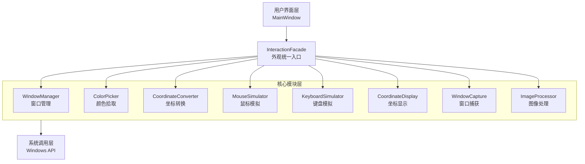

# QtDemo Project

这是一个基于Qt6的C++桌面应用程序项目，提供了窗口操作、颜色拾取、鼠标点击模拟和**高级窗口捕获**功能。

## 🚀 主要特性

- **高级窗口捕获**：支持捕获最小化窗口，基于Windows Graphics Capture API
- **图像处理**：集成OpenCV进行图像处理和分析
- **窗口操作**：枚举、绑定、管理系统窗口
- **鼠标模拟**：精确的鼠标点击和操作模拟
- **键盘模拟**：键盘按键和组合键模拟
- **坐标转换**：支持多种坐标系转换
- **实时预览**：窗口内容实时预览和捕获

## 项目架构

### 整体设计
本项目采用**外观模式(Facade Pattern)架构**，通过InteractionFacade统一封装所有核心功能模块：
- **视图层（View）**：基于Qt Widgets的用户界面层，包括MainWindow、LogWindow、WindowPreviewPage
- **外观层（Facade）**：InteractionFacade作为统一入口，封装并协调所有核心模块
- **核心模块（Core）**：独立的功能模块，各司其职，分别处理窗口管理、颜色拾取、坐标转换、鼠标模拟、键盘模拟、**窗口捕获和图像处理**

### 架构图


## 核心模块

### 1. InteractionFacade - 交互外观
- **职责**：作为所有用户交互功能的统一入口点
- **设计模式**：外观模式，封装了五个核心模块的复杂性
- **主要接口**：
  - 窗口管理：`refreshWindowList()`, `bindWindow()`, `hasTargetWindow()`
  - 鼠标操作：`leftClick()`, `rightClick()`, `doubleClick()`, `mouseClick()`
  - 键盘操作：`sendKey()`, `sendKeyWithModifiers()`, `sendText()`
  - 坐标功能：`enableCoordinateDisplay()`, `convertCoordinate()`

### 2. WindowManager - 窗口管理器
- **职责**：系统窗口的枚举和管理
- **主要接口**：
  - `refreshWindowList()` - 刷新窗口列表
  - `bindWindow(int index)` - 绑定指定窗口
  - `getWindowList()` - 获取窗口列表
  - `getBoundWindow()` - 获取当前绑定窗口
  - `bringWindowToFront()` - 将窗口置于前台

### 3. ColorPicker - 颜色拾取器
- **职责**：实时屏幕颜色获取
- **主要接口**：
  - `startPicking()` / `stopPicking()` - 开始/停止取色
  - `getColorAt(QPoint)` - 获取指定位置颜色
  - `getCurrentCursorColor()` - 获取当前光标位置颜色
  - `setUpdateInterval(int)` - 设置更新间隔
- **信号**：`colorChanged()`, `colorPicked()`, `pickingStarted()`, `pickingStopped()`

### 4. CoordinateConverter - 坐标转换器  
- **职责**：处理不同坐标系之间的转换
- **主要接口**：
  - `convertCoordinate(QPoint, fromType, toType)` - 通用坐标转换
  - `screenToClient(QPoint)` - 屏幕坐标转客户区坐标
  - `clientToScreen(QPoint)` - 客户区坐标转屏幕坐标
  - `getWindowRect()` / `getClientRect()` - 获取窗口区域信息

### 5. MouseSimulator - 鼠标模拟器
- **职责**：模拟鼠标点击操作
- **主要接口**：
  - `mouseClick(QPoint, coordType, button, clickType)` - 通用点击接口
  - `leftClick()` / `rightClick()` / `doubleClick()` - 便捷点击接口
  - `setClickDelay(int)` - 设置点击延迟
  - `setDoubleClickInterval(int)` - 设置双击间隔
- **信号**：`mouseClickExecuted()`, `mouseClickFailed()`

### 6. KeyboardSimulator - 键盘模拟器
- **职责**：模拟键盘按键操作
- **主要接口**：
  - `keyPress(KeyCode)` - 单个按键
  - `keyPressWithModifiers(KeyCode, shift, ctrl, alt)` - 组合键
  - `sendText(QString)` - 发送文本
  - `sendCtrlKey()` / `sendAltKey()` / `sendShiftKey()` - 便捷组合键
- **信号**：`keyExecuted()`, `keyFailed()`

### 7. CoordinateDisplay - 坐标显示器
- **职责**：实时坐标显示和捕获
- **主要接口**：
  - `enableDisplay(bool)` - 开启/关闭坐标显示
  - `setUpdateInterval(int)` - 设置更新间隔
  - `setCoordinateCaptureKey(int)` - 设置捕获快捷键
  - `getCurrentMousePosition()` - 获取当前鼠标位置
- **信号**：`coordinateChanged()`, `coordinateCaptured()`

### 8. WindowCapture - 高级窗口捕获器 🆕
- **职责**：高性能窗口捕获，支持最小化窗口
- **技术特性**：
  - 基于Windows Graphics Capture API（回退到传统PrintWindow）
  - 支持捕获最小化的窗口
  - 硬件加速支持
  - 高效的内存管理
- **主要接口**：
  - `initializeCapture(HWND)` - 初始化捕获目标
  - `startCapture()` / `stopCapture()` - 开始/停止捕获
  - `captureFrame()` - 捕获单帧图像
  - `isSupported()` - 检查系统支持
  - `setFrameRate(int)` - 设置帧率
- **信号**：`frameReady()`, `captureStateChanged()`, `captureError()`

### 9. ImageProcessor - 图像处理器 🆕
- **职责**：基于OpenCV的图像处理和分析
- **技术特性**：
  - 支持多种图像滤镜（模糊、锐化、边缘检测等）
  - 高效的格式转换（QImage ↔ cv::Mat）
  - 异步处理支持
  - GPU加速选项
- **主要接口**：
  - `resizeImage()` - 图像缩放
  - `applyFilter()` - 应用滤镜效果
  - `calculateSimilarity()` - 计算图像相似度
  - `matToQImage()` / `qImageToMat()` - 格式转换
  - `setProcessingThreads(int)` - 设置处理线程数
- **信号**：`processingCompleted()`, `processingProgress()`, `processingError()`

## 构建与运行

### 环境要求
- Qt 6.9.2 (MinGW 64-bit)
- CMake 3.16+
- MinGW-w64 13.1.0
- Windows 10/11
- **OpenCV 4.x** (可选，用于图像处理功能)

### 构建步骤
直接使用命令 zsh D:/ws/qoder4ymjh/build.sh

### 运行程序
构建成功后，可执行文件位于：
```
d:\ws\out\QtDemo.exe
```

直接双击运行或通过命令行启动：
```bash
d:\ws\out\QtDemo.exe
```